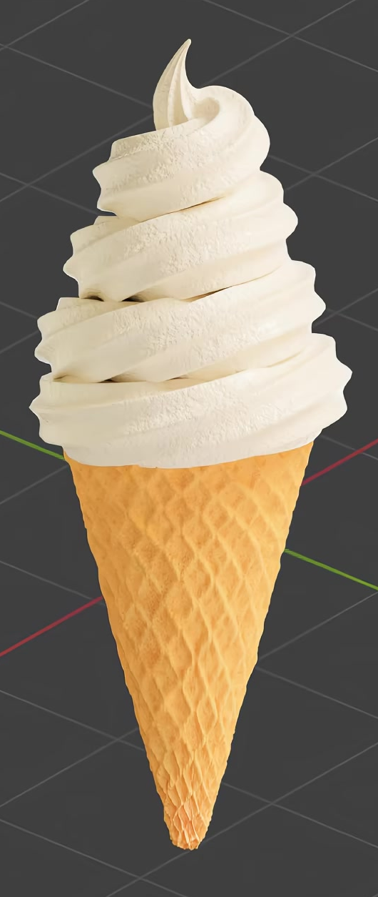
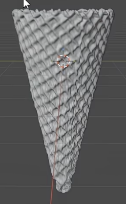
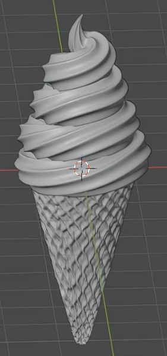

# Soft-Serve Waffle Cone

Create a vanilla soft-serve ice cream in a slender waffle cone. The finished asset should combine an open, thin-walled cone with raised diamond cells, a continuous fluted swirl that narrows to a curled point, and contrasting creamy and baked surfaces.

## Starting Scene and Input

Use Blender 5.1.2 and Cycles with GPU rendering. Start from an empty scene and build the cone and soft-serve geometry. No starter model is provided.

Use [waffle_texture.avif](../input/waffle_texture.avif) as the source of the cone's waffle relief. The supplied file is a grayscale diamond-pattern texture. A lossless decoded copy may be used if the image format requires conversion for your workflow; preserve the supplied original. No external model, HDR image, or curve extension is required.

## Cone Shell

Make a round cone that narrows steadily from a broad circular mouth to a small closed tip. It must have a continuous outer wall, an inner wall, and visible rim thickness. The mouth remains open beneath the ice cream and can be inspected by temporarily hiding the cream. Keep the wall thin relative to the mouth, the rim rounded, and the large-scale silhouette smooth, without accidental holes or a swollen tip.

## Waffle Relief

Wrap the supplied texture around the cone to form raised diagonal ribs enclosing recessed diamond cells. The pattern must produce real surface relief and shading, rather than a flat printed color pattern. Keep recognizable cells over the exposed cone, with coherent scale around the circumference and gradual compression toward the tip. Avoid an obvious broken strip at the wrap seam, abrupt changes in cell size, and relief that tears through the shell. Add restrained irregularity so the baked surface is not perfectly mechanical while its diamond structure remains clear.

## Soft-Serve Form

Build one continuous thick strand that rises through approximately three narrowing turns. Its lowest turn should cover and rest on the cone mouth, with a modest overhang. The swirl must read as a stable, connected serving: keep neighboring turns close, avoid conspicuous gaps through the stack, and avoid harsh visible self-intersections.

Give the strand a softly fluted cross-section, with several rounded longitudinal ridges and valleys that follow the spiral. Preserve these ridges around the visible turns. Smoothly taper the upper strand into a slender, slightly leaning curled point; close its end and tuck the lower end into the serving. The visible surface and silhouette should be smooth between intentional grooves.

## Editable Swirl

Retain an editable path and reusable fluted profile, or equivalent geometric controls that generate the soft-serve. A small increase in overall swirl height and a separate change in strand thickness must each update the visible geometry predictably. Both adjustments must be independent and reversible. Keep the base anchored at the cone mouth, the continuous turns, and the tapered upper end when making these edits. A frozen mesh accompanied by unused controls does not satisfy this requirement.

## Food Surfaces

- **Cream:** Use a warm ivory surface with broad, soft highlights. It should look creamy and opaque, with a smoother and glossier response than the cone. Keep its grooves readable without a metallic or glass-like appearance.
- **Cream microstructure:** Add procedural surface variation at two distinguishable small scales. Close views should reveal gentle fine irregularity, while the full serving still reads as soft cream. Avoid coarse rocky bumps or changes that obscure the fluting.
- **Baked cone color:** Use procedural golden-orange and toasted-brown variation. Broad patches should extend across several waffle cells, with smaller variation within them. The cone should appear matte and baked rather than uniformly painted or metallic.
- **Cone grain:** Add procedural fine pits or grain at a much smaller scale than the waffle cells. Keep it visibly separate from the large diamond relief and restrained enough that the lattice remains legible.

## Presentation

Compose a static portrait view that includes the entire cone and curled tip with comfortable margins. Use a plain contrasting background and lighting that reveals the waffle relief, cream grooves, and different surface responses. Keep both materials readable without blown highlights, deep obscuring shadows, or distracting scene objects. The final image must show the actual submitted scene.

## Deliverables

- `submission.blend`: the complete editable scene, including the active camera, materials, working swirl controls, and a configured Cycles GPU render. Keep required textures packed or resolve them through relative paths.
- `build.py`: a Blender Python script that rebuilds the scene from an empty scene using the supplied input and saves `submission.blend`. Resolve input paths relative to the script or its documented project layout, and do not require unavailable models or extensions.
- `B52_Soft_Serve_Waffle_Cone.png`: a finished PNG rendered from `submission.blend`, matching the Presentation section. Do not substitute a source image, viewport screenshot, or external replacement.
