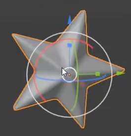

# Luminous Star Rain

Create an editable animation of a soft white cloud releasing a continuous shower of luminous five-point stars against a bright blue background. The stars should feel like small solid objects, with varied sizes and orientations, falling through an open vertical composition.

## Starting Scene

Use Blender 5.1.2 with Cycles and GPU rendering. Start from an empty scene. No external input assets are provided; `input/` is empty. Create the cloud, star geometry, materials, animation, lighting, and camera in the scene.

## Cloud Form

Make a single connected cloud shape with a broad horizontal silhouette, overlapping rounded lobes, an uneven raised top, a gently scalloped lower edge, and smaller end lobes. Give it depth so that it remains a cloud when inspected from an oblique angle.

Render the cloud as a white participating volume with soft density transitions, subtle edge irregularity, and gentle internal light and shade. It should retain a readable lumpy form without a hard opaque shell, visibly separate balls, coarse voxel blocks, or an exposed construction mesh.

## Solid Luminous Stars

Create a reusable, closed five-point star body with clear alternating tips and recesses. Give it visible thickness, a slightly raised center, and softened edges with smooth shading. Preserve the star silhouette after rounding.

Use a white self-emitting material on the animated stars. They should remain bright without depending on a spotlight, and the larger stars should retain recognizable points in the final image.

## Reusable Shower

Drive the shower from an editable star source so that changing the source shape updates the falling stars together. Keep the cloud and the region where stars appear independently editable. Place that region beneath the cloud, spanning much of its width, with the shower centered under it.

Provide editable shower-density and downward-speed controls. Changing density must change the population of falling stars; changing speed must change their rate of descent. The construction region and any oversized source star must stay out of the final camera image.

## Falling Motion

Use frames **1-240 at 24 fps**, producing a ten-second clip. Keep the cloud stationary. The clip may begin with a sparse shower or with rain already in progress; by frame 49 it must be established and remain active through frame 240.

Stars must emerge beneath the cloud and travel smoothly downward, with modest lateral drift and varied spacing rather than a rigid group translation. Show a populated shower with several dozen distinct stars at representative middle and late moments. Vary their size and face angle while keeping the larger stars legible.

New stars must continue appearing while older stars fall farther down or leave the view. Avoid synchronized disappearance, frozen intervals, and visible teleporting across the scene. Resetting to frame 1 and replaying must reproduce the same animation. This is a non-looping clip: the rain may still be falling at frame 240, and no return to the opening state is required.

## Final Shot

Use a fixed portrait camera with the entire cloud near the top and ample space below to read the stars' descent. Keep the shower visibly associated with the cloud while allowing stars to leave the bottom of the image naturally.

Use a saturated blue background, soft illumination that reveals the cloud's lobes, and restrained glow around bright stars. Preserve distinct star silhouettes and cloud shading instead of washing the image into white patches. Small background sparkles are optional. The final image must contain no modeling overlays or visible construction objects.

## Deliverables

- `submission.blend`: the self-contained editable scene, with its camera, materials, animation, and Cycles GPU render settings ready to use. Save a representative populated-shower frame and include any data needed for reliable replay.
- `build.py`: a reproducible Blender Python script that builds the scene, animation, and render settings from an empty scene without external assets.
- `B53_Luminous_Star_Rain_dynamic.mp4`: the portrait animation rendered from the actual submitted scene, covering every frame from 1 through 240 at 24 fps. Do not substitute reference images, viewport recordings, or an externally composited replacement scene.
