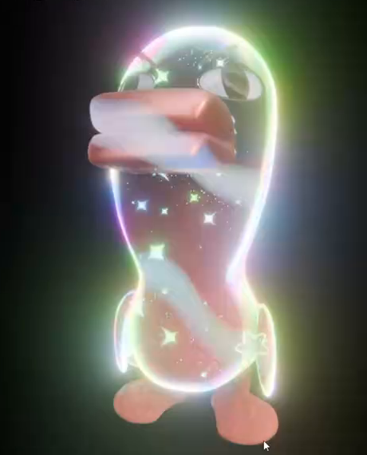
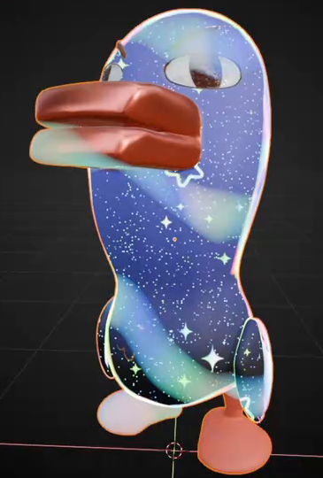
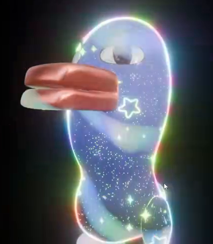

# Iridescent Star Ripple Material

Create an animated iridescent finish on the supplied character. A blue-violet body carries flowing pastel ripples, dense tiny sparkles, and larger outlined stars, with a luminous colored rim against a black background.

## Starting Scene

Use Blender 5.1.2 and EEVEE with GPU rendering. Open a working copy of [character_starter.blend](../input/character_starter.blend), which provides the character geometry, rig, regional materials, and an existing walk action. Keep the character geometry and recognizable face. Present it in a stable pose so that the material animation is easy to see; no new character modeling or walking animation is required.

Use [character_preview.png](../input/character_preview.png) as a reference for the original regional colors. Use [star_outline_mask.png](../input/star_outline_mask.png) for the rounded outline-star motifs. The preview is a visual reference, not a surface texture. Unused legacy reference-image datablocks may be removed from the working scene.

## Body Color and Ripples

Give the head, torso, and wings a continuous-looking blue-violet iridescent surface with lighter cyan or mint areas and darker blue regions. Soft highlights should describe the character's curved form.

Overlay broad, softly blended diagonal ripple bands. The bands should bend across the curved body and carry pale cyan, mint, pink, and near-white accents. Keep enough darker body color between bands for the ripple pattern and stars to remain distinct. The color field and ripple placement must remain separately editable.

## Stars and Regional Colors

Layer dense fine light points, less frequent filled diamond-like sparkles, and larger rounded outline stars over the body and wings. Use the supplied star mask for the outline motif. Preserve its open center and smooth continuous border, with the background of the mask contributing no opaque rectangle. The three star scales must remain visually distinct and editable independently of the underlying color and ripples.

Keep the bill and tongue orange-red, the feet coral, the eye whites light, and the pupils and eyebrows dark. Confine the iridescent field and star layers to the intended body and wing surfaces; the facial features and feet must remain clearly identifiable throughout the clip. Implement the regional separation using the supplied material regions or an equivalent editable mask.

## Emissive Rim

Add a narrow luminous rim around the visible head, torso, and wing silhouettes. It should be predominantly pale cyan-white, with visible mint, pink, or violet variation. Keep its source attached to the character's surface and preserve the silhouette's shape. The interior surface must retain its body colors and star detail rather than becoming uniformly white.

## Material Animation

Use frames 1-150 at 30 fps for a five-second clip. Keep the camera and character pose stable. At frame 1, show a blue-violet surface with diagonal bands and recognizable stars. By frame 150, the bands and larger stars must occupy visibly different surface positions, with a changed distribution of pastel color.

Animate the color field and ripple flow continuously across the clip. Animate the positions of the larger outline stars and vary the sparkle pattern or intensity over time. The layers must move across the body surface, rather than moving only because the character or camera moves. Avoid abrupt jumps, popping, detached floating stars, or visible rectangular texture boundaries. The clip does not need to loop, but revisiting a frame must reproduce the same material state.

## Presentation

Frame the whole character, including the feet and luminous rim, in a fixed front three-quarter view on a black background. Use lighting and exposure that retain the bill, eyes, body colors, and all three star scales. Add controlled glow and short starburst highlights around the brightest details, with subtle colored edge separation. Keep the glow soft enough to distinguish the silhouette and outline-star centers.

## Deliverables

- `submission.blend`: the editable completed scene with the declared timeline, materials, animation, camera, and render setup. Pack required image resources or keep their paths relative to the supplied inputs.
- `build.py`: a reproducible Blender Python script that builds the completed scene from the supplied starter and input images, sets the declared timeline, and saves `submission.blend`.
- `B54_Iridescent_Star_Ripple_Material_dynamic.mp4`: the complete frames 1-150 at 30 fps, rendered from the actual submitted scene. Use at least 1280 x 720 pixels, with no source footage, viewport screenshots, or external replacement imagery.
