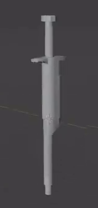
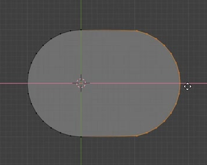
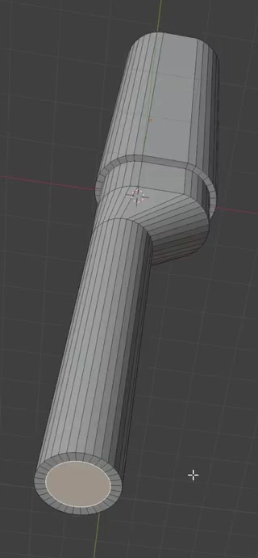
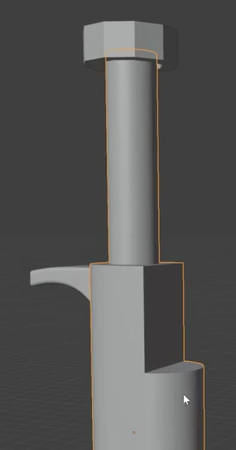
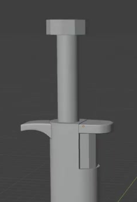

# Pipette Gray Model

Create an editable gray model of a handheld laboratory pipette. Its long vertical silhouette combines a capsule-section housing, a stepped lower shoulder and narrow nozzle, a raised plunger, and different controls on the two sides of the upper housing.

The complete silhouette reference establishes the relative placement of the housing, plunger, and lower nozzle. The detail references below show the individual forms more clearly.

## Starting Point

Use Blender 5.1.2 and begin with an empty scene. The input folder is empty; create the model from native geometry. No external assets or add-ons are required. Use Cycles with GPU rendering for the final image.

This is a static exterior model. Keep a plain neutral gray appearance, and use the references for shape and relative proportions. Overall scene scale is free.

## Main Housing

Make a slender vertical housing with a closed capsule-shaped horizontal section: two rounded ends connected by short straight sides. Preserve this character along the main grip rather than making the grip a circular tube. The grip must be visibly wider than both the upper plunger shaft and the lower nozzle.

The reference shows the housing section during construction. The completed housing must remain a solid exterior form with continuous sides and clearly defined transitions at its ends.

## Lower Shoulder and Nozzle

Below the grip, form a short stepped transition and an angled shoulder that leads into a long, narrow cylindrical nozzle. Preserve the asymmetric side profile: the nozzle sits toward one rounded end of the wider housing, with the shoulder sloping inward from the other side. Keep the nozzle parallel to the housing's vertical direction.

The lower assembly must read as a sequence of wide grip, short shoulder, and narrow elongated nozzle. Give the nozzle a small reduced terminal section and a closed end. Maintain connected-looking transitions without gaps or twisted sections.

This construction view shows the offset shoulder and round lower section; the complete silhouette reference shows the final elongated nozzle.

## Upper Plunger

Add a distinct plunger above the housing. It must have a long narrow vertical shaft, a broad thin pressing cap, and a clear connection into the upper neck of the housing. Center the cap on its shaft and align the shaft with the upper neck. Keep the plunger independently editable from the housing.

## Opposing Side Controls

Place the controls around the top of the grip. On one side, create a short horizontal finger rest or trigger with a fairly flat top, a curved underside that deepens toward its root, a rounded outer end, and softened edges. Its root must meet the housing convincingly.

On the opposite side, create a real recessed control area in the upper housing. The recess must have visible depth and a defined lower ledge while leaving the lower grip intact. A dark marking or a separate box placed on the outside does not replace the recess.

Fit a narrow vertical side button into this recess. Give it a rounded outward face and a flatter back toward the housing. Keep its border and lower end visibly distinguishable from the surrounding housing.

Above the vertical button, add a separate horizontal paddle with a rounded outer end in top view, a thin solid profile, and softened outer edges. It must be visibly distinct from the vertical button and from the curved trigger on the opposite side.

## Editable Geometry and Finish

Retain independently editable geometry for the housing, plunger, curved trigger, vertical side button, and horizontal paddle. Equivalent modeling methods are acceptable. The final evaluated shape matters; specific topology counts, modifier types, and modifier settings are not prescribed.

Finish the curved surfaces with continuous shading while retaining intentional ledges and edges. The required components must be present and readable, with no accidental holes, inverted faces, spikes, major pinching, or exposed intersections that obscure their forms. Hidden attachment overlap is acceptable where parts meet.

## Presentation

Render the full pipette from a three-quarter view on a plain background, with the entire cap and nozzle inside the image. Frame it closely enough to distinguish the housing transitions, the curved trigger, and the opposite control assembly. Use neutral lighting that reveals the recess depth and rounded forms without hiding them in glare or deep shadow.

## Deliverables

- `submission.blend`: the complete editable scene, ready to render in Blender 5.1.2.
- `build.py`: a reproducible Blender Python script that builds the submitted model and its presentation scene from an empty scene, without unavailable external assets.
- `B55_Pipette_Gray_Model.png`: a PNG rendered from the actual submitted scene, following the Presentation requirements. Source images, viewport screenshots, and external replacement images are not accepted as the final render.
