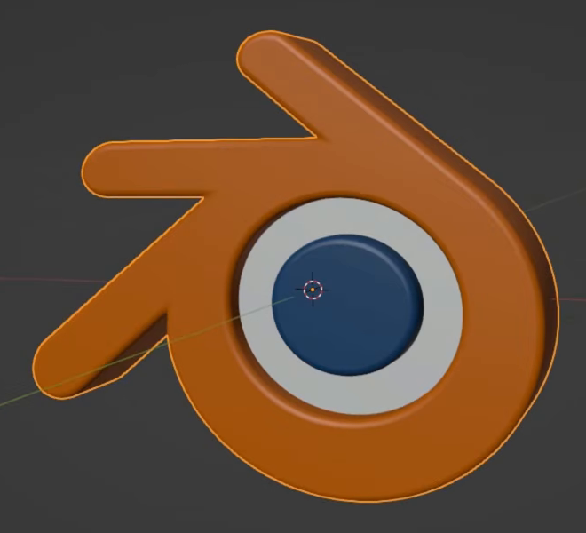
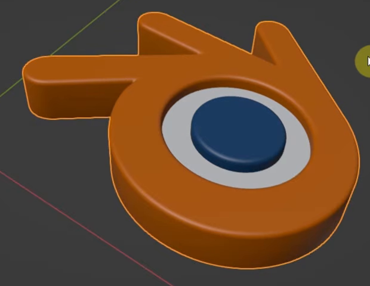
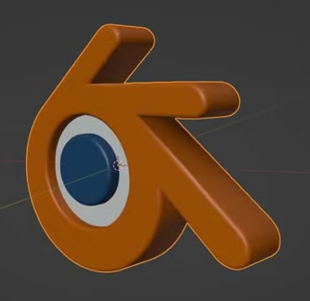

# Spinning 3D Blender Logo

Create an upright, three-dimensional Blender logo from the supplied vector artwork. Its orange body and blue eye have rounded raised rims, while the white ring between them is recessed and square-edged. The complete logo turns once about its own vertical axis over a 100-frame clip.

## Starting Scene and Input

Use Blender 5.1.2 and Cycles with GPU rendering. Start with an empty scene and use [blender_logo.svg](../input/blender_logo.svg) as the source of the logo's filled outlines and colors. This is the only supplied build input. Create the depth, editable mesh, animation, camera, and lighting in the scene.

The reference images show the target form from several angles. They are visual references, not replacement artwork for the render. Equivalent construction methods are acceptable when they use the supplied vector paths and produce the required editable result.

## Logo Shape

Preserve the artwork's orange outer silhouette, its three projecting arms, the white band inside the eye, and the blue center. Keep their original alignment and proportions. The white region must have an opening occupied by the blue center, rather than a white disc covering it.

Overall scale is free. Preserve the supplied artwork's width-to-height proportions and vector silhouette while adding depth and rounding; avoid inflated edges, narrowed arms, or a crowded white band.

## Layered Relief

Give the orange body and blue center matching total depths, with the white ring about half as deep. Keep the overall form a thin relief relative to the logo's width and height, matching the proportions visible in the references. Center all three depths about the same artwork plane so the relief has the same depth relationships on its front and back.

The white band must remain visibly recessed between the equally raised orange and blue regions. The blue center must be a solid raised form with an exposed front face. All three regions need filled faces and sidewalls, so the logo reads as a solid relief from oblique and edge-on views.

## Rim Geometry and Mesh

Round the orange body's outer and eye-facing rims and the blue center's rim with a small, even profile relative to the relief depth. Keep the white ring square-edged. Preserve the supplied outline across this rounding, including the narrow projecting arms. Modest visible faceting is acceptable when the profile still reads as rounded.

Deliver the complete logo as one editable mesh object containing all three material regions. The depth, front and back faces, sidewalls, and rounded profiles must exist as mesh faces in the saved asset. The regions may remain disconnected within that mesh. Avoid duplicate overlapping copies, visible cracks, missing faces, and shading damage. The logo must remain complete when its animation is disabled.

## Color and Readability

Use the supplied artwork's orange, blue, and white fills on their corresponding mesh regions. Their sRGB reference colors are `#E87D0D`, `#265787`, and `#FFFFFF`. Keep them opaque, clearly distinct, and visible on both sides of the relief. Preserve the flat color identity of each region; do not replace it with image projections or unrelated textures.

Use a neutral background and lighting that reveals the recessed ring, raised center, and rounded rims throughout the turn. Keep the whole logo visible in the rendered frame at every pose, with no unrelated visible geometry or overlays.

## Upright Pivot

At frame 1, stand the artwork upright and present its recognizable front face to the fixed camera. Place the vertical rotation axis through the eye region near the blue center, as in the reference. The logo's overall world position is free.

Keep this pivot fixed throughout the animation, so the logo turns in place without orbiting a distant point. Preserve its size and upright posture through the turn.

## Single-Turn Animation

Set the scene to frames 1 through 100 at 24 fps. From frame 1 to frame 100, rotate the upright logo through exactly one positive 360-degree revolution about world Z. Frame 100 returns to the frame-1 pose; this single-turn clip deliberately includes that repeated endpoint.

Advance the angle at a constant rate throughout the 99 frame intervals, with no easing, holds, reversals, or extra revolutions. Intermediate angles may deviate by at most 1 degree from a straight progression between the two endpoint angles. Keep the pivot position, size, and upright orientation fixed throughout the motion.

The animation must evaluate intermediate poses in the submitted scene and remain editable. Replaying the range from frame 1 must reproduce the same turn without accumulated transforms. Keep the camera fixed so the motion visibly presents the front, side, and back of the same mesh.

## Deliverables

- `submission.blend`: the editable logo mesh, assigned materials, animation, and render-ready scene in Blender 5.1.2, saved at frame 1.
- `build.py`: a script that uses the supplied SVG to rebuild the scene from an empty scene and saves `submission.blend`. Resolve the supplied asset using a portable relative path.
- `B56_Spinning_3D_Blender_Logo_dynamic.mp4`: a Cycles GPU render of frames 1 through 100 at 24 fps from the actual submitted scene, with the entire logo readable throughout the fixed-camera turn. The movie must show the submitted geometry and animation, not source images, viewport screenshots, or an external replacement.
