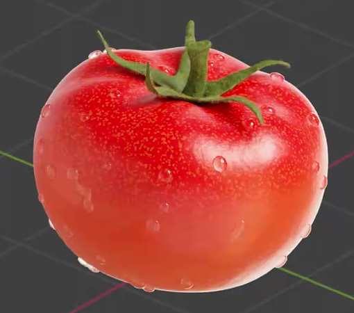
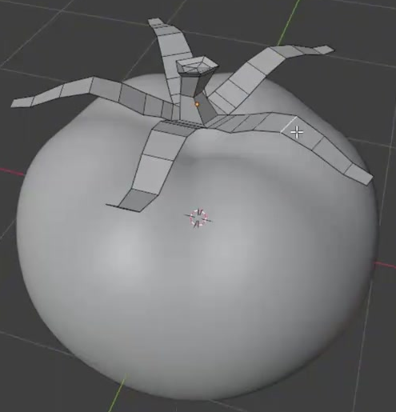
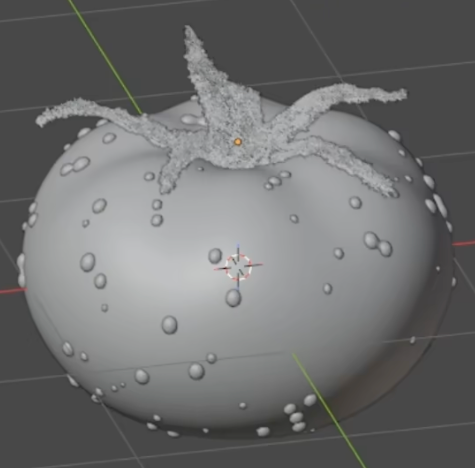
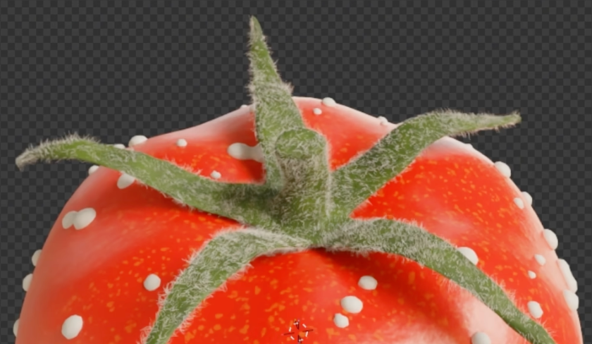

# Procedural Dewy Tomato

Create a ripe tomato with a softly lobed body, an irregular green calyx, fine stem and leaf fuzz, and clear dew beads. The skin should combine a red-to-orange height transition, warm mottling, and subtle surface texture through editable procedural materials.

## Starting Scene

Use Blender 5.1.2 and start from an empty scene. No input assets are provided; the input folder is empty. Build the fruit, stem, calyx, hairs, and droplets from native geometry. Use Cycles with GPU rendering for the final image. Lighting and background may be created within the scene; no particular environment image is required.

## 1. Fruit Shape

Make one plump, slightly flattened tomato with broad rounded shoulders, soft radial lobes, a shallow depression around the stem, and a rounded lower pole. Its silhouette must remain smooth without a faceted outline, sharp ridges, or pinched poles. Keep the fruit geometry editable and independently editable from the calyx.

## 2. Stem and Calyx

Seat a short upright stem in the top depression and surround it with five tapered sepals. The sepals should spread across the shoulders, with varied lengths, widths, bends, and tip heights. Give them thin physical thickness, rounded edges, and slight irregularity. Their roots should meet the stem coherently, and their tips should remain distinct without broad intersections through the fruit.

## 3. Fuzz and Dew Geometry

Add fine, short hairs over the stem and calyx. Their density should suggest a soft botanical surface while preserving the visible stem and leaf shapes. Keep the fruit skin visually smooth beneath the dew.

Scatter many small rounded dew beads over the exposed fruit surface. Vary their sizes and spacing, keep them seated on the skin, and preserve visible stretches of bare fruit between them. Avoid floating beads, a merged blanket of spheres, or a large source sphere beside the tomato. The finished distribution must stay fixed when the timeline changes; this is a static asset.

## 4. Procedural Fruit Skin

Give the fruit an editable procedural material with rich red shoulders transitioning smoothly toward warm orange at the lower part. Combine broader warm color variation with smaller scattered warm speckles; the surface must still read predominantly as ripe red skin.

Retain controls that can shift the height of the color transition and change the scale and intensity of the mottling without rebuilding the geometry. A small translation or rotation of the whole tomato must carry the texture with it.

Use glossy but soft highlights and restrained procedural microtexture that breaks up the highlights without producing a rough, stone-like surface or altering the fruit silhouette. Keep the microtexture strength independently adjustable from the color variation.

## 5. Calyx and Dew Shading

Shade the calyx and stem in naturally varying dark and yellow-green tones, with a rougher response than the fruit. Use an independently editable procedural material so its color variation can change without changing the red fruit. The hairs should blend with these botanical colors.

Give the dew a clear, water-like material with bright reflections and visible transmission or refraction of the skin beneath. It must read as transparent liquid rather than white beads, opaque red bumps, or metal. The final overview above is the material reference for the dew.

## Deliverables

- `submission.blend`: the editable scene with its geometry, assigned materials, camera, lighting, and Cycles GPU configuration. Keep all necessary dependencies packed or generated within the scene.
- `build.py`: a reproducible Blender Python script that builds the submitted scene from an empty scene and saves `submission.blend`. No additional downloads or local absolute-path assets may be required.
- `B57_Procedural_Dewy_Tomato.png`: a PNG rendered from the actual submitted scene, at least 1024 pixels on its longer edge. Use a close three-quarter view from above that shows the complete tomato, stem, and calyx with a small margin. The lighting must make the skin, fine fuzz, and clear droplets inspectable. Do not substitute a viewport screenshot, a reference image, or an externally composed replacement.
