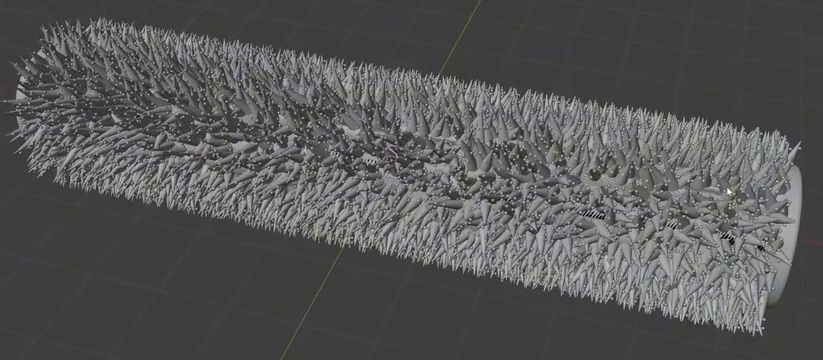
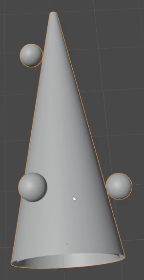
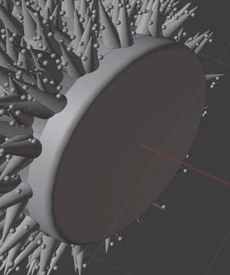
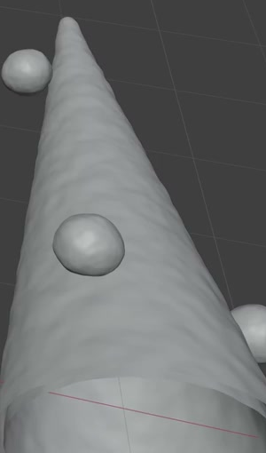

# Procedural Spiked Rod

Create an editable static rod densely covered with tapered protrusions and small spherical nodules. The result should read as one continuous cylindrical structure, with a clear circular end cap and a fine layer of rounded geometric waviness on the protrusions.

## Starting Scene

Use Blender 5.1.2 and build the asset from native geometry in a clean scene. The `input/` directory is empty; no external models, textures, images, or plugins are required. Use Cycles with GPU rendering for the final image. This is a static asset; no animation is required.

## 1. Overall Rod Form

The completed assembly must have a straight horizontal axis and a circular cross-section. Make the cylindrical body at least four times as long as its core diameter, excluding the protrusions. The coating must follow this underlying shape along the full length, without bending the rod or breaking it into disconnected sections. The supporting surface may remain visible in small gaps between protrusions.

## 2. Reusable Tapered Unit

Retain an editable source unit containing a slender tapered shell. Its wide circular base must be open, with a readable inner surface, and its narrow end must have a softly rounded finish. Preserve a continuous taper rather than a needle with an abrupt shoulder. The open rim and the silhouette must remain clean when the source is inspected separately.

## 3. Spherical Detail Layer

Attach several smaller, near-spherical nodules to the tapered unit. Give them visibly different sizes and distribute them at different heights and around more than one side. They should meet or intersect the shell surface, creating a coherent composite unit. After repetition, these nodules must remain recognizable as a finer scale of detail among the larger tapered protrusions.

## 4. Procedural Surface Coverage

Distribute the composite unit densely around the circumference and along the full length of the rod. The result must have continuous coverage while individual protrusions remain discernible. Each narrow tip should point predominantly away from the local cylindrical surface, with restrained irregular leaning rather than a perfectly regimented pattern.

Retain a working procedural relationship between the source unit and its repetitions. Editing the size of one source nodule must update its corresponding detail throughout the coating. Keep editable controls for coverage density and orientation variation in the saved scene. Halving density must visibly reduce the number of repetitions while preserving the rod shape; modestly changing orientation variation must change local leaning while keeping the coating predominantly outward-facing. Restore the intended dense appearance for submission. Any implementation that preserves these relationships is acceptable.

## 5. End Cap and Geometric Finish

Fit a shallow circular cap to one end of the rod. Align it with the rod axis, provide a clean planar face and a softly rounded perimeter, and meet the coated body without a visible separation. The cap should provide a clear end to the rough cylindrical surface.

Add restrained rounded undulations to the tapered surfaces as actual evaluated geometry. Keep the overall taper, open base, and spherical detail recognizable. The finish should be softly uneven, without large spikes, torn surfaces, or angular shading bands.

## 6. Presentation

Present the rod in a neutral gray appearance with lighting that reveals the protrusions, nodules, and cap. Use an oblique view that shows the full rod and the capped end without cropping the geometry. Keep construction sources available for editing but outside the final camera view. The background must leave the silhouette and small-scale detail easy to inspect.

## Deliverables

- `submission.blend`: the complete editable scene, retained source unit, functioning distribution controls, camera, and lighting.
- `build.py`: a Blender Python script that recreates the submitted scene from the clean starting scene and sets up its final render without external assets or machine-specific paths.
- `B58_Procedural_Spiked_Rod.png`: a PNG rendered from the actual submitted scene with the presentation described above. Do not substitute a reference image, viewport screenshot, or externally created image.
