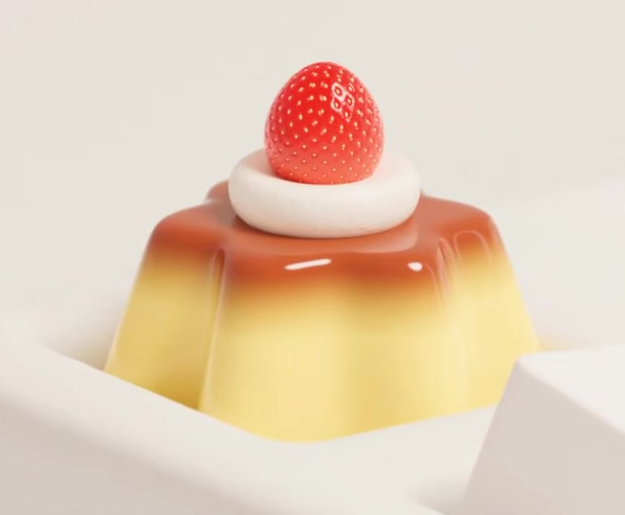
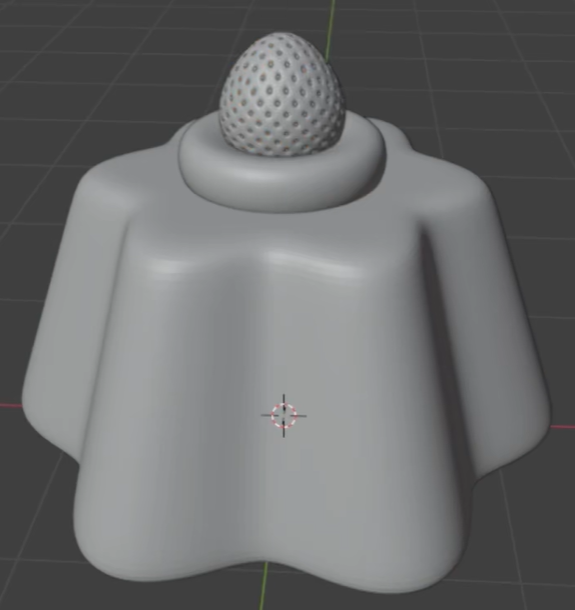
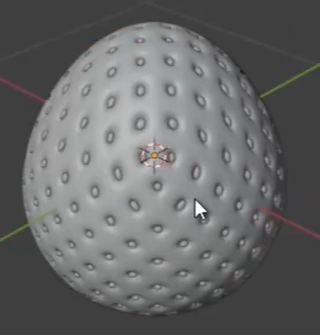

# Strawberry Pudding Keycap

Create a decorative keycap topped with a fluted custard pudding, a soft cream ring, and one seeded strawberry. The pudding has a glossy caramel-colored top that blends into a warm yellow body.

## Starting Scene

Use Blender 5.1.2 and begin with an empty scene. The `input/` directory is empty. Build the pudding, cream, strawberry, and a simple keycap support from native geometry; no external asset is required. Use Cycles with GPU rendering. The required asset is one decorated keycap.

## Fluted Pudding Body

Make a short pudding with a regular flower-like outline and broad vertical lobes. Its sides flare gently toward the bottom while its top forms a smaller, nearly level platform. Close its top and underside, and keep the curved lobe transitions soft and continuous.

## Cream and Strawberry

Place a flattened, rounded cream ring on the top platform. Its raised outer rim must surround a shallow central depression that supports an upright strawberry. Model the strawberry as a compact rounded fruit that narrows toward its upper tip. Cover its skin with many small seed recesses containing pale seeds, preserving the curved fruit silhouette. The strawberry, cream, and pudding must touch in a stable vertical arrangement without floating gaps or broad interpenetration.

## Keycap Support and Surface Form

Build a simple keycap support with a square footprint, softly rounded corners, a smaller top, and flared lower sides. Centre the pudding on its top so the decoration reads as one mounted keycap. Keep the support editable and visible in the final composition. Smooth the pudding lobes, cream, and strawberry while preserving the seed recesses; avoid unintended faceting, holes, or broken normals.

## Pudding and Cream Finish

Use an editable procedural vertical color transition on the pudding: reddish caramel brown on top, warm yellow below, and a soft intermediate transition. Give it concentrated glossy highlights. The cream must be off-white with subtle fine procedural color variation and softer reflections than the pudding, retaining its rounded ring form.

## Strawberry Finish

Give the fruit a rich red skin and clearly distinguishable pale seeds. Add fine procedural surface bump that enhances the skin under close lighting while leaving the geometric seed recesses readable. Its reflections should be softer than the glossy pudding glaze. Keep the bump editable and applied to the actual fruit surface.

## Deliverables

- `submission.blend`: the editable decorated keycap, materials, lighting, and final camera.
- `build.py`: a reproducible Blender Python script that builds the scene from empty without external assets.
- `B59_Strawberry_Pudding_Keycap.png`: a Cycles GPU render from the actual submitted scene, showing the complete keycap support and pudding from an elevated oblique view. Keep the strawberry, cream depression, fluted body, and color transition readable. Do not substitute a source image, viewport screenshot, or externally created picture.
