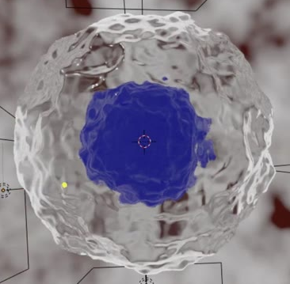
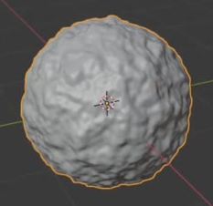
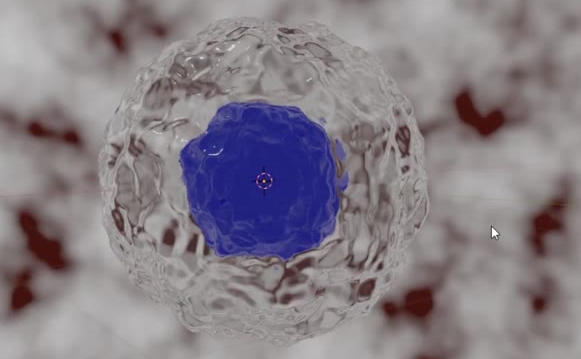

# Stylized Nucleated Cell

Create a stylized biological cell with a saturated blue, organically uneven nucleus suspended inside a larger transparent membrane. Both surfaces share the same irregular character. Present the cell against a softly mottled red-and-white microscope-like background.

The reference shows the completed cell in a rendered viewport. Its cursor and light-guide overlays are not part of the asset.

## Starting Scene

Use Blender 5.1.2 with Cycles and GPU rendering. Start from an empty scene and create the geometry from native primitives. No external assets are required or provided; the `input/` directory is empty. Create the surface variation and background procedurally.

## Cell Geometry

The nucleus is a single compact, approximately spherical body covered with soft, irregular bumps and shallow depressions. Distribute this relief across the whole surface. Preserve the rounded overall shape; avoid spikes, deep tears, flat faces, or a regular repeating pattern.

Use sufficient evaluated geometry for the irregular outline and relief to remain smooth at close inspection. The nucleus and membrane must both be closed surfaces with consistent outward normals, smooth shading, and no visible faceting, holes, or self-intersections.

## Nested Proportions

Enclose the nucleus completely within a separate membrane. The surfaces share a center and a matching overall spherical form, with a continuous visible gap between them. The membrane's diameter is approximately 1.7 times the nucleus diameter; use a ratio between 1.6 and 1.9 along each principal axis. Neither surface may touch or intersect the other.

The membrane's irregular surface must read as an enlarged version of the nucleus, with corresponding bumps and depressions at the same angular locations around their shared center.

## Shared Procedural Relief

Keep the geometric relief editable through a procedural pattern shared by both surfaces. A change to the shared pattern scale must change the size or spacing of the bumps on both surfaces while preserving their correspondence and nested relationship. Restoring the previous value must restore the original cell shape. The default saved state must show the completed organic relief.

Equivalent procedural implementations are acceptable. The visible relief must affect evaluated geometry and the silhouette, rather than exist only as a shading effect or an unconnected procedural setup.

## Surface Appearance

Give the nucleus its own opaque, saturated deep-blue material with gentle gloss. Its color must remain clearly blue in the finished image, with enough local shading to reveal the bumps.

Give the membrane a distinct, nearly colorless glassy material. The nucleus must remain readily visible through its front surface, including its blue color and rounded contour. The membrane must still be visibly present through irregular refraction and soft reflective highlights. Avoid a completely invisible shell, frosted opacity, strong color tint, or dark refraction failures that obscure the nucleus.

## World Background

Create a procedural World background with irregular dark-red blotches dispersed across a bright white or very light gray field. Mix smaller and larger patches with softened edges, resembling out-of-focus material on a microscope slide. Keep the background subordinate to the cell.

The pattern must come from an editable procedural shader. Changing its pattern scale must visibly change the blotch spacing or size; restoring the original value must recover the saved appearance. Use the World to surround the view without a floor, horizon, or visible image boundary.

## Lighting And Presentation

Illuminate the cell with broad, soft contributions from above, below, and opposing sides. The lighting must reveal the membrane around its outline and its surface relief while keeping the blue nucleus distinct. Balance the illumination so no large part of the cell disappears into darkness or washes out to featureless white.

Frame the entire cell prominently with breathing room around the membrane. The final image must show the nucleus visibly inside the shell, the full outer silhouette, and enough surrounding background to establish the microscope-like setting. Keep the image free of viewport overlays, visible light shapes, labels, and unrelated objects. This is a static asset; no animation is required.

## Deliverables

- `submission.blend`: the complete editable scene, including the shared procedural relief, materials, World, lighting, camera, and saved render settings.
- `build.py`: a Blender Python script that recreates the scene from an empty scene and saves `submission.blend` without manual editing or external dependencies.
- `B60_Stylized_Nucleated_Cell.png`: a PNG rendered from the actual submitted scene using the saved camera. Do not substitute a source image, viewport screenshot, or externally created replacement.
