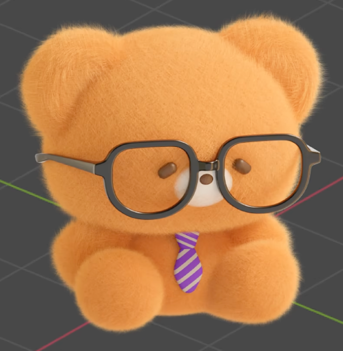
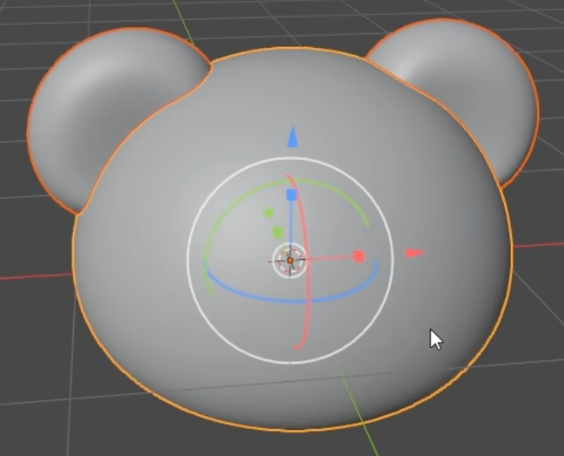
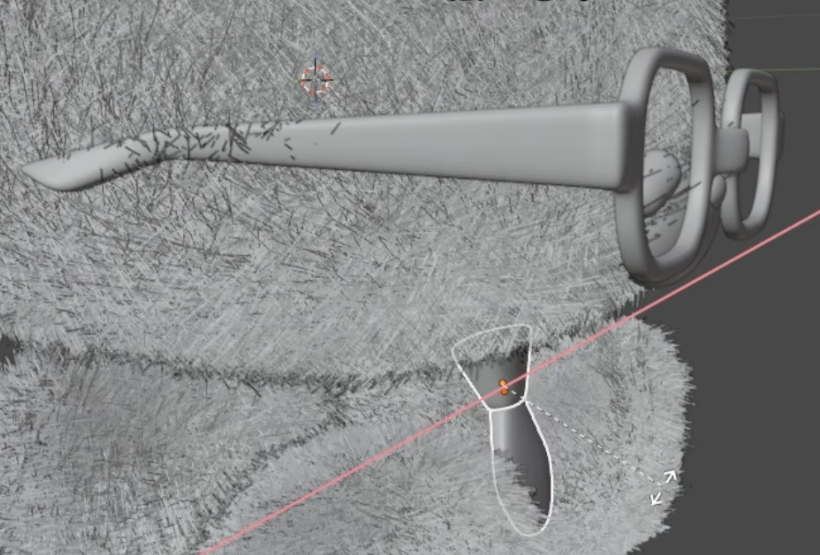
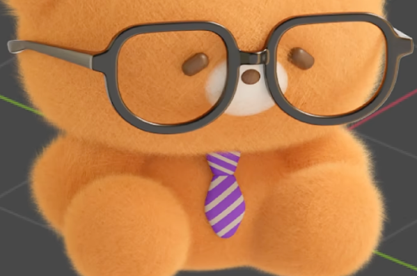

# Bespectacled Teddy Bear

Create a compact, seated teddy bear with an oversized rounded head, dense short fur, large dark glasses, and a purple-and-gray striped tie. The result should have the soft proportions and clear facial layering shown in the references, with editable geometry, fur, and materials.

## Starting Scene

Use Blender 5.1.2 and start from an empty scene. The `input/` directory is empty; build the bear and accessories from native Blender geometry. Use Cycles with GPU rendering for the final image. No external model, texture, or environment image is required.

## 1. Bear Silhouette

Build a dominant, broad head with rounded cheeks, a gently flattened chin, and substantial depth. Place two similarly sized rounded ears at its upper outer corners, with shallow, soft-edged ear hollows. The head should be wider than the compact torso.

Give the torso a softly squared, fuller belly with rounded narrowing at the top and bottom. Add two short feet projecting forward from its lower edge and two rounded arms resting along the belly sides. Keep the paired parts balanced about the centerline. The feet should flow smoothly into the torso, and the arms should meet the body without visible gaps. Preserve the low, seated stance and smooth plush silhouette.

## 2. Facial Features

Place two small oval eyes on the lower half of the head. Add a rounded, projecting muzzle centered between and below the eyes, with a smaller flattened nose on its front upper area. Keep both eyes legible inside the glasses openings. The muzzle must project from the head, and the nose must sit in front of the muzzle. Keep these features editable without reshaping the whole head.

## 3. Fitted Glasses

Make a pair of large, hollow, rounded rectangular frames with visible rim thickness and softly rounded edges. Join the frames with a centered bridge above the nose. Add two temple arms that extend backward from the outer rims along the sides of the head.

Fit the glasses in front of the eyes and muzzle so both eyes remain visible, the bridge clears the nose, and the temples sit close to the head. Preserve the continuous frame openings; lens geometry is optional and must not obscure the face.

## 4. Two-Part Tie

Place a small tie knot beneath the muzzle and a longer hanging blade on the chest centerline. The blade should widen below the knot and taper to a rounded point. Give both parts a little thickness and soften their edges. Keep them close to the chest, with a coherent knot-to-blade connection and without sinking the visible front into the fur.

The knot and blade must support independent material pattern adjustments, whether they use separate objects or another editable material assignment.

## 5. Short Fur

Cover the head, ears, torso, arms, and feet with attached, dense short strands. The coat should lightly soften the silhouette while preserving the ear hollows, limb shapes, facial features, glasses, and tie. Avoid conspicuous bald patches, detached clumps, and long spikes.

Retain a procedural strand system with accessible length and density controls. Changing length must alter the strand reach, and changing density must alter the strand population across the covered parts. These controls must work without manually editing individual strands. Restore the intended short, dense coat before saving.

## 6. Materials and Presentation

Use a consistent warm golden-brown surface and fur color across the bear. Give the muzzle a pale cream color and use darker brown eyes and nose so the facial layers remain distinct. Make the glasses near-black with restrained glossy highlights that reveal their rounded rims and temples.

Apply alternating purple and light-gray diagonal stripes with crisp boundaries to both tie parts. The knot and blade should have visibly different stripe directions, as in the finished reference. Keep stripe direction and spacing independently adjustable for each part; changing one part must leave the other unchanged. The pattern must remain confined to the tie.

Create a clear, softly lit front three-quarter presentation of the complete bear. Keep both ears and feet inside the frame and make the fur, face, frame thickness, and tie pattern readable against a simple background.

## Deliverables

- `submission.blend`: the complete editable scene, saved with the intended fur and material settings and a camera ready for the final composition.
- `build.py`: a reproducible Blender Python script that builds the scene from the empty starting scene and saves `submission.blend`.
- `B61_Bespectacled_Teddy_Bear.png`: a finished PNG rendered from the actual submitted scene using its saved camera and materials. Do not use a source image, viewport screenshot, or external replacement as the render.
