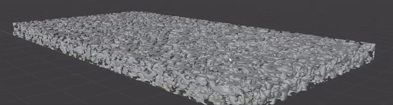
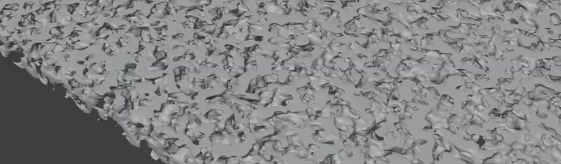
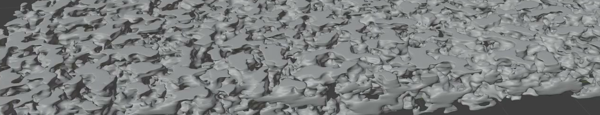

# Procedural Porous Slab

Create a static, thin rectangular slab filled with dense, irregular pores. Its rounded solid webs should form a coherent three-dimensional body, while a live generator keeps the slab dimensions, pore scale, and surface fidelity editable.

## Starting Scene

Use Blender 5.1.2. The input folder is empty; no external model, texture, image, or plugin is required. Begin with an empty scene and construct the asset using native Blender geometry and procedural tools. This is a static asset with no required animation.

## Rectangular Envelope

Keep a broad rectangular footprint and a shallow but visible thickness. Target overall proportions of approximately 11:6:0.5 for length, width, and thickness. Absolute size, orientation, and position are free. Local openings may interrupt the boundary, but the four outer sides should still describe a recognizable rectangular slab.

## Irregular Pore Geometry

Distribute dense geometric cavities and openings across the broad faces, including both the center and the perimeter. Vary their size and direction, with lobed, branching outlines and an organic, nonrepeating arrangement. Avoid a regular grid of matching holes or large uninterrupted solid patches.

The pores must occupy real three-dimensional geometry. Many openings should pass through the slab, with visible finite-thickness rims and irregular internal walls. Their profiles should vary through the depth, producing passages and recesses rather than a flat cutout extruded uniformly. A surface image, bump effect, or transparency mask cannot substitute for these features.

## Connected Body and Finish

Retain a dominant interconnected body, with solid paths extending along the length and across the width. Neighboring cavities should be separated by substantial rounded webs. Small isolated specks are acceptable, but disconnected flakes must not replace the main slab, and broad accidental tears should not destroy its footprint.

Give the pore rims, internal walls, and connecting webs smooth, continuous contours and shading. Preserve the small openings and narrow connections while removing conspicuous voxel steps, broad planar faceting, shading seams, and spikes. The thickness should remain visible along the porous outer sides.

## Live Procedural Controls

Keep a live generator that evaluates a spatially varying three-dimensional field within an editable rectangular domain. Equivalent native implementations are acceptable. Provide discoverable settings for the following relationships; descriptive labels or concise comments in build.py may identify them.

- Pore scale: changing this setting must regenerate visibly coarser or finer pore geometry while the slab envelope stays fixed. A useful nearby range should retain a porous slab, and restoring the setting should restore the saved result.
- Domain dimensions: length, width, and thickness must be independently editable. Enlarging the domain while holding the pore scale fixed should generate additional field-based structure in the added region, rather than merely stretching the existing holes or scaling the finished object.
- Surface fidelity: provide a lower-cost preview and a finer final setting. Increasing fidelity should refine pore boundaries and small connections while preserving the broad spatial pattern and envelope. Save the asset at the finer setting.

## Final Presentation

Use a neutral, opaque material and lighting that make the pore walls and their depth easy to inspect. Frame the complete slab in an oblique view that shows its broad face and at least one porous side. Keep the background quiet and avoid decorations or lighting effects that conceal the geometry. Configure Cycles with GPU rendering.

## Deliverables

- `submission.blend`: the complete scene with the live generator, final settings, materials, lighting, and render camera retained.
- `build.py`: a Python script that reconstructs the scene from a clean Blender file, restores the editable relationships, and saves `submission.blend` without external dependencies.
- `B62_Procedural_Porous_Slab.png`: a PNG rendered from the actual submitted scene using the final presentation above. The complete slab and its pores must remain legible. A source image, viewport screenshot, or externally substituted image is not an acceptable render.
