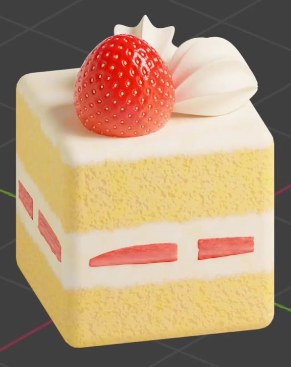
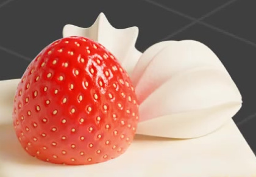
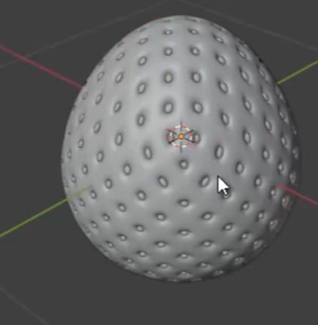
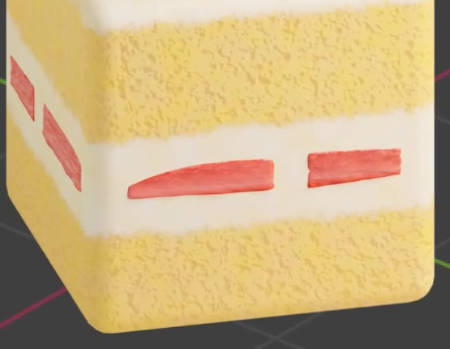

# Square Strawberry Cream Layer Cake

Create an editable square cake with rounded edges, yellow sponge and white cream layers, two fluted cream decorations, a whole seeded strawberry, and red fruit pieces in the filling. The result should read as a small, richly textured dessert with soft cream and moist fruit.

## Starting Scene

Use Blender 5.1.2 and Cycles with GPU rendering. Start from an empty scene. The `input` folder is empty; create the cake and decorations from native geometry and procedural materials. Build the whole strawberry from a rounded, tapered body with repeated seed detail. No external model, texture, or plugin is required.

## Cake Body and Layer Layout

Make a compact, nearly cubic cake with a square footprint, broad flat side faces, a level top, and softly rounded vertical corners and perimeter edges. Keep the overall silhouette firm and smooth.

From bottom to top, show yellow sponge, a broad white cream filling, another yellow sponge band, and a thinner white top coating. The layers must continue around the cake, with approximately horizontal boundaries and mild natural variation. Preserve a clear difference between the two sponge bands and the central filling.

## Cream Piping

Place two cream decorations on the top, behind and beside the strawberry. Each should have a plump shell-like body, several deep lengthwise folds, and a narrowed end. Their folds should form smooth rounded ridges and valleys instead of sharp fins. Give the pair slightly different orientations while keeping both in contact with the top coating.

## Strawberry and Filling Geometry

Place one rounded, tapered whole strawberry prominently on the top. Give its surface a distributed pattern of shallow seed recesses with small seeds seated within them. The seeds and recesses must have visible relief in oblique views. A slight lean is appropriate. The body should remain smooth between the seed details.

Make multiple thin, irregular fruit pieces visible in the central cream band on each of the two side faces seen in the final view. Use elongated shapes with softly rounded edges and modest variations in size and angle. Embed them in the cream so that their red exposed faces read as pieces inside the filling rather than detached ornaments.

## Material Appearance

Give both yellow sponge bands a fine, irregular porous crumb with small pits and subtle yellow variation. Keep the texture fine enough that the broad cake silhouette remains smooth. The white filling and top coating should be visibly smoother than the sponge.

Use a consistent warm-white cream appearance for both piped decorations, with gentle color variation and very fine surface texture. Preserve their broad soft highlights and readable folds.

The whole strawberry should be rich red with glossy highlights and pale yellow seeds. The filling pieces should have a softer red-to-pink flesh appearance, with lighter internal streaks, irregular color variation, and subtle surface relief. Keep these fruit materials distinct from the cream and sponge.

## Editable Surface Controls

Keep the cake, piping, strawberry, and filling pieces editable as three-dimensional geometry. Preserve adjustable procedural material inputs for the layer proportions, sponge crumb scale, and fruit-pulp variation scale. Existing material inputs or custom controls are both acceptable.

Changing each of these three inputs must produce its corresponding visible change while leaving the other features recognizable. A change to the cream appearance must update both piped decorations consistently. Keep the saved scene in the reference appearance after testing the controls.

## Presentation

Compose a clear three-quarter view showing the top and two side faces. Keep the entire cake and all top decorations inside the image. Use soft lighting that reveals the piping folds, seed relief, sponge pores, and embedded filling without washing out the white cream or red fruit. Use an unobtrusive background and retain natural contact shadows.

## Deliverables

- `submission.blend`: the complete editable scene, saved with its final camera, materials, and Cycles GPU render configuration.
- `build.py`: a reproducible script that builds the scene from an empty Blender file, saves `submission.blend`, and produces the required PNG without external assets.
- `B63_Square_Strawberry_Cream_Layer_Cake.png`: the final still image rendered from the actual submitted scene. Do not substitute a reference image, viewport screenshot, or externally produced replacement.
