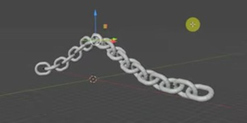
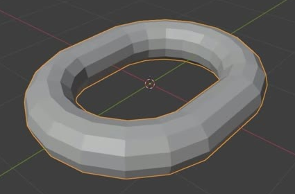
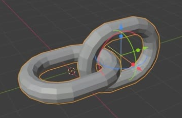
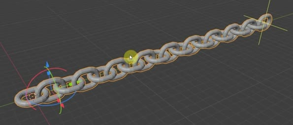

# Procedural Arched Chain

Create an editable chain of twenty interlocked links, rising over one rounded central peak with both ends descending and extending away. The links have a chunky, faceted, rounded-rectangle form. A shared link outline, a live length control, and a separate editable path must continue to control the finished asset.

## Starting Scene

Use Blender 5.1.2 and start from an empty scene. No external input assets are provided; the input directory is empty. Construct the link and its guide from native Blender geometry. Use Cycles with GPU rendering for the final image. This is a static asset with editable controls; no animation is required.

## Link Form

Each undeformed link is one closed stadium-shaped loop with two straight parallel sides and rounded ends. Keep a clear opening through its center. Its outer length is approximately 1.25 times its outer width, and its tube diameter is approximately 0.23 times that width. Keep these ratios within 10 percent of their targets; overall scene scale is free. Measure the link before the path bend is evaluated.

The tube has a round but visibly faceted cross-section, with consistent thickness around the entire loop. Preserve the deliberate faceting visible in the reference while avoiding breaks, doubled surfaces, spikes, and accidental shading seams. All copies share the same undeformed proportions.

## Interlocking Run

In the straight, undeformed run, neighboring links alternate between perpendicular planes about the run's lengthwise axis. Keep their plane angle within 5 degrees of a right angle. This alternation must continue through the whole chain.

Each neighboring pair must pass through the other's opening. Choose spacing that produces a connected chain with small clearances or surface contact, without one solid tube penetrating another. The relationship must remain intact in the final arched configuration, including near the apex. Mild shape changes caused by bending individual links are expected.

## Arched Shape

The finished run contains exactly twenty links and follows one smooth, open spatial path. Its highest region is near the middle, with a rounded transition into two descending arms. Both ends continue outward beyond the central arch. Retain the reference's slight asymmetry: one end sits a little higher and the run has a gentle sideways sweep. Either mirrored orientation is acceptable.

Avoid a flat row, a sagging center, an abrupt corner at the peak, or a twisted bundle. The guide may be shorter than the generated chain; straight extensions beyond its ends are acceptable. The guide is an editing control and must not appear as an extra visible tube in the final image.

## Shared Link Source

Keep a single editable closed outline as the common source of the repeated links, with an independently editable tube thickness. Editing the source outline must update the shape of every generated link. Editing thickness must change the tube on every link without changing the repeat count. The source geometry must remain available in the submitted scene.

Equivalent native procedural implementations are allowed. The saved asset must retain these dependencies, so independent hand-shaped copies or a baked final mesh alone are insufficient.

## Live Length Control

Provide one discoverable integer control for link count, saved at twenty. Changing it must regenerate the chain from the shared link source while preserving consistent spacing and alternating orientation.

The control must work at sixteen and twenty-four links, as well as at one link for source inspection. Provide non-destructive access to the straight repeated run with the guide bend bypassed. Restore the twenty-link arched state before saving.

## Editable Path

Use a separate editable open Bezier guide with independently adjustable ends and a central apex control. The guide must bend the complete generated run. Moving the apex upward must raise the central chain region; moving one end laterally must reshape the adjacent arm. These edits must evaluate without manually editing individual links or rerunning the construction script.

Keep count and path edits independent: changing the count preserves the guide, and changing the guide preserves the requested count. Bypassing the bend reveals the straight chain. Restore the reference-like arch for delivery.

## Deliverables

- `submission.blend`: the complete editable scene, saved in its twenty-link arched state, with the shared source, count control, path, and final render setup available. Make the controls easy to identify in the scene or through concise comments in the build script.
- `build.py`: a Blender Python script that recreates the scene and its editable behavior from an empty scene, saves `submission.blend`, and produces the final PNG. Use native Blender functionality and portable paths.
- `B64_Procedural_Arched_Chain.png`: a PNG at least 1280 pixels wide, rendered from the actual submitted scene. Show the entire chain in a clear three-quarter view with enough contrast to inspect the openings, alternating links, and apex. A simple neutral gray surface and unobtrusive background are sufficient. Do not substitute a source image, viewport screenshot, or external image for the render.
