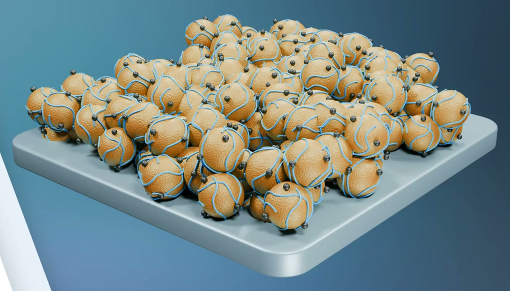
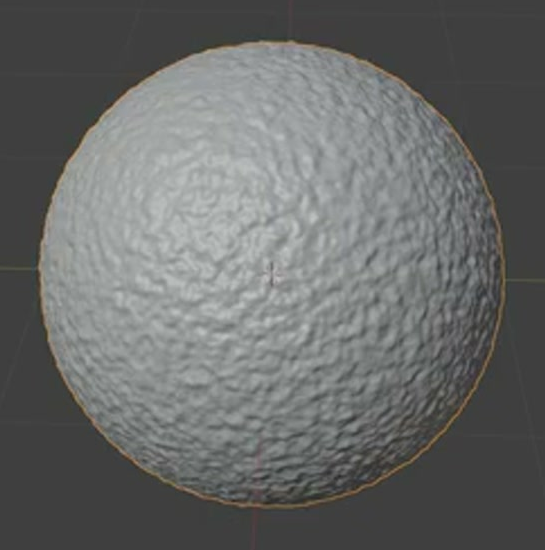
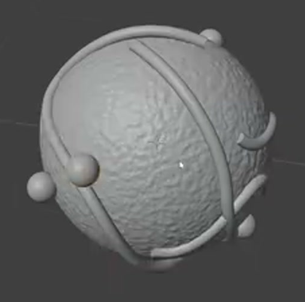
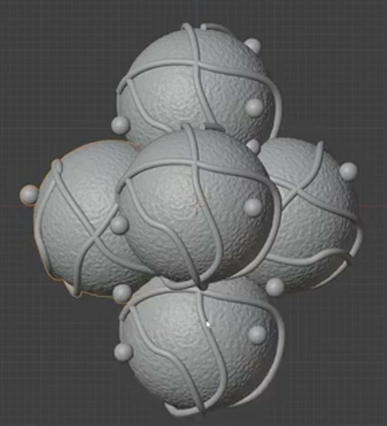
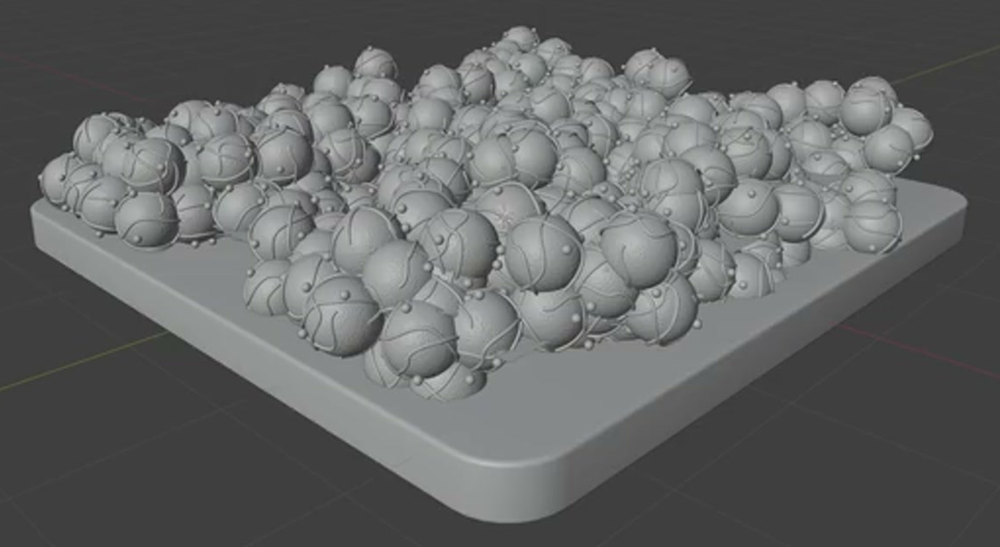

# Wrapped Particle Pile

Create a static Blender scene showing a dense, irregular pile of wrapped spherical particles on a rounded square slab. Each particle combines a finely roughened body, thin open tubular wraps, and small attached spheres. Retain an editable cluster source and a reusable scatter system.

The reference establishes the warm particle bodies, pale blue wraps, dark small spheres, and cool neutral support.

## Starting Scene

Use Blender 5.1.2 and Cycles with GPU rendering. Start from an empty scene and create the geometry with native Blender tools. No external input assets are provided or required; the input folder is empty. The reference pictures are appearance guides, not textures to place in the scene.

## 1. Wrapped Particle

The main body must remain broadly spherical while carrying dense, shallow, irregular geometric relief. It should read as a finely pebbled surface at close range, with a continuous rounded silhouette and smooth shading. Avoid long spikes, torn surfaces, and conspicuous flat facets.

Place multiple slender round tubes around the outside of the body. Their paths must wrap across different sides and directions, with continuous bends and comparable thickness. Keep the paths open, with separated visible tips. They should closely follow the body for most of their length; small local gaps and crossings are acceptable, but large floating loops or long buried sections are not.

Add several much smaller smooth spheres at different locations around the body. They must contact or shallowly overlap the body or a wrap, and remain visibly spherical. They do not all need to mark wrap endpoints.

## 2. Reusable Cluster

Arrange a small group of complete wrapped particles into a compact three-dimensional cluster. Use different particle orientations and offset their centers in depth as well as across the cluster. Neighboring particles should touch or overlap slightly while their rounded bodies remain individually readable. Avoid a flat row, a uniform grid, detached particles, or deep intersections that erase the component shapes.

Retain this cluster as an editable source for the pile. Each particle in the source must include the body, wraps, and small spheres described above.

## 3. Rounded Support

Create a shallow solid slab with a near-square footprint, flat upper face, visibly rounded plan-view corners, and softly rounded perimeter edges. Its thickness must remain clear from an oblique view. Keep its top flat and its sides smooth, without warped faces or sharp accidental corners.

## 4. Editable Scatter

Generate the pile by repeating the retained cluster across a bounded region on top of the slab. Preserve a functional relationship to the source: editing a visible feature of the source cluster must update that feature throughout the generated copies after reevaluation. Keep the source available for inspection without showing an extra isolated source cluster in the final camera view.

Provide identifiable editable controls for quantity or density, random seed, and orientation variation. Native system fields, geometry-node inputs, or an equivalent editable generator are acceptable. Reducing quantity or density must reduce the population. Changing the seed must produce a different layout, and restoring the seed must restore the same layout. Reducing orientation variation to zero must visibly align the cluster orientations; restoring variation must bring back mixed orientations. These controls must affect the evaluated geometry, and must not require manually replacing the scattered particles.

## 5. Pile Arrangement

At the saved settings, many recognizable particles must occupy most of the slab's top and form an uneven, compact pile. Leave a visible strip of slab around the pile so that the support's footprint remains readable. Break up obvious repeated rows and repeated wrap directions. The cluster arrangement and rotations should create clear changes in the pile's height and outer silhouette.

The pile must appear supported by the slab, with particles touching their neighbors where they stack. Small local intersections are acceptable for dense packing. Avoid large floating clusters, extensive buried bodies, large empty regions in the center, or substantial groups extending beyond the support. Keep the slab sides and underside free of scattered particles.

## 6. Surface Finish and Presentation

Use warm yellow to golden-orange bodies, pale blue or cyan wraps, dark charcoal small spheres, and a light cool-gray slab. The body surfaces should read as rough, the wraps as smoother, and the small spheres as gently glossy. Assign these appearances to the actual geometry so that the same distinctions remain visible from other views.

Compose an elevated oblique camera view that includes the entire pile and slab with a small margin. Use controlled lighting and a simple background so that the wrapping paths, small spheres, rounded slab corners, and front-side thickness can be inspected. Keep highlights from obscuring these details. The finished image must contain the modeled scene without interface elements, captions, or stray source copies.

## Deliverables

- `submission.blend`: the complete editable scene, including the retained source cluster, functional scatter controls, materials, camera, and render setup.
- `build.py`: a reproducible Blender Python script that builds the scene from the stated empty starting scene, preserves the source and scatter behavior, and saves `submission.blend`.
- `B66_Wrapped_Particle_Pile.png`: a finished still rendered from the actual submitted scene in Cycles with GPU rendering, with a longest image edge of at least 1600 pixels. Do not substitute a reference image, viewport screenshot, or externally created replacement.
