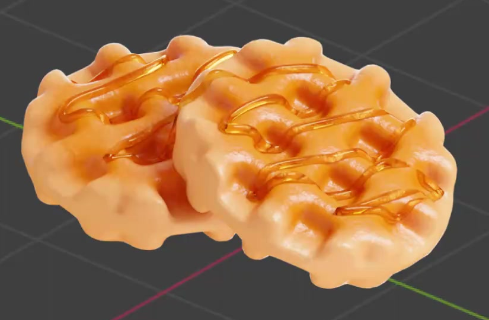
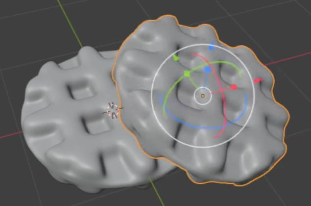
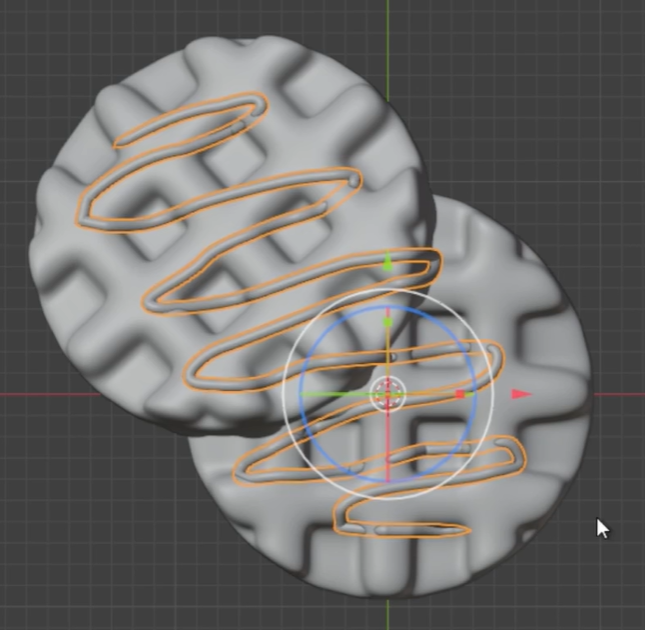

# Golden Waffles With Honey

Create an editable Blender scene containing two softly rounded, golden waffles arranged in a shallow overlap, with a glossy honey drizzle sweeping across both. The result should preserve the broad square pockets, pillowy ridges, pale outer crust, toasted interior, and amber highlights shown in the references.

## Starting Scene

Use Blender 5.1.2 and start from an empty scene. The `input` folder is empty; create the waffles and honey from native geometry and procedural materials. Use Cycles with GPU rendering for the final still.

## Rounded Waffle Bodies

Create two separate, similarly sized waffles with broad, roughly circular silhouettes and a softly scalloped perimeter. Each should read as a substantial but shallow baked piece, with a continuous sidewall connecting its upper and lower surfaces. Preserve a visible thickness around the exposed edges.

## Grid Relief and Geometry Finish

Each waffle must have a repeated orthogonal arrangement of broad square pockets separated by raised, rounded ridges. Make this actual three-dimensional relief with recessed floors and connecting walls; the pockets must remain legible from an oblique view. The outer grid cells may meet the curved perimeter naturally.

Soften ridge intersections, pocket transitions, and the outer edge to create the pillowy form in the references. Keep the evaluated geometry continuous and clean, without sharp accidental spikes, open seams, severe pinching, or visible faceting across the main curved surfaces.

## Honey Drizzle

Create a slender, three-dimensional drizzle that travels back and forth in loose, elongated turns over the exposed tops of both waffles. Its repeated sweeps should cross several ridges and pockets while leaving much of the grid visible. Give the strand a smooth, rounded cross-section and natural ends, without abrupt angular corners or flat ribbon-like segments.

The drizzle must follow the waffle heights and visibly rest against the raised surfaces. Small bridges over individual pockets are appropriate; long floating stretches and deep penetration through the waffles are not. Keep the path and its thickness editable in the submitted scene.

## Toasted Waffle Surface

Apply a shared baked appearance to both waffles. Use a procedural color progression from pale golden outer edges to richer golden and orange-brown tones in the inner patterned region. This variation must be present in the material itself, with an editable light color, toasted color, and transition spread.

Add fine, irregular surface relief that reads as baked texture at close range without overwhelming the square pockets or changing the overall silhouette. Keep the texture scale and strength editable. Waffle highlights should be broad and restrained, visibly softer than the honey highlights; the waffles must remain opaque.

## Honey Surface

Give the drizzle a warm pale-yellow to amber transmissive material. Preserve readable waffle color and form through thinner portions of honey, with refraction and bright glossy highlights that describe its rounded volume. Avoid an opaque painted strand, a metallic wire appearance, or a nearly invisible clear strand.

## Arrangement and Presentation

Place one waffle slightly above and offset from the other, with a modest relative rotation. Their silhouettes should partially overlap, while a substantial patterned area and an exposed outer edge remain visible on each. Make the contact plausible, without a large air gap or deep interpenetration between the bodies.

Use an oblique final camera that shows both upper surfaces, the exposed thickness, and the drizzle. Frame the entire pair with clear margins. Lighting and background should make the toasted gradient, pocket depth, and honey transmission easy to inspect without distracting scene decoration or clipped highlights.

## Deliverables

- `submission.blend`: the complete editable scene, including waffle geometry, honey geometry, assigned materials, camera, lighting, and final render settings.
- `build.py`: a reproducible Blender Python script that builds the complete scene from an empty scene and saves `submission.blend`. Any adjustable material or path settings required above must remain available after the script runs.
- `B67_Golden_Waffles_With_Honey.png`: the final still rendered from the actual submitted Blender scene. Source images, viewport screenshots, and externally composited replacements are not acceptable substitutes.
