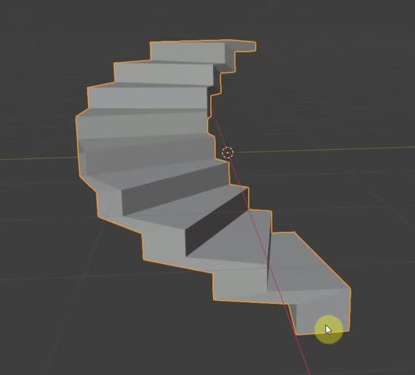
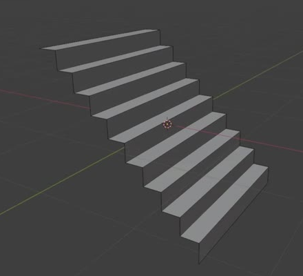
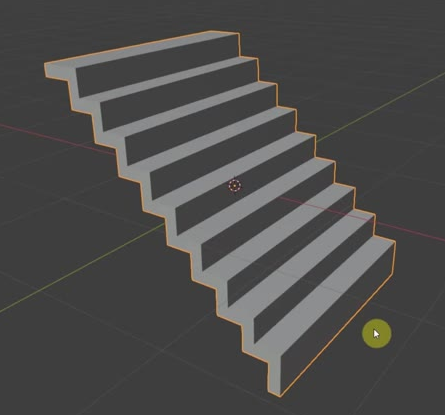

# Editable Curved Staircase

Create a compact, freestanding staircase that rises through a half turn. Its eight regular tread-riser pairs form a continuous folded ribbon, with a clear opening inside the curve and an even solid slab. Preserve editable bending and thickness generation so the straight, unthickened stair surface remains recoverable.

The curved form shows the stepped silhouette and open center. The thickness requirements below apply to the completed asset.

## Starting Scene

Use Blender 5.1.2 and Cycles with GPU rendering. No external input files are provided; `../input/` is empty. Begin with native Blender geometry and construct the staircase. A plain neutral surface and simple lighting are sufficient. Choose any convenient overall scale.

## Stair Profile and Proportions

Make one continuous staircase with eight regular horizontal treads and eight regular upright risers. The regular rises must be equal, and regular treads must have equal depth along the center of the run. Add a horizontal terminal strip beyond the uppermost regular tread and a vertical terminal strip below the lowest regular riser. Each terminal strip should be roughly the size of its neighboring tread or riser, respectively.

In the recoverable straight, unthickened form, use total vertical height `H` as the scale reference: the horizontal run should be about `0.70 H` and the width about `0.64 H`. Keep each within 10 percent of that proportion. The upper terminal strip and lower terminal strip must span the full width. Preserve an angular stair profile with clearly distinct flat treads and upright risers.

The straight ribbon reference shows the connected stair surface and its two terminal strips before the final fitting of its proportions.

## Half-Turn Layout

The final flight must wrap through 180 degrees, within 5 degrees, around a vertical axis. It must curve in plan without tipping or corkscrewing. Treads remain horizontal and risers upright. The outer and inner boundaries form a regular curved sweep, with the inner opening clearly visible and neighboring step ends separated. The staircase must not cross itself or double back.

## Slab and Geometry Finish

Give the folded ribbon a closed, continuous slab with thickness approximately 45 percent of one regular riser height, within 20 percent of that proportion. Thickness must remain even through tread-riser corners, across the width, and from the bottom to the top of the run. In particular, bending must not pinch the inner edge thinner than the outer edge. Close the narrow boundary rims while retaining the open space beneath the folded flight; do not fill the staircase with a solid stair-shaped block.

Keep neighboring steps free of interpenetration. The slab must have coherent outward-facing surfaces, clean corners, and no accidental holes, duplicate faces, visible shading seams, or collapsed regions. Planar faces should read as planar, without rounding away the stepped silhouette.

This straight state shows the continuous slab and closed edge rims. The final curved state must preserve that thickness quality.

## Editable Geometry

Keep a live geometric relationship between the straight stair surface and the finished curved slab. Expose a bend-angle control and a separate slab-thickness control with clear English labels. Native modifiers or an equivalent editable procedural construction are acceptable.

Disabling bending and thickness generation must recover one connected, unthickened straight stair ribbon with open side boundaries, the eight regular tread-riser pairs, and the two terminal strips. It must contain no enclosing side walls, back wall, or bottom panel. Preserve this as editable construction geometry, not a disconnected demonstration copy.

Changing the bend angle from the saved 180 degrees to 120 degrees must produce a visibly more open curved flight with the same steps, unchanged height, horizontal treads, and intact slab. A zero-degree setting must produce a straight flight. Returning the angle to 180 degrees must restore the saved shape.

Changing thickness to 75 percent and 125 percent of its saved value must change the generated slab across the whole flight while preserving its step layout and bend. Thickness generation must act on the bent surface so these variants remain even at inner and outer edges. Returning the thickness to its saved value must restore the finished slab. Deliver the saved scene with the half-turn form and the required default thickness active.

## Deliverables

- `submission.blend`: the complete editable scene, including the recoverable construction geometry, functional controls, a camera, and lighting for the final view.
- `build.py`: a runnable Blender Python script that recreates the scene and its editable controls from the empty input set and saves `submission.blend`.
- `B68_Editable_Curved_Staircase.png`: a PNG rendered from the actual submitted scene using Cycles GPU. Use an elevated three-quarter view that includes the entire staircase and makes the curved sweep, inner opening, individual steps, and slab edges readable. Do not substitute a source image, viewport screenshot, or external replacement.
