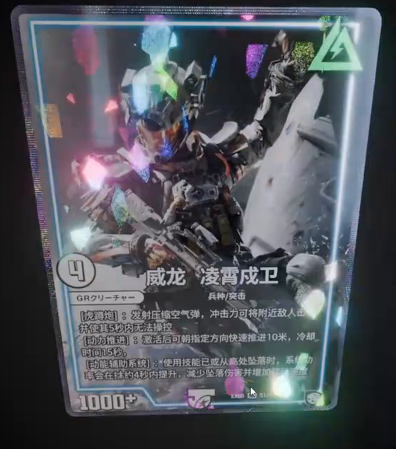
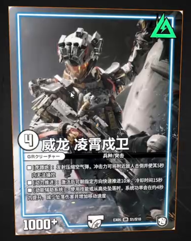
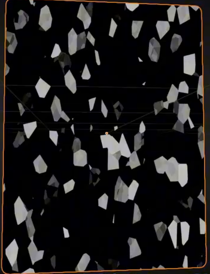
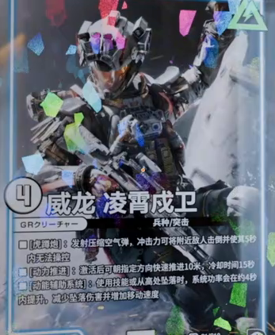
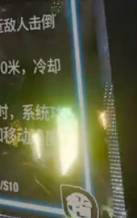

# Glass-Shard Holographic Card

Create a portrait trading card whose printed artwork remains recognizable beneath scattered glass-like foil shards. Changing the viewing angle must move a bright zone across the surface and change the visible colored shards. A finer, independently adjustable foil border and localized star glare complete the result.

## Starting Scene and Input

Use Blender 5.1.2 and Cycles with GPU rendering. Start from an empty scene and construct the card from simple geometry.

Use [front_artwork.png](../input/front_artwork.png) as the card's printed image. This is a low-resolution source-derived bitmap; preserve the artwork as supplied. Its existing lettering does not need to become sharper or be recreated. No starter model or environment image is supplied. Build the lighting with native scene lights or a procedural World.

## 1. Card and Printed Artwork

Create a flat, renderable portrait card with a continuous perimeter and smoothly rounded corners. Preserve the input image's proportions, upright orientation, and complete composition. Keep the illustrated figure, upper-right emblem, lower information area, and printed border visible; the rounded corners must not cut through important artwork.

Map the provided image onto the front surface without tiling, mirroring, or appreciable stretching. The printed surface should have a reflective foil finish while retaining the contrast and detail available in the input. The card does not require a designed back, protective case, or complex layered body.

## 2. Shard Surface

Add a surface effect made of scattered, irregular polygonal patches with angular boundaries and varied sizes. Some patches should be elongated. Gaps must remain between them so the image continues to read as printed artwork beneath the foil. The effect belongs to the card surface; do not replace it with loose fragments floating in space.

Include fine granular variation within the foil response or its transition edges. It should be substantially finer than the large shard shapes, visible in a close view, and free of silhouette displacement. Keep shard density or coverage editable, with a visible change in the patches when that control is adjusted.

## 3. Viewing-Angle Response

Make the bright foil response depend on the viewing direction. A diagonal zone of stronger response must cross the card and activate selected shards while others remain subdued. At a fixed view the result must be stable.

Use separated cyan or blue, pink or violet, and green or yellow hues across the active shards. The colored regions must remain distinct rather than merging into a uniform white sheet. Preserve recognizable artwork between and beneath the highlights.

Check a near-frontal view and views approximately 25 degrees to either side, keeping the card, lighting, exposure, and material settings fixed. The bright zone must visibly occupy different card regions between the oblique views, with a smooth transition through intermediate views. The active shard response should change with the view; a color pattern permanently painted into the image is insufficient. Keep both sweep width and foil intensity editable without replacing the artwork.

## 4. Independent Foil Border

Surround the central face with a narrow, continuous foil rim that follows the rounded outline. Give it a denser, directionally organized texture than the broad central shards, such as fine linear or grid-like sparkle. It must remain visually distinct from the printed border already present in the image.

The rim should catch colored highlights while leaving the image composition intact. Its texture density and brightness must be adjustable independently of the center: changing the rim must not replace or recolor the central artwork and shard pattern.

## 5. Final Presentation

Present the complete card against a dark, quiet background with enough surrounding space for the outline and glare to remain visible. Choose a slightly oblique view that reveals the rounded outline, printed image, colored shards, and fine rim together.

Add localized star-shaped glare and soft glow around the strongest highlights in the rendered image. Preserve dark areas and the recognizable figure and information area; broad bloom must not wash over the entire card. The star glare must arise from the scene's highlights through the render or compositing setup, not from painted stars or an externally overlaid image.

Keep the surface, border, and presentation adjustments editable. The delivered scene must reproduce the effect after reopening, including when the viewing angle changes. A timeline animation is not required.

## Deliverables

- `submission.blend`: the editable scene with the supplied artwork packed, the final camera and compositing setup, and Cycles GPU rendering configured.
- `build.py`: a reproducible Blender Python script that builds the scene from an empty scene and the supplied input, saves `submission.blend`, and renders the final image.
- `B69_Glass_Shard_Holographic_Card.png`: the final PNG rendered from the actual submitted scene. It must not be a source-video frame, viewport screenshot, or external replacement image.
