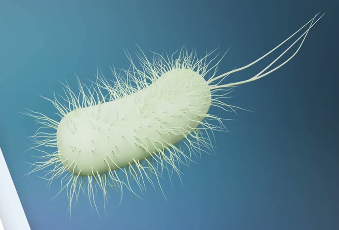
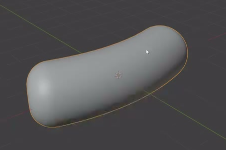
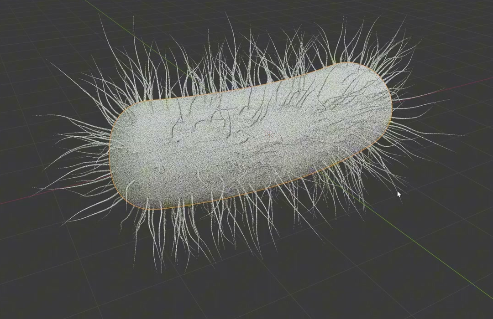
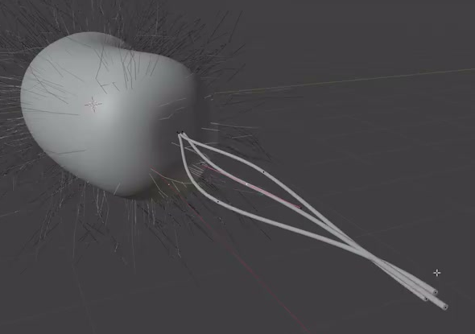

# Stylized Bacterium with Three Flagella

Create a static, editable bacterium with a gently curved capsule body, a distributed covering of short irregular surface filaments, and three much longer flagella emerging from one end. Preserve the clear distinction between the compact body, the fine surface covering, and the three sweeping tails.

## Starting Scene

Use Blender 5.1.2 and Cycles with GPU rendering. Start from an empty scene and construct the geometry using native Blender tools. The input directory is empty; no external model, image, texture, or plugin is required. This is a static modeling task, so no timeline animation is required.

## 1. Curved Capsule Body

Make one elongated, solid body, roughly three body widths long. Both ends must close with rounded caps that blend into the side wall. Give the body a gentle, continuous bend while retaining its capsule character and substantial volume throughout the middle.

The evaluated body must have a smooth silhouette and smooth shading across its sides and rounded ends. Avoid a sharp central kink, flattened open ends, visible faceting, or pinched transitions. Use proportions rather than a prescribed world-unit size.

## 2. Short Surface Filaments

Cover the body with many fine three-dimensional filaments generated from its surface. Distribute roots over the side walls and both rounded ends, including the back of the body. The roots must meet the evaluated body surface, with the strands extending outward instead of floating beside it or disappearing inside it.

Most short filaments should be shorter than the body width and much shorter than the long flagella. Their paths must show irregular curvature and varied directions rather than a uniform straight brush. Keep individual strands slender and the covering open enough that the body silhouette and side wall remain readable.

## 3. Three Long Flagella

Create exactly three long flagella emerging from a small shared region at one rounded end. Each root must meet the body, and each flagellum must extend for a length comparable to the body length or longer. Shape three continuous, gently sweeping paths with visible separation in their middle sections and differing end directions. They may approach or cross one another, but must remain recognizable as three individual tails.

Give the flagella narrow, round cross-sections, smooth tubular surfaces, and ends that taper down to fine closed tips. Keep the paths free from sharp angular breaks. Their thickness must remain small compared with the body width while making the long tails readable.

## 4. Editable Geometry

Keep a reusable surface-filament system with independent controls for coverage density, overall filament length, and the amount of irregular curvature. Each control must visibly update its corresponding property of the generated filaments while preserving the body shape and the shapes of any existing long flagella.

Keep each long flagellum's path independently editable. A local path adjustment on one flagellum must leave the other flagella and the body unchanged, while retaining that flagellum's continuous tubular form. Equivalent curve, hair, mesh, or procedural implementations are acceptable; the behavior and evaluated geometry are what matter.

## 5. Presentation

Present the organism in an uncluttered three-quarter view that reveals the curved body and separates the tail paths. Frame the complete modeled organism, including the tips of the short filaments and long flagella. Use simple lighting and a contrasting background so the body volume, fine covering, and slender tails remain readable. A restrained neutral or pale material is sufficient; the reference's graphic layout and exact colors are not required.

## Deliverables

- `submission.blend`: the editable scene with the body, surface-filament controls, independently editable flagella, and a camera and lighting suitable for the final image.
- `build.py`: a Blender Python script that reconstructs the scene from an empty scene in Blender 5.1.2, preserves the required editable behavior, saves `submission.blend`, and renders the final PNG using Cycles GPU.
- `B70_Stylized_Bacterium_With_Three_Flagella.png`: the final still rendered from the actual submitted scene. It must show the complete organism described above. Do not substitute a source image, viewport screenshot, or externally generated replacement.
