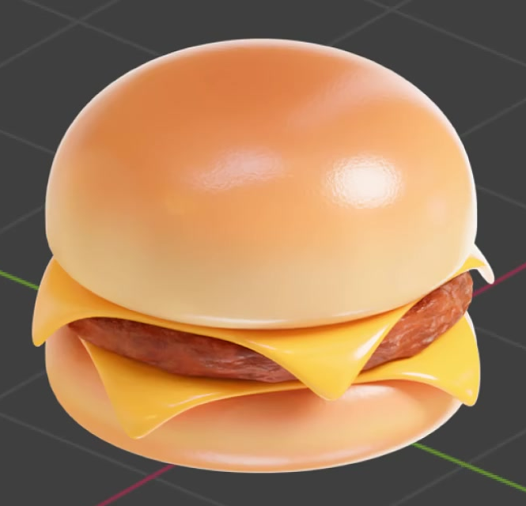
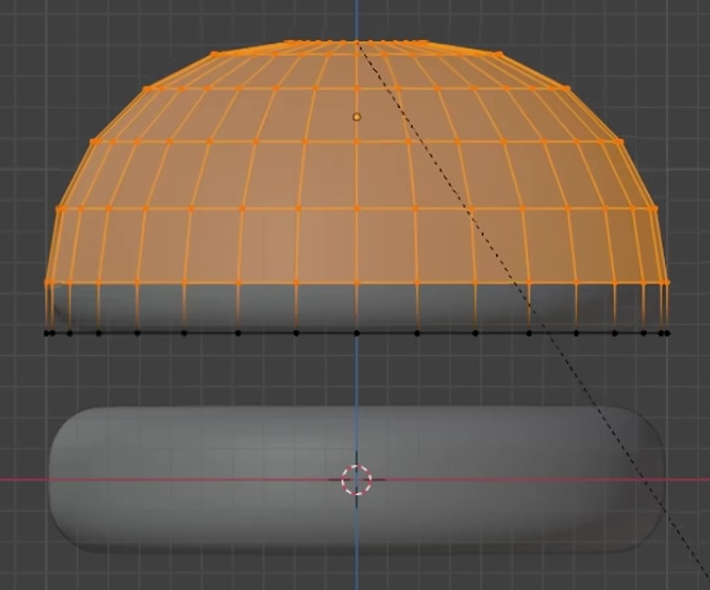
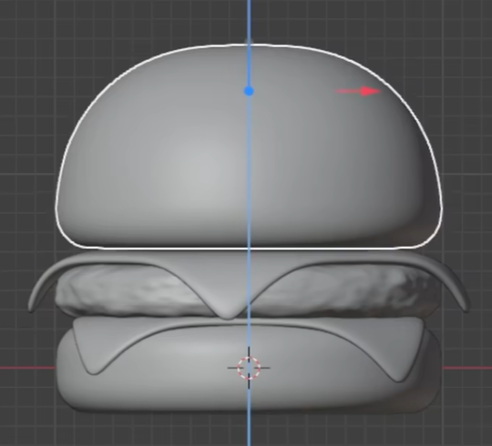

# Cartoon Cheeseburger

Create an editable cartoon cheeseburger with a tall rounded top bun, a shallow bottom bun, two soft cheese slices, and one textured meat patty. The finished asset should have warm baked bread, glossy yellow cheese, and a darker, rougher patty.

## Starting Scene

Use Blender 5.1.2 and Cycles with GPU rendering. The input folder is empty. Start from an empty scene and create the burger from native Blender geometry. Keep the ingredient components separately editable. The required result is a static model.

## Bun Shapes

Create two broad buns with similar circular footprints. The upper bun is a rounded dome with a softly flattened underside; it is clearly taller than the lower bun. The lower bun is a shallow, rounded disc with a broad supporting top. Both have smoothly rounded outer rims and clean shading without visibly faceted edges or pinched poles.

## Cheese Slices

Create two broad, roughly square cheese sheets with rounded corners and visible but thin solid edges. Each sheet has a supported central area and soft bends that carry its projecting corners downward. Preserve the thin, flexible appearance through the curved edges, without torn surfaces, self-intersections, or sharply creased folds.

## Patty Shape

Create one flattened, round meat patty. Its width is close to the bun width and its thickness is much smaller than its width. Give its perimeter and exposed side a gentle, irregular lumpy form while preserving a coherent disc silhouette. The patty must remain a substantial visible ingredient rather than a thin line between the cheese slices.

## Layered Assembly

Arrange the ingredients from bottom to top as lower bun, cheese, patty, cheese, and upper bun. Keep the buns and patty centered around a common vertical axis and the stack compact, with convincing contact between adjacent layers. Offset the two cheese slices around that axis so their hanging corners are visibly staggered. From a three-quarter view, both cheese layers and the exposed patty must remain distinguishable. Avoid floating layers and deep intersections that hide the intended ingredient boundaries.

## Bun Materials

Use procedural materials to give both buns smooth baked-color transitions. The top bun should fade from a pale golden lower edge into a warmer orange-brown crown. The lower bun should also combine pale golden and toasted orange-brown areas, following its rounded form. Keep the gradients soft, without abrupt color bands or visible seams.

Add fine procedural surface grain to both buns. It should read as subtle bread texture under highlights while leaving the large rounded form smooth. The buns should have a soft sheen. Keep the baked-color distribution and the grain scale and strength editable within the materials; changing one should not require rebuilding the geometry.

## Filling Materials

Give both cheese slices a consistent warm yellow material with smooth, glossy highlights that follow their curved surfaces. Keep the cheese opaque and visually distinct from the buns and patty.

Give the patty a procedural dark reddish-brown material with irregular color variation and a visibly uneven fine surface texture. Its texture should be stronger and its highlights broader and less polished than the cheese. Keep the color variation and texture scale and strength editable within the material. The patty's fine surface texture should remain distinct from its larger geometric lumps.

## Deliverables

- `submission.blend`: the complete editable scene with the finished burger, working materials, and a camera and lighting ready for the final render.
- `build.py`: a reproducible Blender Python script that builds the scene from an empty scene, saves `submission.blend`, and renders the required image without external assets.
- `B71_Cartoon_Cheeseburger.png`: a finished Cycles GPU render from the actual submitted scene. Use a clear three-quarter view that shows the whole burger, the rounded crown, both cheese layers, and the patty. Preserve readable surface detail and avoid clipped geometry, obstructing props, or overexposed highlights. The image must be a scene render, not a reference image, viewport screenshot, or external replacement.
