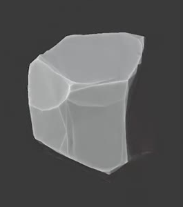
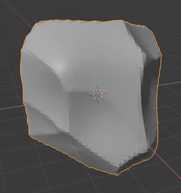
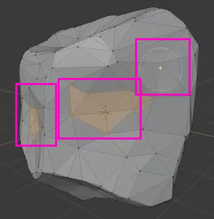

# Voronoi Low Poly Rock

Create one chunky low-poly boulder with broad irregular bulges and large angular facets. Deliver a solid, directly editable rock mesh and a clear static render of the completed asset.

The completed rock reference shows the intended broad planes, uneven outline, and restrained geometric detail.

## Starting Scene

Use Blender 5.1.2 with Cycles GPU rendering. The `input` directory is empty: create the asset from native Blender geometry, starting from a cube or an equivalent rounded block. No external model, image texture, or add-on is required.

The modeled subject is a single rock. A camera, lights, and a simple presentation ground may support its render. Choose a convenient overall scale; proportions and facet structure determine the result.

## Boulder Form

Give the rock substantial volume in all three dimensions and a roughly equant, moderately elongated body. It should read as a compact boulder rather than a thin plate or narrow shard.

Make its outline and shoulder heights visibly asymmetric in front, side, and top views. Distribute a few broad angular bulges and shallow recesses around the body, with unequal flat-ish regions between them. Avoid thin spikes, deep branching cuts, a regular sphere, or the six intact faces of an undeformed cube.

This earlier state illustrates the scale of the broad bulges and recesses; the finished surface must have the cleaner, larger facets shown in the completed reference.

## Facets and Density

The finished rock must be an actual low-poly mesh with no more than 300 editable vertices. Fewer vertices are acceptable when the required form and facets are retained. Its contour and major planar regions must be present in the mesh itself. The final visible rock should correspond to that editable mesh.

Use large irregular facets of varied size and orientation. Broad planes should meet along angular boundaries, with smaller transition faces where needed. Triangles, quads, and planar n-gons are all acceptable when they support the form. Keep the larger planes free of tight vertex clusters, tiny triangle fans, degenerate faces, and long narrow slivers that add no useful shape.

The marked clusters in this earlier mesh are examples of unwanted clutter. Preserve the surrounding facet boundaries while producing clean, uninterrupted planes in the final rock.

## Mesh Integrity

Deliver one connected, closed rock shell with an enclosed volume. The surface must have no holes, internal duplicate faces, loose fragments, or self-intersections.

Keep face normals consistent and make the angular planes readable under neutral lighting. Avoid inverted patches, accidental shading seams across a single plane, and smoothing that hides the intended facets. The top, sides, and underside must all be complete.

## Procedural Construction

Generate the broad shape irregularity with a spatial cellular or Voronoi field that displaces real geometry. Preserve that field-to-geometry relationship in `build.py`, so rebuilding the asset reproduces the shaped rock. Its influence should extend across the body and determine the broad relief.

Bake the finished result to the directly editable low-poly mesh described above. Equivalent geometric implementations are acceptable; no particular object name, texture datablock name, modifier sequence, or custom control panel is required.

## Presentation

Use a simple neutral-gray surface and lighting that makes the geometric planes legible. Frame the complete rock in a three-quarter view with visible top and side surfaces, comfortable margins, and no obstruction. Keep the background restrained and the whole silhouette inside the image.

## Deliverables

Submit these three files together:

- `submission.blend`: the completed rock, directly editable mesh, and render setup.
- `build.py`: a self-contained Blender Python script that creates the asset and render setup from a clean scene, saves `submission.blend`, and produces the required PNG. Rebuilding with the same script must reproduce the submitted geometry.
- `B72_Voronoi_Low_Poly_Rock.png`: a static Cycles GPU render from the actual submitted scene using the presentation above. It must show the completed rock, not a source image, viewport screenshot, or external replacement.
