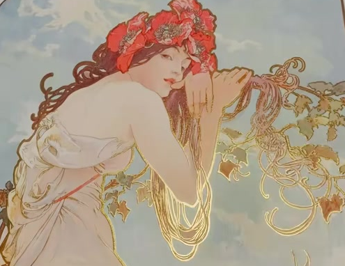
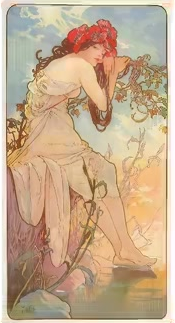
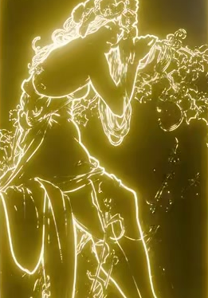
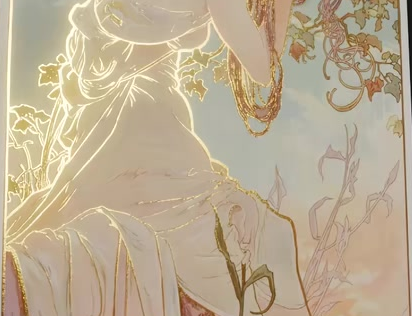

# View-Responsive Gold Foil Card

Create a portrait art card whose colored illustration develops localized luminous gold outlines as the viewing angle changes. The result should retain the printed artwork while a fine, irregular foil response reveals selected contours in the hair, fabric, and foliage.

## Starting Scene and Inputs

Use Blender 5.1.2 and Cycles with GPU rendering. Start from an empty scene and create a simple planar portrait card. Its face must match the colored image's aspect ratio; elaborate card construction is unnecessary.

Use both supplied images:

- [card_color.png](../input/card_color.png): the complete colored illustration, used as the printed artwork.
- [card_line_art.png](../input/card_line_art.png): the corresponding black-line illustration, used to select the gold outlines.

Keep the supplied image files unchanged. Their resolutions and some drawn details differ. Fit them to the same card composition and make reasonable mapping adjustments, while accepting the pair's inherent small drawing differences. Pack both images into the finished Blender file.

## Artwork Mapping

Show the complete colored illustration once across the card face, upright and at its original proportions. Retain its surrounding border, top flowers, lower figure, and bottom edge. Avoid repeated tiles, mirrored artwork, or cropped principal features.

Map the line image to the same orientation and overall composition. Corresponding major regions, including the flowered head, shoulder, hanging hair, dress, and lower border, should remain visually associated when the color and outline layers are inspected separately. Small inherent drawing differences in the supplied pair are acceptable; avoid an additional offset, rotation, or scale mismatch that creates obvious duplicated silhouettes.

## Gold Outline Layer

Extract the dark contours of the line image into an outline-only surface effect. Keep its white paper background inactive. Preserve recognizable internal detail in the hair, fabric folds, and foliage instead of replacing these areas with solid luminous shapes.

Give the active outlines a warm gold color and self-emission. The line cores should remain distinguishable from their surroundings, with fine features readable in a close inspection. A separate outline-layer inspection must show gold marks on a dark or inactive field; the final card must combine this layer with the colored artwork.

## View-Responsive Foil

Make the foil visibility respond to the relationship between the card surface and the viewing direction. Use a fine procedural surface variation to break the response into subtly irregular regions. The card itself should retain a flat silhouette, and the printed illustration should remain visually fixed on its surface.

Set up the material so it can be inspected from a near-front view and with the card turned 25 degrees toward either side around its vertical axis, while lighting and camera distance remain fixed. Across these three orientations, at least one must retain the colored illustration as the dominant appearance, and at least one must show a clearly visible, localized gold-outline region. Both active foil and quieter printed areas must coexist in a useful demonstration view.

During a gradual turn between these orientations, the active gold regions must move or fade smoothly. The effect must not be a permanently visible outline overlay, a full-card brightness switch, or a change driven only by timeline playback. The fine surface variation should add subtle irregularity without producing broad mottled blocks or obscuring the underlying artwork.

## Editable Surface Controls

Provide clearly labeled, working material controls for surface-pattern density, surface-response strength, view-response width, outline selection, and gold color and intensity. Equivalent material implementations are acceptable.

Changing pattern density should alter the scale of the fine variation. Response strength and width should change the amount or spread of the angle-sensitive region. Outline selection should vary the retained fine lines without moving the artwork. Gold color and intensity should change the active outlines without replacing the printed image. These controls must remain usable after reopening the file and must preserve the two image mappings.

## Presentation

Provide a camera composition that shows the complete card against a simple, unobtrusive background. Choose a useful demonstration angle where the colored artwork and localized gold effect are both visible.

Add restrained image-space glare around the bright gold lines. The glow should reinforce their brightness while leaving line cores, adjacent artwork, and quieter regions readable. Keep the card fully in frame, leave clear space around its edges, and avoid a broad yellow veil across the image. The source references include cropped previews; the delivered render must show the whole card.

## Deliverables

- `submission.blend`: the editable card, its view-responsive material and controls, both packed input images, and the complete camera, lighting, and compositing setup. Save a useful demonstration view.
- `build.py`: a reproducible Blender Python build script that creates the scene and material from the supplied inputs, packs its dependencies, and saves `submission.blend`. Resolve the input paths relative to the package or a documented script argument.
- `B73_View_Responsive_Gold_Foil_Card.png`: a finished PNG rendered from the actual submitted scene in Cycles GPU, showing the complete card and its gold effect. Do not substitute an input image, source preview, viewport screenshot, or externally assembled replacement.

This is a static material task. No keyed animation or video deliverable is required.
