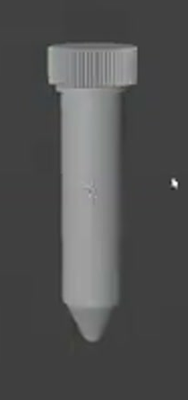
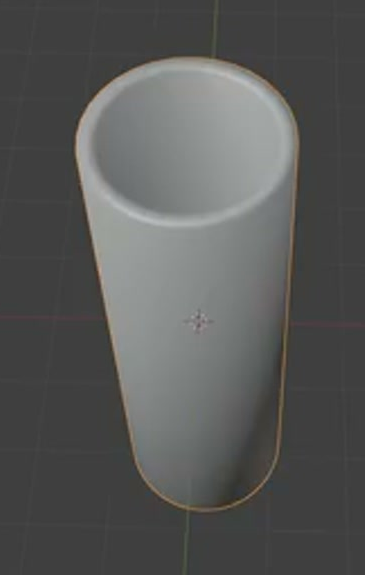
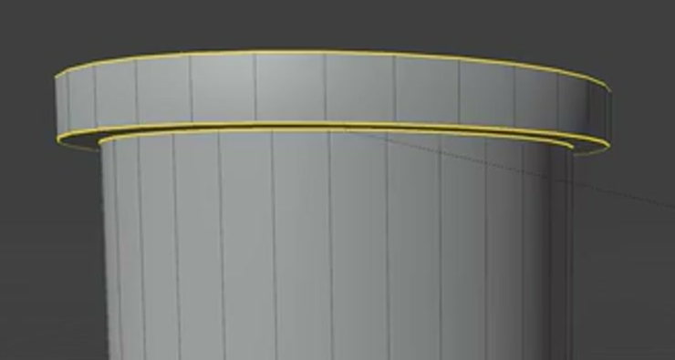
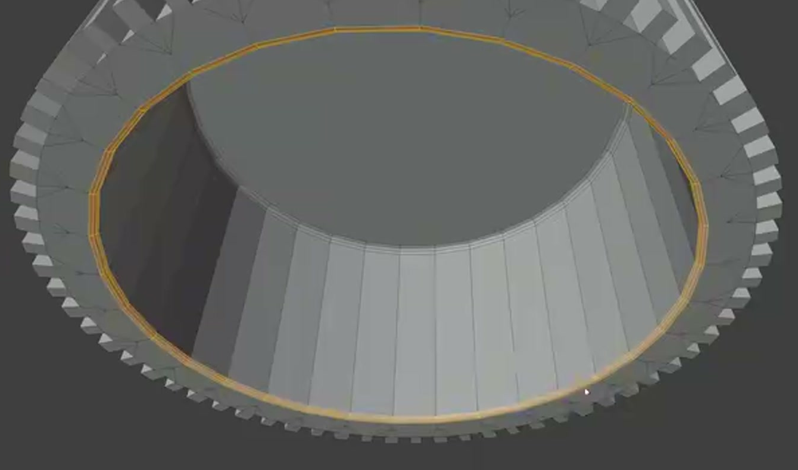
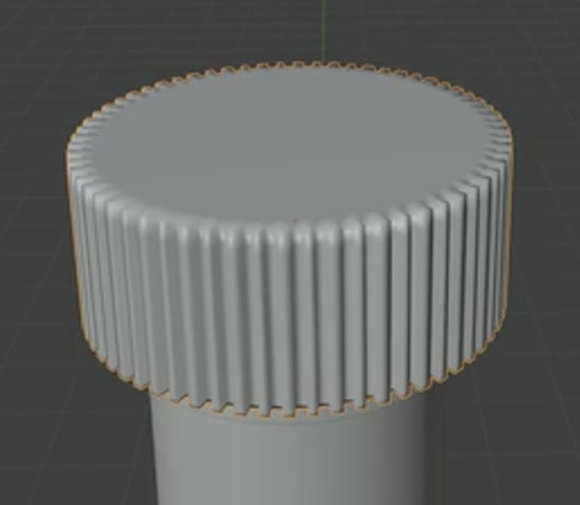

# Centrifuge Tube With Ribbed Cap

Create a static, editable centrifuge tube with a slender hollow body, a rounded conical bottom, an outward mouth flange, and a separate cap with dense vertical grip ribs. Present the cap seated over the tube mouth.

## Starting Scene

Use Blender 5.1.2 and start from an empty scene. No external assets are supplied or required; the `input/` folder is empty. Build the tube and cap from native geometry. Use Cycles with GPU rendering for the final image.

## 1. Tube Silhouette

Keep the tube upright, with a circular cross-section and a straight cylindrical shaft roughly three to four times its own outside diameter in length. Use relative proportions throughout; the model has no required physical size.

Below the shaft, form a short, centered conical section that narrows to a small rounded, closed tip. The cone should be clearly shorter than the straight shaft. Soften its junction with the shaft while preserving a recognizable change from cylinder to taper.

## 2. Hollow Body and Mouth

The tube must be a real container: an open circular mouth leads into a continuous interior cavity, with inner and outer walls joined by a narrow rim. Keep the wall thickness visibly small compared with the body diameter, with no unintended holes through the side or bottom.

At the mouth, include a continuous outward flange whose outside diameter is visibly larger than the shaft diameter. Give this flange a shallow cylindrical band, a clear lower shoulder, and softly rounded edges. The flange must leave the central opening unobstructed.

## 3. Hollow Cap

Make a separate short cylindrical cap, wider than the shaft and with a height roughly half its own outside diameter. Its top is a broad, substantially flat closed disk with a gently rounded perimeter.

The underside must remain open. Include real shell thickness, a continuous inner wall, and a closed inner roof. The underside should show a central roof region surrounded by a concentric transition into a gently inclined inner wall. Preserve a clear circular lower opening; the cap must not be a solid cylinder or a ring open through both ends.

## 4. Grip Ribs

Cover the cap's full outer circumference with dense, evenly spaced vertical ribs. Each rib projects from the sidewall as geometry and extends along most of the cap height. Keep the ribs parallel to the cap axis, consistent in width and height, and separated by visible narrow grooves.

Round the ribs and their ends enough to resemble a molded grip while preserving their distinct relief. Keep the top disk readable as one broad surface and the lower cap edge clearly defined.

## 5. Assembly and Finish

Seat the cap concentrically over the tube mouth. Its cavity must accommodate the flange, with the cap surrounding the mouth rather than hovering above it or visibly cutting through it. The cap should project beyond the shaft on every side, and its lower edge should meet the mouth region in a compact, believable joint.

Keep the cap independently movable so lifting it exposes the intact mouth, flange, and tube interior. The tube and cap must remain editable components; no particular object names, topology layout, or modifier stack is required.

Finish the curved geometry with continuous shading and clean silhouettes. Avoid unintended faceting, pinching, cracks, self-intersections, or collapsed rib grooves. Preserve the shaft's straight profile, the rounded tip, the flange shoulder, and the cap's defined upper and lower edges. A simple neutral surface is sufficient to reveal the form.

## Deliverables

- `submission.blend`: the editable scene saved with the cap seated, all required geometry present, and the final camera and lighting ready to render.
- `build.py`: a script runnable in Blender 5.1.2 that recreates the scene from an empty scene, saves `submission.blend`, and renders the required PNG without external assets.
- `B74_Centrifuge_Tube_With_Ribbed_Cap.png`: a finished PNG rendered from the actual submitted scene using Cycles GPU. Show the complete upright assembly in a slightly elevated three-quarter view, with enough detail and lighting to read the cylindrical shaft, rounded taper, and cap ribs. Use an uncluttered background. The PNG must not be a source image, viewport screenshot, or external replacement.
