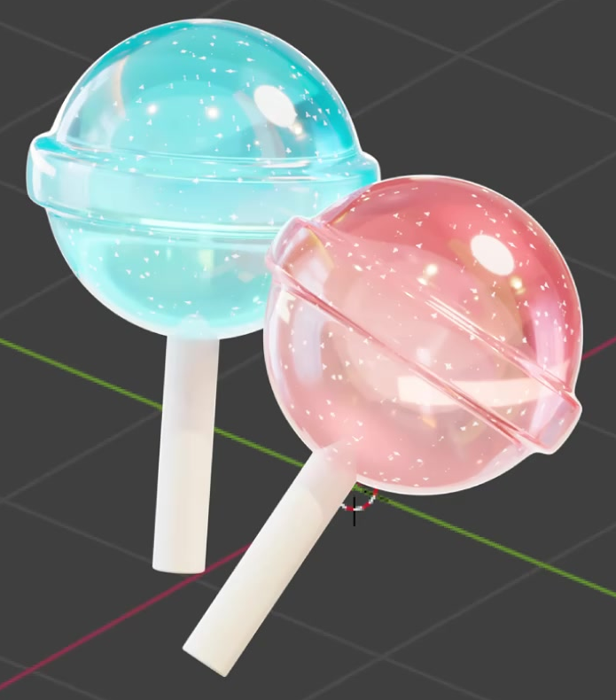
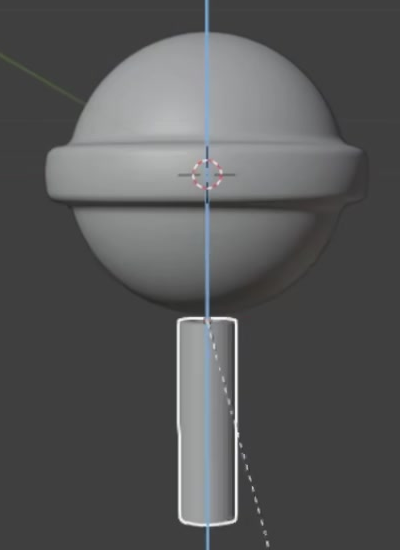

# Transparent Gradient Lollipop

Create a luminous cyan-and-blue lollipop with a rounded transparent candy head, a raised equatorial band, and a pale cylindrical stick. The candy should combine a smooth color gradient, crisp glossy reflections, brighter cyan edges, and scattered fine luminous flecks while retaining a clear sense of depth.

The cyan lollipop is the required subject. The pink example illustrates an optional palette variation.

## Inputs and Setup

Use Blender 5.1.2 with Cycles GPU rendering. Start from an empty scene and create the geometry using native Blender tools. No external assets are provided or required; `input/` is empty.

Create one complete lollipop. Keep the candy head and stick independently editable. Choose a consistent working scale; match the reference proportions rather than any particular world-unit dimensions.

## 1. Candy Form

The candy head is a substantial, nearly spherical three-dimensional form with smoothly rounded upper and lower halves. A broad, shallow raised band runs continuously around its equator. The band projects a little beyond the spherical silhouette and has softly rounded shoulders, remaining distinct from both hemispheres.

Place a narrow, straight cylindrical stick beneath the head, aligned with the head's central axis. Its upper end enters the bottom of the candy without a visible gap. The exposed stick is approximately one candy-head diameter long, and its width is a small fraction of the head's width. Give it a finished lower end and a pale, opaque surface.

Keep the head, band, and stick smooth in silhouette and shading, with no accidental holes, sharp ridges, obvious facets, or shading pinches. The band must remain legible after smoothing.

This construction view clarifies the form. The finished stick should meet the candy head.

## 2. Transparent Gradient Surface

Give the entire candy head, including its raised band, a glossy, light-transmitting sugar or glass-like material. Reflections should be crisp enough to describe curvature while the interior and refracted background remain visible. Avoid an opaque plastic appearance or a flat see-through cutout.

Use a smooth vertical transition between pale cyan and a deeper blue or teal. The color change should span the head, remain evident under the final lighting, and continue coherently across the band without a hard seam. Keep the stick pale and opaque so that it reads separately from the candy.

## 3. Edge Glow and Fine Sparkles

Add a cyan emissive contribution that becomes stronger toward grazing-angle edges and around the band. It should follow the three-dimensional surface as the viewing direction changes. Keep the central area sufficiently clear to preserve the transparent material and color gradient.

Distribute many small, irregular luminous flecks across the candy material, with clear spaces between them. Their arrangement should give the impression of fine sparkling inclusions instead of a uniform wash, a regular dot grid, or large opaque patches. Use an editable procedural material pattern; it should remain attached to the candy when the object moves.

## 4. Editable Material Controls

Keep accessible controls for both gradient colors, the position or direction of the gradient transition, the intensity of the edge emission, and the scale of the fleck pattern. These may be material parameters or clearly identifiable shader controls. Changing one of these controls must produce the corresponding visible change on the candy while preserving the head geometry and the other material features.

## 5. Lighting and Presentation

Provide soft internal illumination that visibly brightens the candy's interior while preserving its colored translucency. Use a light within the candy or an equivalent scene-lighting arrangement whose contribution can be adjusted independently of material emission. Avoid a hard central hotspot or clipped highlights that erase the band and flecks.

Arrange the final camera and reflection lighting so that the complete head, equatorial band, and exposed stick are clearly visible with comfortable image margins. Deliver the candy against a transparent background. The cyan gradient, glossy surface, edge glow, and fine sparkles must all remain readable in the final image.

## Deliverables

- `submission.blend`: the editable scene, including the geometry, working materials and controls, lighting, camera, and render configuration.
- `build.py`: a Blender Python script that rebuilds the scene from an empty scene and saves `submission.blend`, with the camera and render settings ready to reproduce the image.
- `B75_Transparent_Gradient_Lollipop.png`: an RGBA PNG rendered from the actual submitted scene using its final camera. Include the entire lollipop and preserve the transparent background. Source images, viewport screenshots, and externally substituted artwork are not render deliverables.
