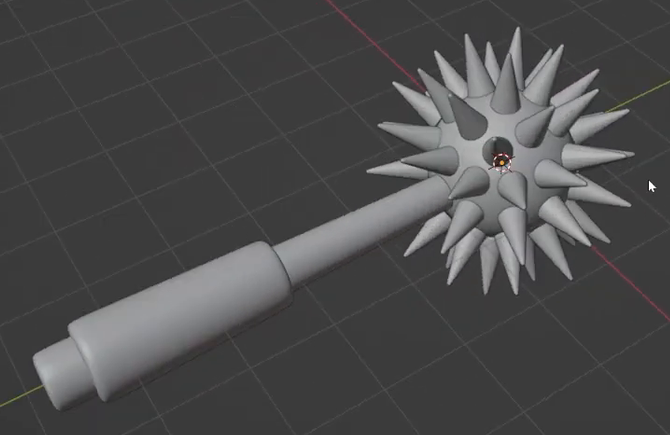
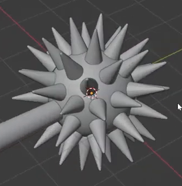
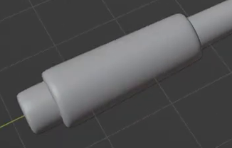

# Procedural Spiked Mace

Create a stylized mace with a rounded ball covered in evenly distributed outward spikes, a long turned handle, a raised grip, and a rounded pommel. The head must remain a reusable procedural asset: changing the head's face layout updates its spike placement, and editing one shared spike source updates every spike.

## Starting Scene

Use Blender 5.1.2 and Cycles with GPU rendering. Start from an empty scene and create the geometry with native Blender data. The `input/` directory is empty; no external model, texture, or add-on is required. The images describe the target form and are not scene assets.

The asset can use any overall size or orientation. In the proportions below, **R** is the radius of the rounded ball without its spikes. Use a simple neutral surface treatment that makes the geometry easy to inspect.

## Head Form

The underlying head is a rounded, approximately spherical body with an editable all-quadrilateral distribution cage. In the delivered state, this cage has **54 faces** arranged in a balanced layout with comparable face sizes around the whole ball, without a concentrated polar fan. Keep the rounded ball visible between the spikes.

## Spike Form

Each spike is a slender, nearly circular tapered form with a broad seated base and a small blunt flat tip. Its visible length is approximately **0.7-0.9 R**, and its base radius is approximately **0.16-0.23 R**. The tip width is roughly **one tenth to one fifth** of the base width. Preserve that taper after smoothing.

The spikes must meet the ball without floating gaps, exposed base discs, or crossing their neighbors. Their repeated shape should produce a clear spiky silhouette while leaving the underlying sphere recognizable.

## Procedural Head

Keep a live geometric relationship between the distribution cage and the spikes. Each cage face supplies exactly one spike, seated at that face's center, with its long axis following the face's outward normal. The delivered 54-face cage therefore produces 54 spikes distributed over the entire head.

Changing the cage to a denser all-quadrilateral sphere must automatically create one spike for every new face, without individually placing copies or rebuilding a fixed list of spikes. A modest local edit to the cage must update the affected spike positions and orientations to follow the new face centers and normals. Restore the regular 54-face state for delivery.

Retain one accessible shared spike source. Editing its shape must update every generated spike while preserving the face-based placement. The source must remain usable while hidden from the final image. Make the cage and spike source easy to identify in the scene or in comments within `build.py`. Any equivalent live procedural implementation is acceptable.

## Handle and Pommel

The handle is aligned with the center of the ball and enters it cleanly. The distance from the ball center to the far end of the handle is approximately **5.5-6.5 R**. The upper shaft is slim, with a diameter roughly **one fifth of the ball diameter**, and widens gently toward its lower end.

Beyond the grip, retain a short visible pommel with a closed end and a smoothly rounded perimeter. Its width is approximately **1.5-2 times** the upper shaft width. The end should read as a rounded, slightly flared butt of the handle. Keep the shaft and pommel profiles editable.

## Raised Grip

A single raised sleeve surrounds the lower portion of the handle, nearer the pommel than the head. It occupies roughly **one quarter to one half** of the shaft length. Its outer wall stands visibly proud of the shaft, and its two defined shoulders turn inward to meet the shaft without floating rims or visible gaps. A short section of the pommel remains exposed beyond it.

The grip follows the same axis as the handle and reads as a fitted sleeve around it. Preserve editable control of its length, width, and end profiles.

## Finish and Assembly

The ball, shaft, grip, pommel, and spike sides must have clean rounded surfaces without unintended faceting, shading seams, or collapsed geometry. Keep the small spike tip flats and the grip shoulders distinct. Intentional intersections inside the ball or shaft are acceptable; their visible junctions must be closed and clean.

Provide one assembly control that translates and rotates the entire mace together. The handle, grip, pommel, ball, and generated spikes must keep their relative placement when that control moves. The delivered scene is a static asset and does not require timeline animation.

## Deliverables

- `submission.blend`: the complete editable scene, saved in its regular 54-spike state with the procedural dependencies intact, plus a camera and lighting suitable for the final image.
- `build.py`: a reproducible Blender Python script that creates the submitted scene from an empty scene and saves `submission.blend`, including the editable asset, camera, lighting, and render settings. Use paths relative to the script for any output files.
- `B76_Procedural_Spiked_Mace.png`: a PNG rendered from the actual submitted scene using Cycles GPU. Frame the entire mace at a useful three-quarter angle so the spike distribution, handle length, raised grip, and pommel are readable. The image must be a scene render, not a source image, viewport screenshot, or external replacement.
