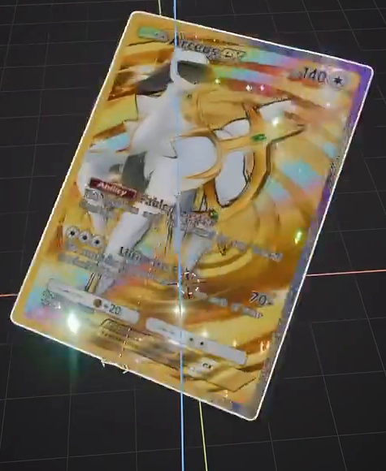
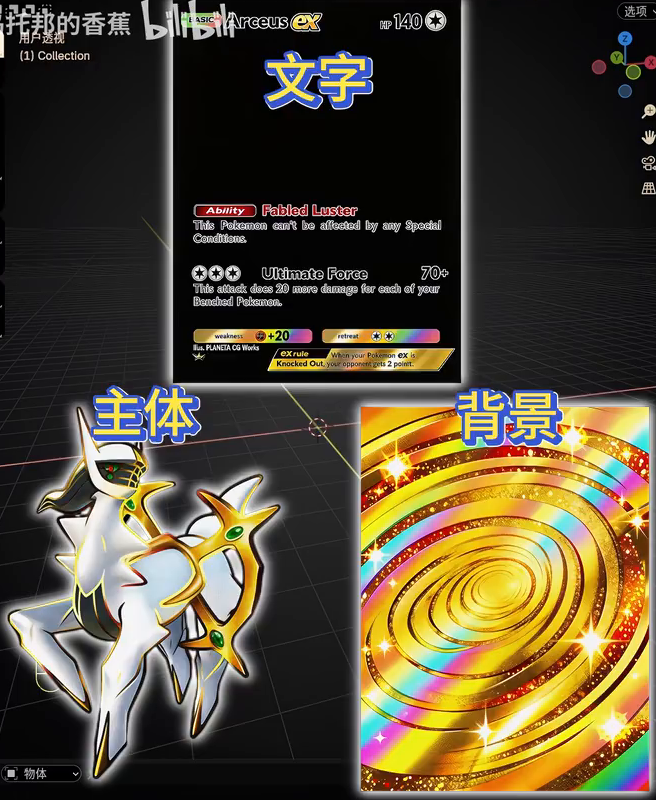
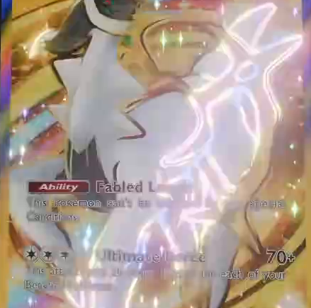

# Parallax Holographic Trading Card

Create an editable portrait trading card whose flat artwork appears layered in depth as the viewing angle changes. Combine the supplied white-and-gold subject, gold spiral background and lettering with a diagonal rainbow foil band, fine ornamental texture, colored contour light, sparse sparkles and a continuous foil border.

## Starting Scene and Inputs

Use Blender 5.1.2 and Cycles with GPU rendering. Start from an empty scene; build the simple card surface yourself. No starter scene, character mesh, HDRI or external plugin is required.

Use these supplied images as the artwork and texture sources:

| Input | Purpose | Dimensions |
| --- | --- | --- |
| [subject_matte.png](../input/subject_matte.png) | White-and-gold subject on a dark matte | 506 x 675 |
| [lettering_matte.png](../input/lettering_matte.png) | Card lettering and small symbols on a dark matte | 189 x 252 |
| [swirl_background.png](../input/swirl_background.png) | Complete selected gold spiral background | 53 x 70 |
| [subject_outline.png](../input/subject_outline.png) | Black contour drawing on white | 180 x 240 |
| [foil_pattern_tile.png](../input/foil_pattern_tile.png) | Repeating ornamental foil motif | 87 x 87 |

The background and small lettering have limited resolution. Preserve the composition and detail actually present in these inputs; sharper lettering, background grain or tiny background starbursts are not required. Do not redraw, replace or generate higher-resolution artwork. Derived masks and normal texture filtering are allowed.

## Card Surface

Create a flat, upright portrait card with an approximately 3:4 width-to-height ratio, gently rounded corners and a narrow, continuous border. Keep the central image area broad enough to show the subject and lettering without clipping. The card surface must have clean shading and no intersecting or flickering face layers. A thin card body is optional.

## Layered Artwork

Compose the background, subject and lettering as separately controllable material layers on the card with stable, undistorted texture coordinates. Use each image's complete portrait canvas as its initial coordinate domain; adjust registration without independently trimming the subject silhouette. The gold spiral fills the card, the white-and-gold subject is prominent in the center, and the title, ability text and lower information strips remain visible above it.

Remove the subject and lettering mattes through masks. Preserve dark details inside the subject and the gaps around its gold ring. Opaque rectangular image backgrounds, obvious edge halos and duplicate subject silhouettes must not remain. Keep all three artwork sources independently editable.

## View-Dependent Parallax

Make the apparent layer depth respond continuously to the viewing direction through the material. The subject should appear in front of the background; the lettering should remain close to the card surface. With the card fixed, moving the camera from a front view to opposite oblique views must produce relative displacement between the subject and background, with the lettering more stable than the subject. A flat composite that merely rotates as a whole does not meet this requirement.

Provide reusable, clearly labeled material controls for the subject and background depth and layer scale. Changing one layer's depth must alter its relative travel without moving the other layers or the card geometry. A zero-depth setting must remove that layer's additional parallax displacement.

Keep the composition coherent through camera yaw from -20 to +20 degrees and pitch from -12 to +12 degrees relative to the card's front normal. The background must continue covering the image area; the main subject must remain recognizable inside the border, and transitions must not jump or abruptly switch images. No timeline animation is required.

## Holographic Foil

Add a soft-edged diagonal foil band that changes position or color with viewing direction. It must carry a recognizable blue, violet and yellow spectrum while preserving the subject's original white, gray and gold areas outside the band. Confine the subject's foil contribution to its mask so that a colored rectangle does not appear around it.

Within the foil response, use the supplied repeating ornament as fine structured detail and add a distinct, subtle granular variation. The ornament must repeat at a much smaller scale than the card and remain visible in at least one oblique view. Keep these details restrained enough that the main subject and lettering remain recognizable. Expose independent band direction or position, band width, and ornament scale controls.

## Sparkles and Contour

Add sparse, independently generated bright points with varied color or intensity. They must supplement the printed artwork and remain individually distinguishable rather than filling the card with a uniform luminous layer. Produce visible four-ray star highlights around the stronger points in the rendered result while preserving the underlying card's contrast.

Use the supplied outline drawing to create a colored luminous contour aligned with the subject. Preserve the recognizable outer silhouette and several internal contour strokes; remove the drawing's white field. The contour must share the subject's parallax movement. Provide separate intensity controls for the contour and the generated sparkle points so that either can be disabled without removing the layered artwork.

## Border and Presentation

Give the border an independently adjustable rainbow foil appearance that remains continuous around all four sides and the rounded corners. Keep it distinct from the central artwork without covering the title or lower information strips.

Present the complete card against a restrained background with lighting that reveals the foil and luminous details. Use a mildly oblique final view within the specified viewing range. Keep the entire card inside the image with a small margin; preserve both bright highlights and readable artwork at the supplied image resolutions.

## Deliverables

- `submission.blend`: the editable card, material controls, lighting, camera and compositing setup. Pack all image resources and derived masks so the scene opens without missing textures.
- `build.py`: a script that recreates the submitted scene from the supplied input images in Blender 5.1.2, including any deterministic mask preparation and the final render settings, and saves `submission.blend`.
- `B77_Parallax_Holographic_Trading_Card.png`: a 768 x 1024 PNG rendered from the actual submitted scene and its compositing setup. Source images, reference crops, viewport screenshots and external image replacements are not acceptable render deliverables.
