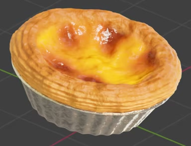
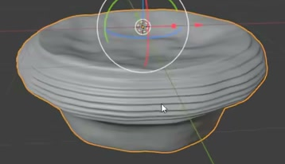
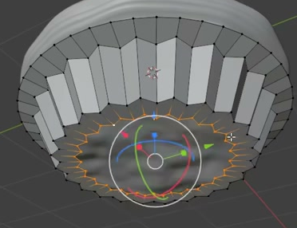

# Custard Tart in a Foil Cup

Create a static, editable custard tart with a thick golden pastry rim, glossy yellow custard marked by irregular brown baked patches, and a silver foil cup. Match the reference's shallow, rounded proportions and clear contrast between flaky pastry, moist filling, and crumpled metal.

## Starting Scene

Use Blender 5.1.2 with Cycles GPU rendering. Start from an empty scene and create the tart with native Blender geometry and procedural materials. The `input/` directory is empty; no external models, textures, or environment images are required. Scene lighting and the background may be created for the final presentation.

## 1. Tart Proportions and Assembly

Build one shallow, roughly circular tart whose width is clearly greater than its total height. The central custard occupies most of the opening, surrounded by a substantial raised pastry rim. The custard surface sits below the rim's highest points and has broad, soft unevenness.

Seat the pastry body inside a separate foil cup. The pastry rim extends slightly beyond the cup, while the cup narrows toward its base. Keep the assembled parts in contact without an exposed gap, a floating filling, or foil protruding through the custard. Use relative proportions from the reference; no fixed world-unit dimensions are required.

## 2. Pastry, Custard, and Foil Geometry

Give the pastry rim a rounded, uneven circular outline and several visible horizontal layers around its outer side. The layered ridges should have real geometric relief and remain readable around the circumference. Use gentle variation to suggest baked pastry while retaining a continuous ring.

Model the custard as a filled surface, without an open central hole or sharp spikes. It may share a mesh with the pastry or be a separate mesh, provided the two surface regions remain editable.

The foil cup must have a flared upper opening, repeated vertical or slightly slanted flutes, and a narrower closed base. Give the cup finite wall thickness and a readable upper lip. Its flutes must affect the silhouette or evaluated geometry, while smaller wrinkles may be shaded. Keep the cup independently editable from the edible body.

## 3. Geometry Finish

Finish the curved pastry, custard, and foil surfaces with coherent normals and smooth shading. Preserve the intended pastry layers, cup flutes, and organic unevenness without accidental faceting, severe pinching, cracks, or self-intersections. Inspect the underside as well as the presentation view. The edible body and cup should each form a complete solid or a closed shell, with no accidental open boundaries.

## 4. Baked and Metallic Surfaces

Give the custard a yellow to orange base with irregular dark brown baked patches and softened orange transitions. Leave clearly visible yellow custard between the patches. Avoid evenly repeated dots or a uniformly dark top.

The custard should appear moist and glossy. Its highlights must respond to broad unevenness and finer surface variation, without turning the filling into a sharp, rocky surface.

Color the pastry in warm golden and toasted brown tones. Combine broader baked color variation with finer grain and a drier, less glossy finish than the custard. The material must support the layered geometry without hiding it beneath excessive noise.

Make the cup visibly silver-gray and metallic, with rough reflections and small irregular wrinkles. Its surface should read as thin crumpled foil rather than smooth chrome, gray plastic, or pastry. Keep all three material regions clearly distinguishable.

## 5. Editable Surface Controls

Keep the surface variation procedural and editable in the submitted scene. Provide understandable controls for custard browning coverage, pastry fine surface relief, and foil fine surface relief. Native material inputs or custom controls are acceptable.

Changing each control must visibly alter its intended surface property without recoloring or reshaping the other material regions. Preserve the final settings in the submitted scene after checking the controls. Equivalent material implementations are welcome; no particular node layout is required.

## 6. Final Presentation

Render a clear elevated three-quarter view that shows the custard top, pastry layers, and a substantial portion of the foil cup. Keep the whole silhouette visible with some margin. Use lighting that reveals glossy custard highlights, the drier pastry texture, and the foil's rough reflections. Choose a simple background that keeps the tart easy to inspect.

## Deliverables

- `submission.blend`: the editable final scene, including geometry, procedural materials, camera, and lighting.
- `build.py`: a Blender Python script that rebuilds the scene from an empty scene and saves the final blend file and render. Keep any build settings needed to reproduce the result in this script or the scene.
- `B78_Custard_Tart_in_Foil_Cup.png`: the final static PNG rendered from the actual submitted scene. A source image, viewport screenshot, or externally substituted image is not a valid render.

Keep the deliverables together and make the scene self-contained, with no unavailable external assets.
