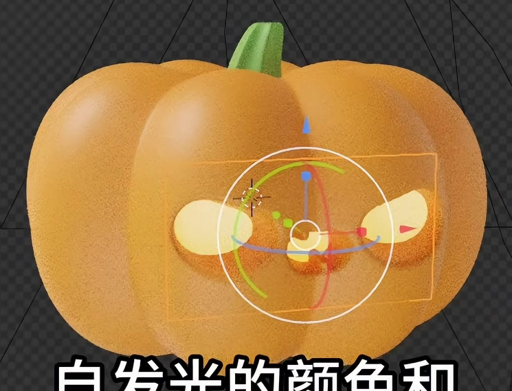
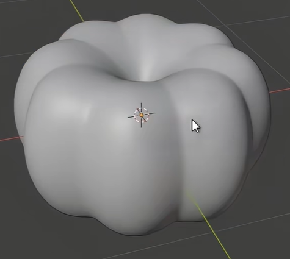
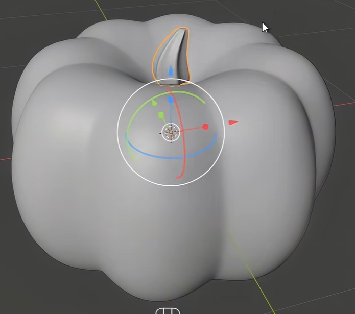
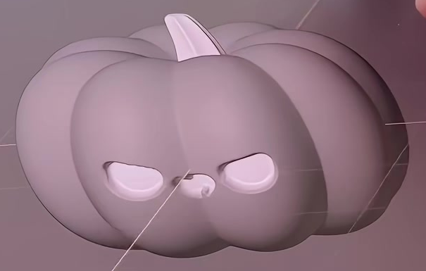

# Glowing Pumpkin Lantern

Create a single stylized pumpkin lantern with a squat, deeply lobed orange body, a short bent green stem, and a stern little face recessed into the front. Warm yellow emission should fill the eyes and small central mouth while the surrounding pumpkin skin remains visibly solid.

The reference shows the intended relationship between the orange skin, recessed expression, and luminous interior.

## 1. Starting Scene and Editable Asset

Use Blender 5.1.2 and Cycles with GPU rendering. No input assets are provided; the input directory is empty. Start from an empty scene and create the pumpkin, stem, and luminous backing with native Blender geometry.

Keep the body and its facial relief editable as geometry. Keep the stem and the luminous backing independently editable, with their material assignments retained. The final asset is one pumpkin lantern.

## 2. Lobed Pumpkin Body

Make a broad, squat volume whose width exceeds its height. Give the top a central depression around the stem and gently flatten the underside. The front and side views should retain a rounded, substantial volume.

Form broad vertical lobes separated by deep, rounded grooves. Carry this pattern around the body and into the upper depression, with a scalloped outline and a coherent transition to the underside. The lobes should read as parts of one pumpkin skin.

## 3. Bent Stem

Seat a short stem in the center of the top depression. Give it a broader base, a narrower closed tip, an obvious sideways lean or gentle bend, and subtle longitudinal ridges. Its scale should remain subordinate to the body, and its base should meet the pumpkin without a visible gap.

## 4. Recessed Expression and Geometry Finish

Place two similarly sized eye recesses on either side of the front center. Their rounded lower edges and sloping upper edges should create the stern expression in the references. Add one much smaller, rounded and slightly notched central mouth below the eyes. Keep the facial arrangement balanced, with clear orange skin separating all three features.

The eyes and mouth must have real inward depth with visible rims and sidewalls. They should remain recognizable under neutral gray shading with emission disabled. Arrange the interior so a luminous backing can show through these facial regions while the rest of the skin conceals it.

Finish the body, stem, and facial rims with smooth evaluated surfaces. Preserve intentional lobe grooves and facial boundaries while avoiding accidental faceting, torn edges, spikes, and shading breaks. Equivalent modeling or sculpting methods are acceptable.

## 5. Color and Emission

Give the pumpkin skin a saturated orange material with soft, broad highlights, and the stem a distinct green material. These materials must be assigned to the corresponding visible surfaces.

Use a warm yellow self-emissive material on the interior backing. It should visibly fill both eyes and the small mouth, with no rectangular backing visible across the outer skin or beyond the pumpkin. Retain independently adjustable emission color and strength. The luminous face must remain visibly emissive when external illumination is removed, and reducing its emission to zero must remove that self-lit appearance.

## 6. Final Presentation

Render a front or modest three-quarter view that shows the complete pumpkin and stem with comfortable margins. Keep both eyes, the mouth, the top depression, and the stem bend readable. Use a simple background and lighting that reveal the orange lobe grooves and recessed facial rims while preserving the warm yellow face.

The result should read as a small luminous lantern, with clear separation between its lit interior and solid exterior. Deliver a clean image without viewport overlays, construction guides, visible backing edges, or distracting render noise. A particular background image or optical halo effect is not required.

## Deliverables

- `submission.blend`: the editable scene with the materials, camera, lighting, and final render settings saved.
- `build.py`: a reproducible Blender Python script that creates the complete scene from an empty scene, saves `submission.blend`, and renders the required image using paths relative to its own location.
- `B79_Glowing_Pumpkin_Lantern.png`: the finished still rendered from the actual submitted scene. It must not be a source image, viewport screenshot, or external replacement.
