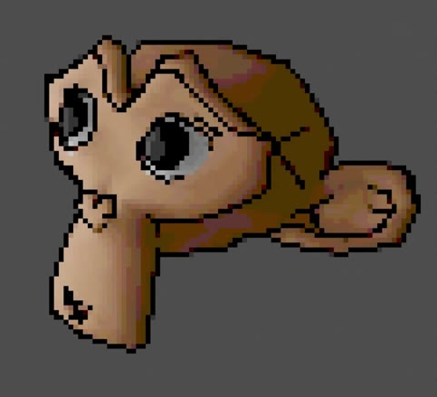
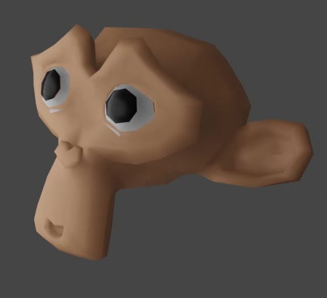
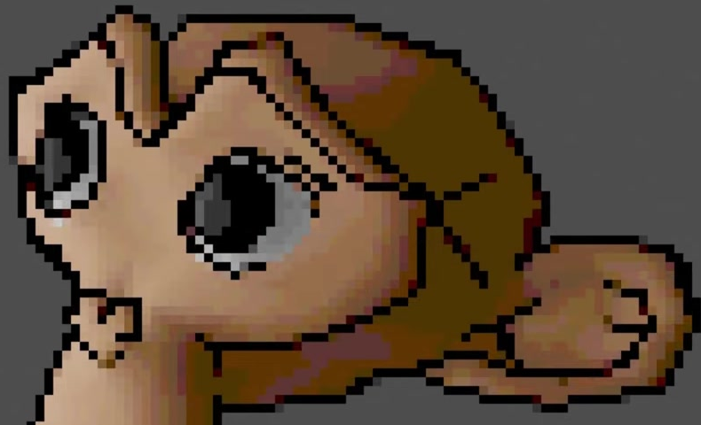

# Pixel Art Monkey Head

Create an editable Blender scene that renders a warm-brown Suzanne head as crisp pixel art: a tilted three-quarter portrait, pale eye rings with black pupils, bold black linework, and a limited shaded palette on a plain dark-gray background.

The final appearance has a regular square-pixel grid, clear facial features, and a continuous dark outline.

## Starting Scene

Use Blender 5.1.2 with EEVEE GPU rendering. Start from a clean scene and use Blender's native Suzanne mesh. No external input assets are provided or required; the `input/` directory is empty. The images in this document are appearance references, not textures to place in the scene.

## Head Geometry

Preserve Suzanne's recognizable proportions: broad forehead, recessed eye sockets, projecting elongated muzzle, and large side ears. Retain the native low-polygon silhouette, including the angular brow and eye discs, while using smooth normal shading across the forehead, cheeks, muzzle, and ears. The head must remain actual editable three-dimensional geometry.

The base render shows the intended head shape, smooth surface shading, material regions, and oblique view. Its lighting has gradual transitions before color reduction.

## Material Regions

Give the exposed head an opaque, nonmetallic warm tan-brown surface with a soft, restrained sheen. Each eye has a near-black central pupil enclosed by a pale white-to-gray ring. Both eye treatments belong to their actual eye surfaces and remain distinct from the surrounding brown face. Keep the three color roles independently editable on the model.

## View and Lighting

Produce a square portrait with the muzzle pointing toward the lower left and the prominent ear extending to the right. Both eyes are visible, with the nearer eye appearing larger. The entire visible silhouette fits inside the frame; the head occupies roughly three quarters of the image width, with clear background margins.

Use a plain, uniform dark-gray background. Broad illumination from the front and above should reveal the forehead, cheeks, muzzle, and ear without harsh spotlight patches. Preserve darker eye sockets and shadowed side regions so the head reads as a volume before the pixel-art treatment. The composition contains only the head and its background.

## Pixel Art Finish

Render black lines that follow the visible silhouette and articulate the brow, eye sockets, muzzle, and ear folds. The outline must survive pixelation as a connected stepped contour rather than scattered dots, while interior lines remain selective and leave the features readable.

Transform the scene render into a regular grid of equal square color blocks. Each block should be around one percent of the full image width, with hard edges and a uniform color inside it. The treatment preserves the scene's framing and square output; it must not stretch pixels into rectangles or blur them during enlargement.

Reduce the shading into distinct flat bands across neighboring blocks, keeping a warm tan-and-brown identity, darker brown shadow regions, pale eye rings, and near-black pupils and lines. The final contrast must distinguish the face from its background and preserve visible differences between the facial planes.

This detail shows the relationship between the pixel grid, color bands, eye regions, and selective interior lines.

## Live Compositing

The pixel grid, palette reduction, and contrast adjustment must be editable effects applied to the current scene render within Blender. Equivalent implementations are acceptable; retain the following behavior:

- Bypassing the pixel-art compositing treatment produces an ordinary smoothly shaded render of the same head and viewpoint, retaining the rendered black lines.
- Bypassing only palette reduction retains the square-pixel grid and linework, while restoring more gradual color variation between neighboring cells.
- Pixel size, palette reduction, and contrast can each be adjusted without remodeling the head. Changing the head's brown material or slightly rotating the head updates the final processed render, including the associated linework.

Save the scene with the complete pixel-art treatment active. This is a static portrait; no animation is required.

## Deliverables

- `submission.blend`: the editable scene, materials, linework, active camera, and live pixel-art processing.
- `build.py`: a Blender Python script that recreates the scene and its render setup from a clean file and saves `submission.blend`, without external assets.
- `B80_Pixel_Art_Monkey_Head.png`: a 1080 by 1080 PNG rendered from the actual submitted scene with the complete treatment active. The image must be the scene's render, not a reference image, viewport screenshot, or external replacement.
