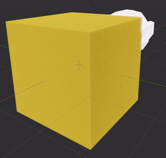
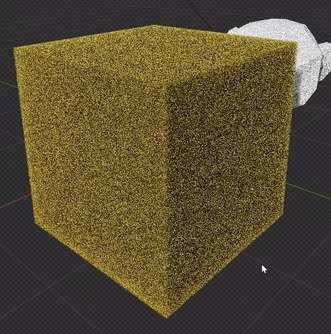
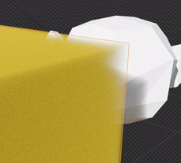

# Procedural Yellow Sponge Volume

Create an editable yellow sponge material whose fine pores exist throughout a cubic volume. The finished object should retain a clear box-like form while its porous body, warm color, and depth-dependent light transmission distinguish it from a solid painted cube.

## Starting Scene

Use Blender 5.1.2 and Cycles with GPU rendering. The `input/` directory is empty; no external assets are required. Create a simple cube as the volume container and a small white reference object from native geometry. The sponge's width, height, and depth should be approximately equal. Absolute scene scale is unrestricted.

## Sponge Volume

Keep the container editable and use a fully procedural material to create spatially varying density inside it. The pore pattern must extend through all three dimensions and continue into the interior. Surface color spots, a flat transparency image, and surface-only indentations do not provide the required volumetric structure. The material must not depend on image textures, imported volume data, or external assets.

## Porous Structure

The default material state should read as a dense, fine-pored sponge. Many small irregular pores should be distributed across the visible body, with pore sizes small relative to a cube edge. Preserve the overall cubic silhouette while allowing the porous density to be apparent near its boundaries. Avoid a small collection of large holes, broad empty regions, conspicuous directional stretching, or a featureless uniform volume. Resolve enough detail in the final image that the pore pattern can be distinguished from render noise.

This source preview contains sampling grain. Use its fine-scale material character as reference; sampling grain is not a substitute for pores.

## Color and Light Transmission

Give the sponge a saturated warm yellow body. Under neutral illumination, retain yellow color on both the brighter and darker visible regions, with darker depth and shadow variation rather than a flat emissive appearance.

Light must travel through the material's volume. Longer paths through the dense body should attenuate a white object behind it more strongly than shorter paths near an edge. The default sponge should retain substantial body density, with a limited translucent edge region or small low-density openings rather than uniform glass-like transparency. Keep the white reference object's uncovered region neutral so that its attenuation through the sponge is legible.

## Editable Material Controls

Provide clearly identifiable, independently adjustable controls for pore scale, porosity, and bulk density. Record their default values and useful working ranges in a text block within the project or comments in `build.py`.

- Pore scale must allow both coarser and finer cells without changing the cube's size.
- Porosity must change the fraction of low-density space while preserving the overall pore scale.
- Bulk density must change the attenuation of the remaining sponge body while preserving the pore locations and scale.

Each control must affect the material assigned to the visible cube, work with the other two controls held fixed, and allow the original appearance to be restored. Save the fine-pored default state. These are material controls; no timeline animation is required.

## Presentation

Frame the whole sponge prominently in a three-quarter view showing the top and two side faces. Arrange the small white reference object behind an edge of the sponge so that part is uncovered and part is seen through the volume. Use restrained neutral surroundings and directional illumination that separate a brighter region from a darker one without clipping away the yellow color. The sponge, its boundary detail, and the reference object's spatial relationship must remain clear in the final image.

## Deliverables

- `submission.blend`: the complete editable scene, with the material controls and the fine-pored default state saved.
- `build.py`: a Blender Python script that recreates the scene, saves `submission.blend`, and renders the required image without manual scene preparation or external downloads.
- `B81_Procedural_Yellow_Sponge_Volume.png`: a finished PNG rendered from the actual submitted scene. It must show the complete sponge and white reference object with sufficient image size and sampling to inspect the pores and transmission. Source images, viewport screenshots, and externally substituted imagery are not valid render deliveries.
