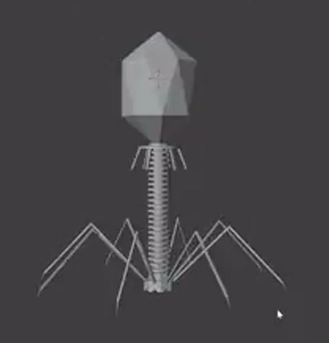
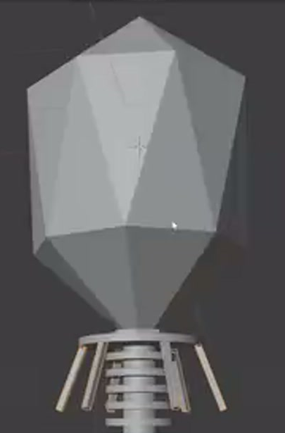
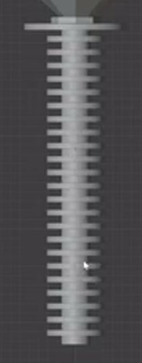
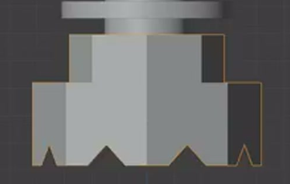
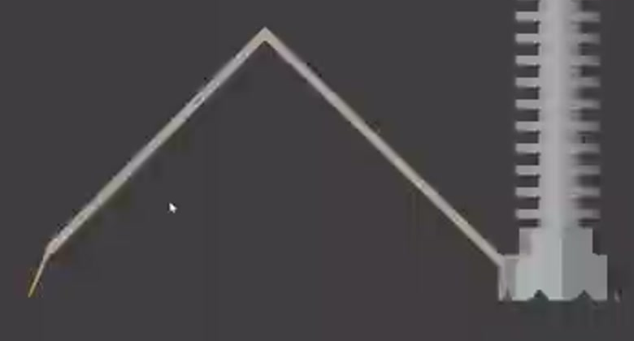

# Low Poly Bacteriophage

Create an editable, static bacteriophage model with a faceted head, layered collar, long segmented tail, notched base, short collar supports, and long bent legs spreading around the base. Match the proportions and geometric character of the references.

## Starting Scene

Use Blender 5.1.2 and start from an empty scene. No external input assets are provided; the `input/` folder is empty. Build the model from native geometry. Use Cycles with GPU rendering for the final image. This is a static modeling task.

## Head and Layered Collar

The head is an elongated, low polygon shell, wider than the tail and taller than it is wide. Its top converges to a central point, while its lower end tapers to a small flat connection surface. Alternating triangular facets around the broad middle create a visibly angular shell rather than a smooth cylinder.

A short neck and stacked thin collar plates connect the head to the tail. Use visibly different plate diameters, with the broad collar below the narrow neck. Keep the head, collar, tail, and base on one vertical axis. The collar layers must have readable thickness and remain visually distinct.

## Tail Core and Repeated Sheath

A slender, continuous central rod extends from the collar to the tail base. Surround it with a long stack of thin horizontal circular plates, leaving regular open gaps between neighboring plates. The plates share the same shape and diameter, stay centered on the rod, and form a tail that is longer and substantially narrower than the head. The rod remains visible through the gaps.

Keep the sheath as an editable repetition of a common plate. Provide controls for repeat count and axial spacing. Changing the count must add or remove matching plates along the same axis; changing spacing must redistribute the plates without changing their individual shape. Keep the collar end anchored during these edits. The saved result should have the dense, even segmentation shown below; an exact plate count is not prescribed.

## Notched Tail Base

At the lower end of the sheath, create a low polygon base that is wider than the tail. Its broad lower body transitions upward through a narrower central step into the tail. Repeated V-shaped notches interrupt the lower rim around the circumference, leaving a recognizable toothed outline. Give the rim and notch boundaries real thickness; the notches must remain open and readable from oblique views.

## Radial Supports and Legs

Short, slender supports attach around the outer collar and slope downward and outward beside the upper tail. Each has a short root and a longer sloping segment with a visible bend. Distribute them in several directions around the collar, with consistent geometry and clear attachment at their roots.

Long legs attach around the lower base and spread much wider than the head. Each leg has a short root, a long segment rising outward to a pronounced knee, another long segment descending outward, and a short, thinner downward-pointing tip. Preserve the angular, narrow rectangular rod character of the reference. Arrange matching legs around the base so their radial structure is readable from above and from an oblique view. Their roots must meet the base, and the legs must not pass through the tail. The short collar supports and long lower legs must remain distinct groups.

## Geometry Finish and Presentation

Preserve the head's deliberate flat facets and the appendages' crisp rod edges. The central rod and circular plate sides should shade coherently, without accidental dark patches, reversed visible faces, or overlapping coplanar surfaces. Inspect the existing head, tail, base, and appendages from multiple angles for these shading defects.

Use a restrained neutral material and lighting that reveal the geometry. Frame the entire model, including every outer tip, in a clear oblique view against a simple background. The final image must show the head facets, tail segmentation, base silhouette, and separation of the appendages at a useful viewing size.

## Deliverables

- `submission.blend`: the editable scene with the completed model, functional tail controls, materials, camera, and lighting.
- `build.py`: a Blender Python script that recreates the scene from an empty scene and saves `submission.blend` beside the script. Running it must reproduce the model and its editable tail repetition.
- `B82_Low_Poly_Bacteriophage.png`: a final PNG rendered from the actual submitted scene using its saved camera. Source images, viewport screenshots, or external replacements are not acceptable substitutes.
