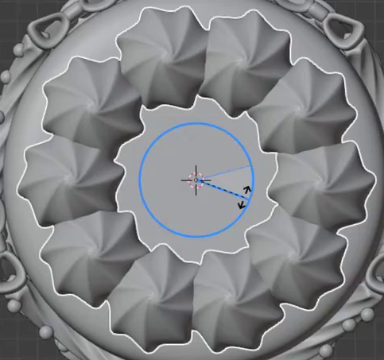
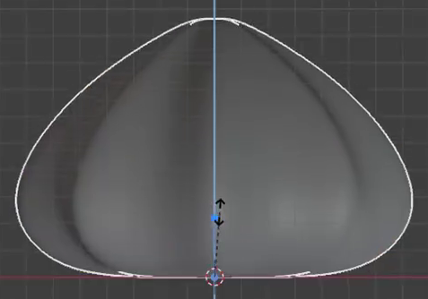
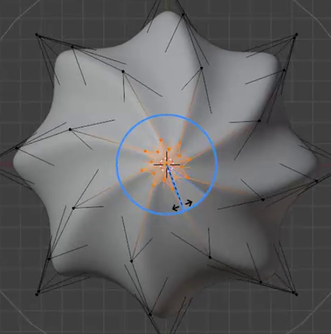

# Eight-Lobed Cream Ring

Create a smooth, eight-lobed piped cream dollop with gently spiraling ridges, then use an editable circular pattern to place ten copies around the top of a plain round cake support. The final scene should clearly show the individual cream forms and the complete ring.

The reference focus is the cream ring. Use a plain support; the decorative bows, beads, fruit and other cake details visible in the source images are outside the required result.

## Starting Scene

Use Blender 5.1.2. The `input/` directory is empty; no external assets are needed. Start from a clean scene and create the cream and a simple cylindrical cake support with native Blender geometry. Keep the support's top broad and level, with a gently softened outer rim.

## Cream Form

Make one editable cream form with a broad, rounded lower body, a slightly tucked-in foot, and a smooth taper toward a compact central peak. Its height should be smaller than its widest diameter, while remaining clearly three-dimensional rather than a flattened rosette. Close the cream's underside and tip.

Give the body eight evenly distributed lobes separated by eight clear grooves. Preserve this eightfold structure through the substantial lower and middle body; the lobes may merge naturally at the small peak. The lobes should feel full and rounded, with no thin spikes or disconnected petals.

## Spiral Ridges and Finish

Carry the grooves and ridges upward with a gradual twist in one consistent direction. The twist should extend through the body and converge toward the peak, producing the piped spiral appearance visible in the references. Keep the foot stable and the ridges distinct; avoid a sudden kink or a twist confined to the tip.

The evaluated cream surface must remain smooth while retaining the grooves. Avoid visible faceting, accidental holes, self-intersections, collapsed folds and shading seams. Keep the cream geometry editable; equivalent modeling and smoothing methods are acceptable.

## Circular Repetition

Arrange exactly ten copies of the cream on one complete circle centered on the support. Use equal angular spacing, a common ring radius, equal scale and a consistent orientation relative to each copy's radial direction. Keep the creams upright at one common height.

Place the ring near the support's outer edge while leaving a clear central opening. Every cream foot must meet the top surface, without floating or being deeply buried. Each dollop must remain individually readable: small gaps or light contact are acceptable, but avoid substantial overlaps or an oversized gap where the circle closes. All cream footprints must remain on the support.

## Editable Pattern

Preserve a reusable geometric relationship between one editable cream source and all ten repeated forms. A shape edit to the source must update the complete ring without manually editing each copy.

Keep the ring radius and angular layout adjustable through the saved setup. Changing the radius must move the repeated forms together while retaining the common center and even spacing. Instance count and angular spacing may be coordinated manually, but changing them together must allow another evenly spaced closed ring without repositioning copies individually. Save the delivered configuration with ten creams.

## Presentation

Use simple light cream or neutral materials and lighting that make the ridges, peak shape and contact with the support easy to inspect. Frame the entire ring and support in a clear elevated three-quarter view, with enough detail to distinguish the repeated lobes. Use Cycles with GPU rendering. Decorative additions must not obscure the required forms.

## Deliverables

- `submission.blend`: the complete editable scene, saved with the ten-copy ring, its shared cream source, adjustable pattern, materials, lighting and render camera.
- `build.py`: a script runnable in Blender 5.1.2 that recreates the complete scene from a clean start and explicitly saves the resulting scene as `submission.blend`. It must use no unavailable external assets or manual setup steps.
- `B83_Eight_Lobed_Cream_Ring.png`: a PNG rendered from the actual submitted scene using the required composition. A source image, viewport screenshot or externally substituted image is not a valid render.
