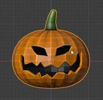
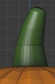
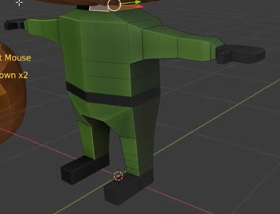

# Carved Pumpkin Character

Create a stylized low-poly character with an oversized carved pumpkin head, a compact green body, and a second carved head placed beside it. The result should have real hollow carvings, deliberate faceting, a leaning green stem, and black shoes, gloves, and belt.

The finished head reference shows the flattened silhouette, facial openings, and faceted surface.

## Starting Scene

Use Blender 5.1.2 and start from an empty scene. No input assets are provided; `input/` is empty. Create the geometry from native primitives or generated meshes. Use Cycles with GPU rendering. Solid-color materials are sufficient for the orange, green, and near-black regions.

## Pumpkin Shape

Make both heads broad and flattened, with the pumpkin shell height about three quarters of its maximum width, excluding the stem. Include shallow dimples at the top and bottom and sixteen raised lobes alternating with sixteen longitudinal grooves around the circumference. The grooves should have slight natural variation in depth while preserving a coherent pumpkin silhouette.

Keep the low-poly planes visible. The surface should have intentional facets, clean face orientation, and intact geometry around the dimples, lobes, and stem base.

## Hollow Shell and Carved Face

Give each head an actual hollow interior and a thin, continuous wall, roughly 3-5% of that head's maximum width. The two eyes and mouth must pass completely through the front wall into the cavity, with visible thickness along their rims. Keep the back of the shell intact.

The main head has two pointed, slanted eye openings with the outer ends higher than the inner ends. Make them visibly different in shape or width while keeping a balanced expression. Below them, create a wide jagged grin spanning most of the front, with upswept corners, approximately three prominent downward teeth, and two upward points. A difference of one prominent point on either edge and small secondary notches are acceptable. Preserve solid bridges between the eyes and mouth.

The rims should be clean and continuous, with no visible cutter geometry, unintended holes, doubled surfaces, or collapsed teeth. The dark interior must remain visible through the openings from the front and from a modest three-quarter view.

## Leaning Stem

Each stem rises from a small flattened area at the top of its pumpkin. Give it three visibly tapering sections, a gentle sideways lean, and a small closed tip with softened faceted edges. Its base should meet the shell cleanly. Keep the stem short relative to the head, approximately one third of the shell height.

## Body and Live Symmetry

Build a compact body beneath the main head. Include a slightly tapered blocky torso, two separate legs with slanted upper sections and narrower ankles, forward-projecting shoes, and short outstretched arms ending in small segmented gloves. Keep the limbs deliberately angular and broadly match the proportions in the body reference. A narrow continuous belt encircles the waist.

Keep the body bilaterally symmetric with a live construction relationship. Editing a source arm or leg on one side must update its reflected counterpart across the body's center plane. The center seam should remain joined without a gap or doubled surface. The editable source side must remain accessible in the saved scene; an equivalent procedural construction is acceptable.

## Spare Head

The spare head should match the main head's size, lobes, stem, and carving style. Vary one eye so it becomes noticeably narrower or skewed compared with the corresponding eye on the main head. Keep the other eye and overall face recognizably related, and preserve the cavity and rim geometry around the changed opening.

## Materials

Use warm orange for the outside of both pumpkin shells, muted leaf green for the stems and body, and near-black for the interiors, gloves, shoes, and waist belt. Keep each color region consistent, with clean boundaries and readable faceted shading. Avoid reflective or emissive finishes that obscure these flat color regions.

## Scene Presentation

Center the main head immediately above the shoulders, with a small visible gap and no modeled neck. Its width should be much greater than the torso width and roughly comparable to the full arm span. Place the spare head to the character's left and lower than the raised main head, leaving a clear gap between their silhouettes.

Compose a static front or modest three-quarter view that shows the complete character and spare head. Keep both faces, stems, shoes, gloves, and belt visible and large enough to inspect. Use a quiet background and lighting that reveals the grooves and wall thickness while keeping the carved cavities dark. All visible artwork must come from the modeled scene.

## Deliverables

- `submission.blend`: the editable scene, including the hollow heads, complete body, live bilateral construction, materials, lighting, and final camera.
- `build.py`: a Blender Python script that recreates the scene from an empty scene and saves `submission.blend`. Include a short code comment identifying the editable source side or control used for the body's live symmetry.
- `B84_Carved_Pumpkin_Character.png`: a finished still rendered from the actual submitted scene. A source image, viewport screenshot, or externally substituted image is not a valid render.
