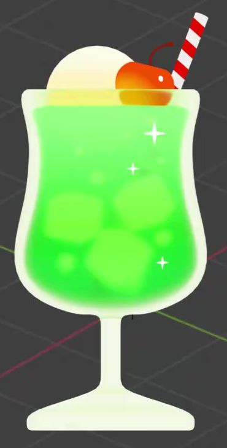
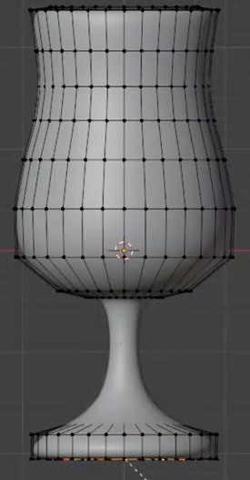
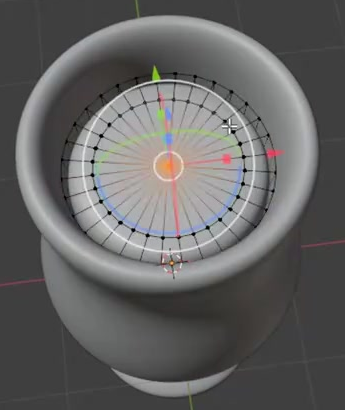
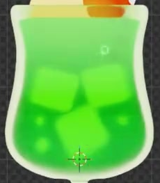

# Cartoon Melon Soda

Create an editable, stylized melon soda in a stemmed goblet. The finished drink combines a pale luminous glass rim, vivid green soda, rounded ice and small bubbles, a yellow scoop, a red-orange cherry, and a red-and-white striped straw.

## Starting Scene

Use Blender 5.1.2 with Cycles GPU rendering. Start from an empty scene. No external input assets are supplied; the input folder is empty. Build the drink from native Blender geometry and editable materials. Use the images for relative shape, placement, and color relationships; choose a consistent working scale.

## Goblet and Liquid Volume

Make a smooth, upright goblet with a broad rounded lower bowl, a gently narrowed waist, and a slightly flared open rim. The bowl flows into a slender centered stem and a broad, low circular foot. Keep the exterior continuous and free of visible gaps or abrupt joins. Give the bowl finite wall thickness, a readable inner rim, and a closed bottom.

Create a separate closed liquid volume that follows the bowl interior. Its level top sits just below the rim. Keep the liquid inside the wall without visible protrusions, large empty gaps around its sides, or overlapping surfaces that flicker.

## Garnish and Interior Details

Place a large smooth spherical scoop at the mouth of the glass, with roughly half its height above the rim. Add a smaller, slightly flattened cherry beside it. Give the cherry a shallow top depression and a slender curved stem that emerges from that depression. A straight thin straw enters the drink behind the garnish and projects diagonally above it. Keep the scoop, cherry, curved stem, and straw individually editable and visually distinct.

Distribute multiple rounded cubic ice pieces and smaller spherical bubbles inside the liquid. Preserve readable flat faces and rounded corners on the ice. Vary the ice rotations and bubble sizes, leaving enough space to distinguish the two types. Their placement must remain inside the drink and leave the green liquid visible between them. Smooth the curved surfaces so that the garnish, stem, ice corners, and bubbles have clean silhouettes.

## Luminous Glass and Soda

Give the goblet a pale yellow-green, glass-like translucent appearance with a bright rim, side boundary, stem, and foot. The shell must allow the liquid and its interior details to remain visible while retaining its own silhouette.

Shade the soda with a clear vertical green transition: light mint green near the top and a more saturated green toward the bottom. Keep its appearance bright and softly luminous. The ice and bubbles use pale luminous surfaces that read as brighter accents through the green liquid. Retain independent editable shell and liquid colors, and an editable position or spread for the liquid gradient. Changing the liquid color must not recolor the shell.

## Garnish Colors and Straw Stripes

Give the scoop an opaque pale-yellow-to-warm-yellow gradient. Give the cherry an orange-red body, a compact bright highlight, and a darker red curved stem. The highlight must remain a localized surface accent and be independently editable in size or placement. Keep the scoop and cherry colors independently editable.

Cover the visible straw with crisp, alternating red and white diagonal bands. The pattern must repeat along the shaft and continue around its cylindrical surface. Keep the two colors, repeat spacing, and stripe slant editable in its material.

## Presentation

Frame the complete drink, including the straw tip and foot, with comfortable margins. Use a near-front view with enough elevation to read the rim, liquid level, and garnish arrangement. Keep the cherry and straw legible against the scoop. Use a clean neutral or transparent background and soft lighting that preserves the bright palette, glass boundary, and interior details. The final image should show the drink without selection outlines, grids, interface overlays, or clipped highlights that erase important shapes.

## Deliverables

- `submission.blend`: the complete editable scene, materials, camera, lighting, and Cycles GPU render settings, with all dependencies available.
- `build.py`: a Blender Python script that recreates the complete scene from an empty scene and explicitly saves `submission.blend` beside the script. Running it in Blender 5.1.2 must produce a saved file that can be reopened and rendered independently.
- `B85_Cartoon_Melon_Soda.png`: a still render from the actual submitted scene, at least 1024 pixels on its longer edge, using the composition described above. Deliver the PNG beside `submission.blend`; source images, viewport screenshots, and external image replacements are not valid final renders.
