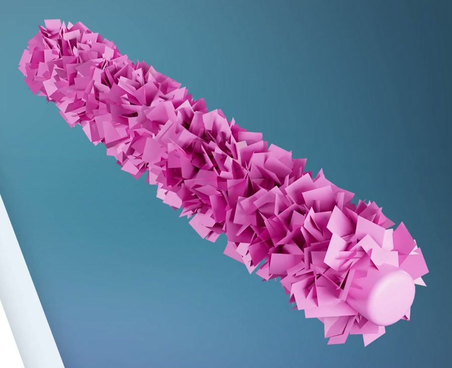
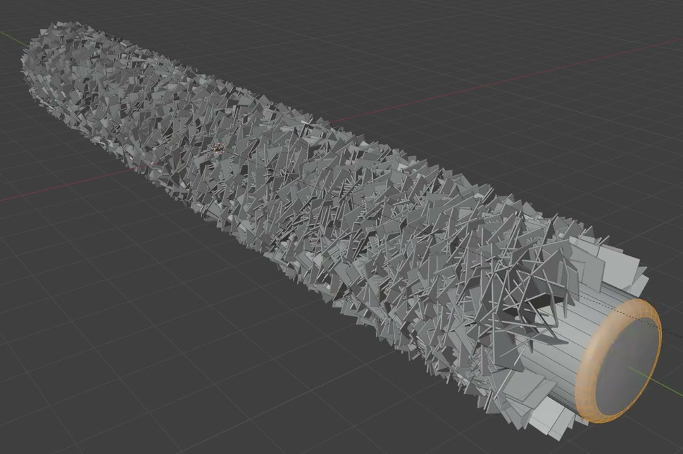
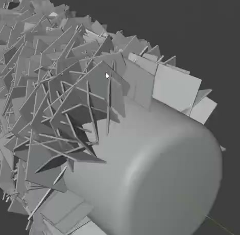

# Porous Flake-Coated Nanorod

Create a static, editable nanorod with a smooth cylindrical core and a dense, irregular coating of thin rectangular flakes. Small gaps between overlapping flakes should give the coating a porous appearance while the rod remains continuous.

## Starting Scene

Use Blender 5.1.2 and Cycles with GPU rendering. The `input/` directory is empty; create the asset from native geometry in a new scene. No external model, texture, or add-on is required. This is a static asset with no required animation.

## Core and End Caps

Create a straight, circular cylindrical core with a length between eight and fourteen times its diameter. Keep a consistent diameter along the central shaft. The coating and core must share the same longitudinal axis.

The core must be closed at both ends. Each end must have a smooth rounded rim leading into a circular end face. Let a short part of the smooth core extend beyond the flake coating at each end, with each exposed length smaller than the core diameter. Preserve a solid, continuous core beneath the coating.

The edge selection in this reference is a modeling overlay, not part of the requested appearance.

## Flake Geometry and Finish

Use small rectangular or near-square plates with broad flat faces, straight edges, and real thickness. Their thickness must be visibly smaller than their width and height. They should read as thin flakes rather than round grains, rods, or thick blocks. Their size must leave many individually readable flakes along the rod.

Maintain clean geometry: the smooth core and rounded rims must avoid conspicuous faceting or shading seams, while flake faces remain planar and their thickness remains visible in close views. Local overlap among flakes and contact with the core are expected; avoid stray floating pieces, duplicate coplanar surfaces, or broken faces that create distracting artifacts.

## Procedural Surface Distribution

Generate the flakes from the cylindrical side surface. The layer must wrap around the full circumference and cover the central length densely, with no large bare bands. The circular end faces must remain free of generated flakes so the smooth tips can be seen.

Give neighboring flakes varied rotations around the local outward direction. The coating should have irregular overlapping faces, edges, and small visible gaps rather than aligned rows or repeated parallel rings. Keep the plate layer close to the shaft so the overall silhouette remains recognizably cylindrical. The porous effect comes from the gaps in the flake layer; the core itself remains intact.

## Editable Generator

Keep the relationship between the flake source and the generated coating editable. Changing the source plate's proportions or thickness must update the coating throughout the rod without replacing the generator with manually placed pieces.

Provide identifiable controls for coating density, flake size, and random seed. A density change must alter the number or spacing of generated flakes; a size change must alter their dimensions without changing the core. Changing the seed must produce a different irregular arrangement, and restoring the same settings and seed must reproduce the original arrangement. Controls may be native properties, modifier inputs, or clearly named script parameters retained with the scene. Use any equivalent procedural implementation that works in the target Blender version.

## Presentation

Render the complete rod from an oblique view that shows its length, flake relief, and at least one rounded circular tip clearly. Keep both ends inside the frame with space around them. Use a simple contrasting background and lighting that makes gaps, plate thickness, and smooth tip curvature legible. A neutral gray or pink material is suitable; an exact color match is not required. Only the intended nanorod should appear in the image, with any standalone source plate or construction helpers outside the final view.

## Deliverables

- `submission.blend`: the complete editable scene, including the working generator and render setup.
- `build.py`: a self-contained Blender Python script that recreates the scene from a new scene and saves the resulting `submission.blend`. Retain all required generator code and control definitions. The saved file must reopen with the same visible result and editable behavior.
- `B86_Porous_Flake_Coated_Nanorod.png`: a still image rendered from the actual submitted scene. Do not substitute a source image, viewport screenshot, or external image for the render.
