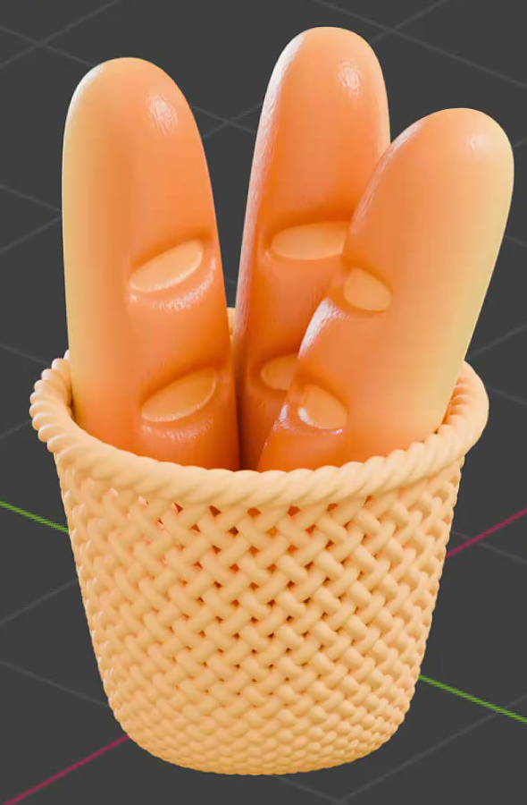
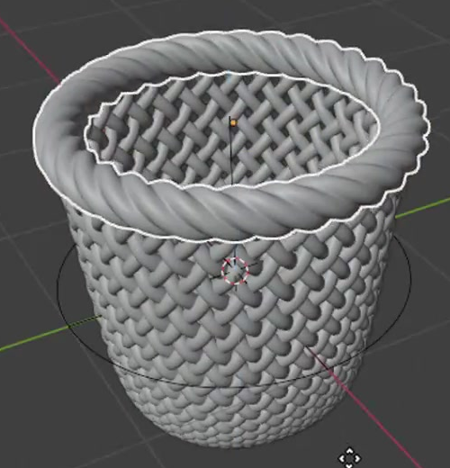
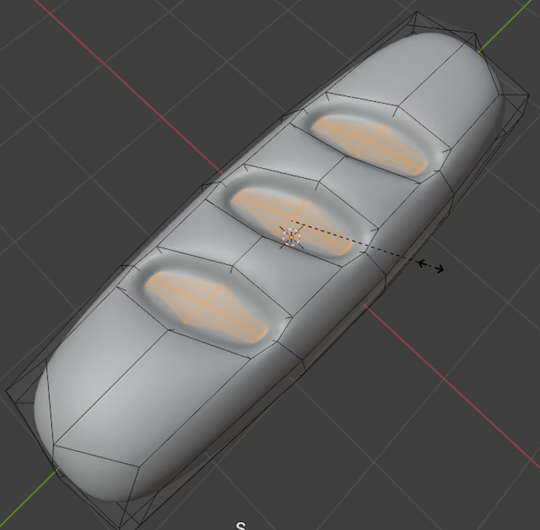

# Woven Bread Basket

Create a stylized basket holding three long golden loaves. The basket has an open woven body and a thick twisted rim; the loaves have rounded silhouettes, recessed score marks, and gently textured baked surfaces.

## Starting Scene

Use Blender 5.1.2 and Cycles with GPU rendering. Start from an empty scene. No external input assets are provided; the `input` directory is empty. Create the basket, rim, and loaves from native geometry. Any modeling technique that produces the required editable result is acceptable; no add-on is required.

## 1. Basket Body

Build a compact upright basket with a broad circular opening, gently tapering sides, and a narrower rounded base. Its height and opening width should be of a similar order, as in the reference. Keep a real interior cavity with enough depth to contain the lower portions of the loaves. Provide a supporting bottom; an unsupported open sleeve is insufficient. The precise underside weave pattern is unrestricted.

## 2. Weave and Rope Rim

Form the basket wall from rounded strands running in two diagonal directions. Repeated crossings must visibly alternate over and under, producing a coherent woven lattice with small diamond-shaped openings around the circumference. The strands must have real three-dimensional depth, smooth profiles, and consistent thickness. Preserve the open spaces between strands; the wall must not read as an opaque shell with a printed pattern.

Add a distinct thick rope ring around the entire opening. Repeated twisting or interlacing must be visible along this closed loop. Fit it closely to the upper edge so that it finishes the wall cleanly without a loose gap, abrupt join, or dangling ends. The rim and wall should remain separately editable.

## 3. Scored Loaves

Create three separately editable elongated loaves. Give each a softly rounded cross-section, full middle, and rounded, slightly narrowed ends. Their surfaces should be smooth and continuous, with no sharp box corners or collapsed tips.

Each loaf must have three broad, shallow score cuts distributed along its outward-facing side. The cuts run across the loaf at a slight diagonal and have rounded recessed interiors with a gently raised surrounding lip. Their depth must be visible in the geometry: they are not painted stripes or separate floating patches. Keep the loaf intact beneath each cut, without holes through its body. The basket may conceal the lowest cut in the final arrangement.

## 4. Materials

Give the loaves a warm baked appearance with broad, smooth variation from pale golden yellow to richer toasted orange. Add fine, low-amplitude irregular surface texture that catches the light while preserving the rounded shape. Highlights should be soft enough to read as a stylized crust, with no metallic or transparent appearance. Keep the color variation and texture editable in the material.

Make the recessed score interiors a visibly distinct, lighter warm golden-orange tone against their toasted surroundings. Confine this distinction to the scored regions with clean boundaries. The distinction must remain visible under neutral lighting and must come from the surface treatment rather than cast shadows alone.

Use a pale cream-yellow material on both basket wall and rim. It should be opaque and nonmetallic, with gentle highlights that reveal the strand crossings and rope relief. Its lighter color should contrast clearly with the orange loaves.

## 5. Arrangement and Presentation

Place the three loaves inside the basket, with their lower ends contained and supported by its interior. Let them stand above the rim in a small fan, using varied lean angles and tip heights. Keep all three upper silhouettes identifiable and enough of each scored face visible to recognize the cuts. Avoid obvious penetration through the wall or rim, unsupported floating, and severe loaf-to-loaf intersections.

Present the whole asset from a slightly elevated three-quarter view that reveals the opening, diagonal weave, twisted rim, and bread surfaces. Use a restrained background and lighting that keep these details readable. The final image should frame the complete basket and loaf tips without clipping.

## Deliverables

- `submission.blend`: the complete editable scene, including geometry, materials, camera, and lighting. All required resources must be contained in the file or use supplied relative assets.
- `build.py`: a script that recreates the complete scene from an empty Blender 5.1.2 session and explicitly saves the result as `submission.blend`. The saved file must reopen with the same geometry, material assignments, and render composition; creating only an unsaved in-memory scene is insufficient.
- `B87_Woven_Bread_Basket.png`: a finished static render produced from the actual submitted scene. Do not substitute a source image, viewport screenshot, or externally assembled image.
