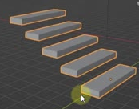
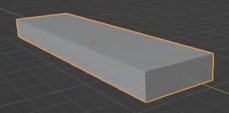
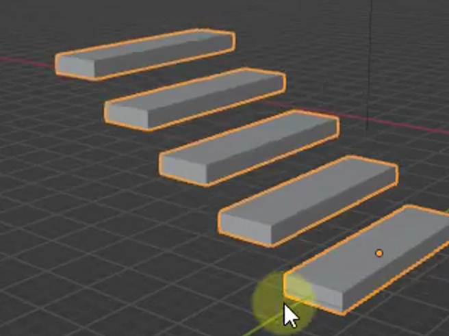

# Parametric Stair Generator

Create a reusable straight staircase generator with five separated, level tread slabs in its saved state. The staircase must remain editable through independent dimensions, tread count, and rise controls in Geometry Nodes.

## Starting Scene

Use Blender 5.1.2 and Cycles with GPU rendering. Start from a new scene; `input/` is empty because the asset requires no external models, images, textures, or add-ons. Build the tread geometry from native Blender geometry. Choose any convenient overall scale.

## Finished Staircase

Create five separate rectangular tread slabs of identical size. Their top faces are level and parallel, their widths share one centerline, and the flight advances in one straight horizontal direction while rising. Use local X for travel, Y for width, and Z for height. Each tread is a closed box with flat faces and clean edges.

Let the saved tread depth be **D**. Each saved tread has width **4D** and thickness **0.33D**. Match these ratios within 5%. Keep the full staircase visible and unobstructed in a three-quarter view with neutral shading that clearly separates top and side faces.

## Spacing and Origin

Center the lowest tread on the generator's local origin. In the saved five-tread state, consecutive centers advance by **1.25D** horizontally and **0.625D** vertically. The highest center is therefore **5D** along X and **2.5D** above the lowest center. The horizontal gap between adjacent tread edges is **0.25D**. Match these distances within 5%; the origin is the center of the lowest slab, so half its thickness lies below the local origin.

## Live Procedural Asset

One carrier object must generate the whole staircase through a live Geometry Nodes modifier. Define a reusable tread prototype inside the generator and output its repeated treads as instances. The carrier's original mesh must not contribute visible geometry: changing that mesh must leave the generated staircase unchanged. Keep the generation live in the saved file, with meaningful controls accessible from the modifier. Equivalent node arrangements are acceptable.

## Dimension and Rise Controls

Expose separate controls for tread depth, width, thickness, and rise factor. Use descriptive labels; exact wording and order are free. These dimensions are independent, so the saved proportions do not lock the width or thickness to later depth changes.

- Width changes the width of every tread, keeping their centers, depths, and thicknesses unchanged.
- Depth changes each tread's depth and the flight's horizontal spread together, keeping width, thickness, and vertical center positions unchanged.
- Thickness changes the thickness of every slab about its center, without moving tread centers or changing width and depth.
- Rise factor changes the vertical spread without changing tread dimensions or horizontal positions. For **N** treads and rise factor **R**, the highest tread center is **N times R** above the lowest. Save **R = 0.5D**.

Changes must update the visible geometry directly, without applying modifiers, rebuilding the script, or manually moving treads. Support positive dimension values around the saved state, including multiplying width, depth, or rise factor by 1.5 and halving thickness. A distance or dimension response should agree with its control within 5%.

## Count and Endpoint Behavior

Expose an integer tread count **N**, supporting at least 2 through 20, and save it at **5**. Changing it must produce exactly N identical treads without changing their dimensions. The first center stays at the local origin. The last center is at **(N times depth, 0, N times rise factor)**, and all N centers are evenly distributed between these endpoints.

There are N minus 1 intervals between N treads, so the actual horizontal and vertical spacing is the corresponding endpoint distance divided by N minus 1. This endpoint behavior must remain correct when changing the count to 2 or 11 and then restoring 5. Match resulting distances within 5%. These are manual procedural controls; no timeline animation is required.

## Deliverables

- `submission.blend`: the complete editable scene, saved with the five-tread proportions and spacing above, live controls, and the final camera and lighting.
- `build.py`: a self-contained Blender Python script that recreates the scene from a new scene and explicitly saves `submission.blend`. The saved file must reopen with the same geometry and working controls, without requiring the script to remain running.
- `B88_Parametric_Stair_Generator.png`: a PNG rendered from the actual submitted scene using the saved three-quarter camera. Show the entire five-tread staircase and its gaps clearly. A source image, viewport screenshot, or external replacement is not an acceptable render.
