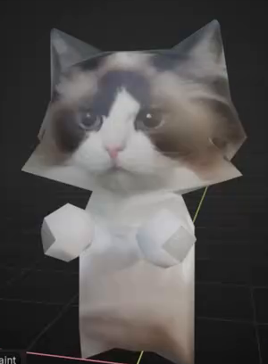
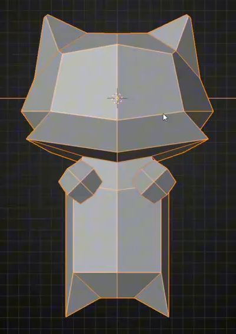
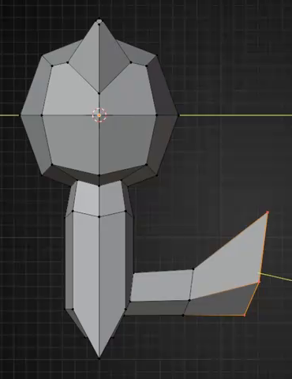
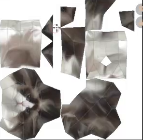

# Low-Poly Cat With Photo Texture

Create an editable low-poly cat with a broad angular head, pointed ears, a narrow upright body, raised front paws, and a bent tail. Transfer the supplied cat photograph into a painted color texture so that its recognizable face and fur markings remain visible on the faceted model.

## Starting Scene And Input

Use Blender 5.1.2 and start from a new scene with native mesh primitives. Build the character geometry yourself. Use Cycles with GPU rendering for the final image.

Use [source_photo_crop.png](../input/source_photo_crop.png) as the required source for the face and fur colors. This is a low-resolution crop extracted from the source video, not the full-resolution original photograph. It contains the complete face, ears, and pale chest needed for this task. Preserve those recognizable features; do not replace the image with another animal or a newly invented face. The photo is a painting source, not a background or a flat substitute for the character.

## 1. Character Silhouette

- Make the head noticeably wider than the body, with a broad forehead, angular cheeks that flare near the lower face, a narrower chin, and two upright triangular ears. Keep the head and ears balanced around the facial centerline.
- Place a short neck above a slender vertical torso. Give the lower torso a shallow central notch between two pointed lower corners, as in the geometry reference.
- Place two small, faceted front paws in front of the upper torso. They should read as a matched pair and remain visibly separate from the chest silhouette.
- Extend a thick, angular tail from the lower rear of the torso. It should travel backward before turning upward into a broad pointed end. Its connection, bend, and thickness must be clear from the side.

## 2. Low-Poly Geometry

Keep large, readable planar facets across the head, ears, body, paws, and tail. Preserve real three-dimensional depth when viewed from the front, side, and back. The character must be editable mesh geometry with clean visible surfaces: no open holes, doubled surfaces, flipped faces, or distracting intersections. Separate mesh objects or disconnected mesh islands are acceptable when they form a coherent character. No exact polygon count or particular modifier stack is required.

## 3. UV Layout And Paint Surface

Provide a usable UV layout for every character surface. Place the mapped faces inside the texture area with nonzero face area and without unintended overlaps. Organize the head, ears, body, paws, and tail so their colors can be edited independently, and leave enough texture space for the eyes and muzzle to remain legible.

Create an editable color-image atlas used by the character's actual surface material. Transfer the photograph into this atlas and add the needed color repairs there. The painted result must stay attached to the model when the view changes and the photo template is hidden. A paint edit on the atlas must visibly affect the corresponding model surface.

## 4. Photo-Based Face And Fur

Align the supplied face to the model's front: both eyes must sit on the upper face, the nose and mouth must lie near the centerline, and the pale muzzle and central blaze must remain surrounded by darker eye and cheek fur. Keep one coherent face with natural feature proportions and a recognizable relationship to the supplied image. Avoid duplicate facial features on the sides or back.

Continue the gray-brown and pale fur colors over the ears, head sides, back, body, paws, and tail. Keep the chest and paws predominantly pale. Repair uncovered areas and abrupt projection boundaries with compatible colors while preserving the low-poly appearance. Ordinary pale fur is expected; blank material patches, photo-background fragments, and obvious UV seam lines are not. The texture's softness may reflect the supplied low-resolution source.

## 5. Final Presentation

Present the complete character in a static, slightly angled front view with a plain background and lighting that makes the face, facets, paws, body, and tail easy to inspect. Keep the full silhouette in frame, make both eyes legible, and choose an angle that reveals the tail beside the body. The final image must show the actual textured geometry.

## Deliverables

- `submission.blend`: the editable character, UV layout, painted atlas, materials, camera, and lighting, saved for Blender 5.1.2. Pack the image dependencies so the appearance survives reopening the project.
- `build.py`: a reproducible Blender Python script that builds and saves the scene from a fresh file using the supplied input image. Include the texture construction and final render setup; do not depend on a pre-existing completed scene.
- `B89_Low_Poly_Cat_With_Photo_Texture.png`: a PNG rendered from the actual submitted scene in the presentation described above. It must not be a source frame, viewport screenshot, or externally substituted image.
