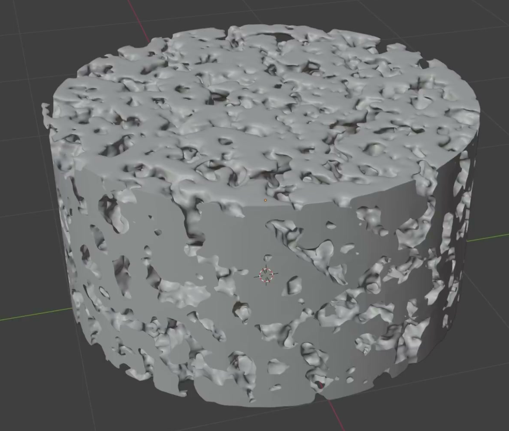
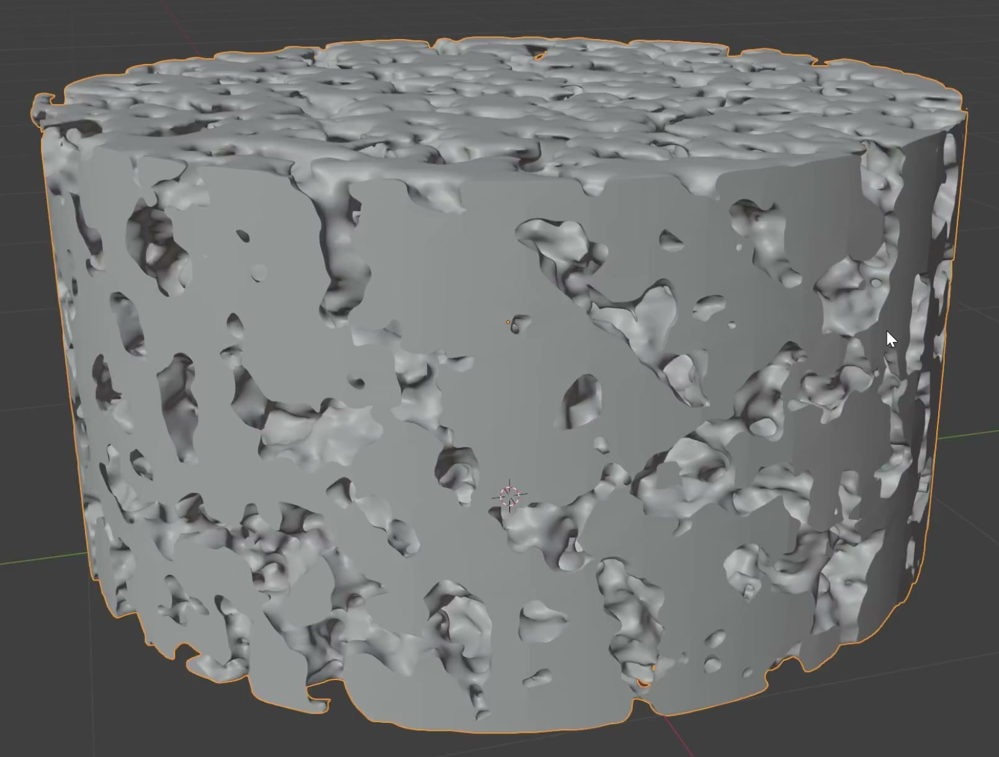
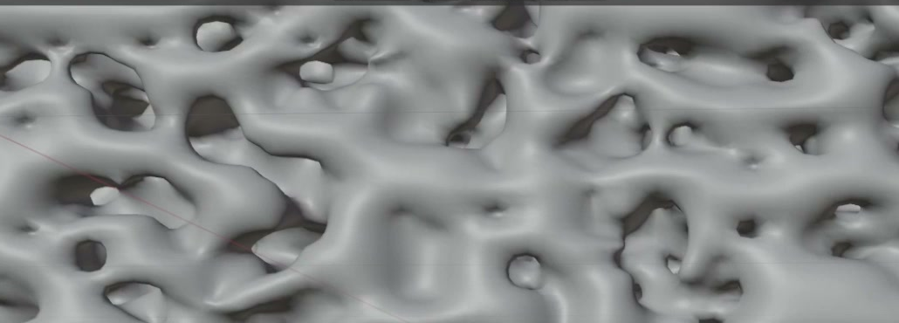

# Procedural Porous Cylinder

Create a static, editable porous cylinder with a short cylindrical envelope, irregular openings, and a connected three-dimensional network of smooth solid walls. The pore pattern must be generated procedurally and remain adjustable in the saved scene.

The reference shows the overall proportions and the relationship between the circular top and perforated side wall.

## Starting Scene

Use Blender 5.1.2 and start from an empty scene. The `input/` folder is empty; no external model, texture, image, or add-on is needed. Construct the host geometry, pore generator, and cylindrical boundary with native Blender features. This is a static asset; no animation is required.

## Cylindrical Envelope

Make one main porous body whose height is about half its diameter. Its overall envelope must be circular in top view, approximately vertical along the sides, and bounded by approximately parallel top and bottom planes. Local pore openings may interrupt these boundaries. Preserve the circular silhouette around the full circumference and remove any rectangular corners or protruding fragments of the original generation region.

The side retains broad solid regions between irregular openings while the whole body reads as a short cylinder.

## Volumetric Pores

Distribute numerous irregular pores across the top, bottom, and all sides, with a mixture of small openings and larger branching openings. Pores must be actual three-dimensional cavities and passages with visible wall depth, continuing into the interior. They must not be a flat cutout pattern, surface bumps, or a hollow cylinder with only a perforated outer skin.

Keep the solid material predominantly connected from the lower region to the upper region and across the body. It should read as a coherent porous sample, with substantial bridges between neighboring regions. Small isolated grains are acceptable, but loose fragments must not dominate the form. Avoid a regular grid of identical drilled holes.

## Smooth Geometry

Give the internal pore walls flowing, rounded transitions while retaining their openings and local shape variation. Resolve the geometry finely enough that coarse voxel steps, blocky pore silhouettes, and large flat facets do not dominate. The cylindrical boundary should be clean, with no conspicuous doubled surfaces, torn sheets, spikes, or shading discontinuities unrelated to the pores.

This detail illustrates the smooth branching walls; the final envelope remains cylindrical as shown above.

## Editable Generator

Keep a live procedural geometry system that evaluates a three-dimensional density field into the solid-and-void structure. Equivalent native implementations are acceptable; the result must not depend solely on a frozen mesh or a surface shader.

Keep these aspects independently editable in the submitted scene:

- Pore scale: changing it produces a visibly coarser or finer pore pattern within the same cylindrical envelope.
- Solid/void balance: changing it produces a visibly more open or denser structure without merely resizing the whole object.
- Cylindrical width and height: changing either boundary dimension regenerates the clipped body without leaving a rectangular generation boundary, an uncut solid core, or exposed helper geometry.

Use clear English labels for the relevant inputs or controls. Modest edits around the delivered settings must produce useful variations, and restoring those settings must restore the submitted form. Keep construction helpers out of the final rendered image.

## Presentation

Use Cycles with GPU rendering. Provide a neutral, opaque surface and lighting that make the pore-wall depth legible. Frame the entire cylinder in a clear three-quarter view showing its top and side, with margin around the silhouette. The final image must reveal both the overall envelope and the open pores without severe noise, crushed shadows, or clipped highlights.

## Deliverables

- `submission.blend`: the complete scene, including the live generator, editable controls, materials, camera, and lighting. It must reopen with the delivered porous cylinder intact and without missing dependencies.
- `build.py`: a script that recreates the complete scene from an empty Blender scene and explicitly saves the resulting `submission.blend`. The recreated file must preserve the procedural controls and render setup. Rebuilding only an unsaved in-memory scene is insufficient.
- `B90_Procedural_Porous_Cylinder.png`: a PNG rendered from the actual scene saved in `submission.blend`, using the presentation above. Do not substitute a source image, viewport screenshot, or external replacement.
