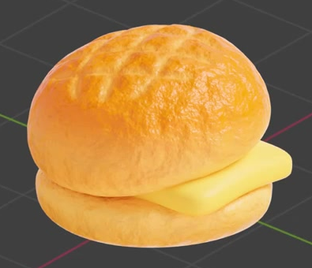
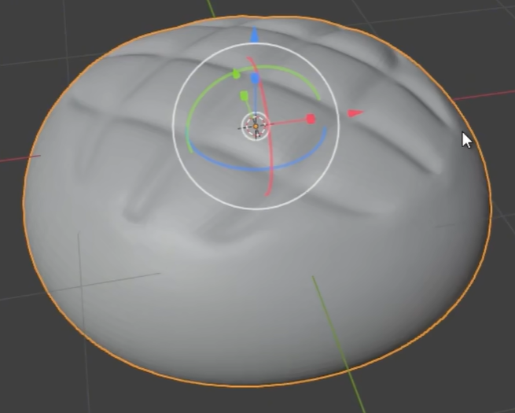
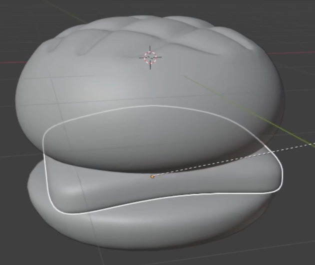
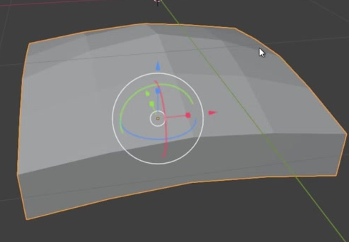

# Pineapple Bun with Butter

Create a stylized baked pineapple bun with a rounded crosshatched crown, a shallow lower bun, and a soft yellow butter slice held between them. The finished asset should read as warm bread with a finely irregular crust and a smooth, gently bent filling.

## Starting Scene

Use Blender 5.1.2 and start from an empty scene. The `input/` directory is empty; no external model, image, texture, or environment asset is required. Build the bun and butter from native geometry and create their materials in Blender. Use Cycles with GPU rendering for the final image.

## 1. Bun Halves

Give the upper bun a broad, plump dome that is wider than it is tall, with rounded shoulders and a softly curved lower edge. It should have substantial volume rather than resemble a thin shell or a sphere.

Create a separate lower bread region with a similar horizontal footprint, a rounded perimeter, and a gently curved underside. This lower layer must be visibly shallower than the upper bun, leaving the upper dome as the dominant mass.

## 2. Crosshatched Crown

Form shallow, recessed grooves in two crossing diagonal directions across the upper crown. Their intersections should divide the central crown into several broad diamond-like cushions, while the pattern fades into the smooth surrounding shoulders. The cushions and grooves must follow the dome's curvature with softly rounded transitions.

The grooves must be present in the evaluated geometry and remain recognizable when the bread material is replaced temporarily with a plain gray material. Surface color or painted lines alone do not satisfy this feature.

## 3. Butter and Assembly

Model a thin, approximately square butter slice with rounded corners, softened edges, and visible thickness. Give it a gentle bend and modest irregularity along its edge so it looks pliable while retaining a recognizable slice shape.

Place it between the bread halves with part of its edge and at least one corner projecting beyond the bread silhouette. The upper bun, butter, and lower bun must read as one assembled sandwich. Keep their contacting regions close enough to avoid a floating layer, without burying the exposed butter or collapsing the bread into one indistinct mass.

## 4. Bread Surfaces

Give the upper bun a warm golden-orange baked crust, with lighter yellow-gold areas toward its sides and natural variation across the crown. The recessed pattern and raised cushions should remain visually legible after shading. Give the lower bread a lighter golden-yellow finish with gentle tonal variation, so it belongs to the same bun without matching the darkest toasted areas above.

Create fine, irregular pores or wrinkles in the upper crust together with broader, restrained surface unevenness. Carry a related fine bread texture onto the lower layer. These details must affect surface shading, not just color, and must remain subordinate to the bun silhouette and crown grooves. Use soft, broad highlights that reveal the texture without making the bread look metallic or uniformly mirror-like.

## 5. Butter Surface

Use a warm pale-yellow butter material that is visually distinct from the toasted bread. Keep the slice substantially smoother than the bread, with soft highlights that reveal its rounded thickness and bend. The material must cover the exposed top, edge, and corner consistently.

## 6. Geometry Quality

Keep the bun halves and butter as editable 3D geometry with separately assignable surface regions. Their silhouettes should be smooth at the final viewing distance, and their visible surfaces should be continuous, without accidental holes, coarse faceting, sharp pinches, or detached fragments. Preserve the intended recessed crown pattern while smoothing the surrounding bread.

## Deliverables

- `submission.blend`: the editable completed scene, including all bun geometry, materials, lighting, a camera, and render settings.
- `build.py`: a reproducible Blender Python script that recreates the scene from an empty scene and explicitly saves the resulting scene as `submission.blend`. It must work without loading the submitted blend or relying on unprovided assets. The saved file must reopen with the recreated geometry, materials, and render settings intact.
- `B91_Pineapple_Bun_with_Butter.png`: a PNG rendered from the actual scene in `submission.blend`. Use a clear three-quarter view that shows the crosshatched crown, lower bread, and projecting butter together, with the complete bun comfortably in frame and lighting that reveals the surface texture. Do not substitute a source reference image, viewport screenshot, or externally generated image.
