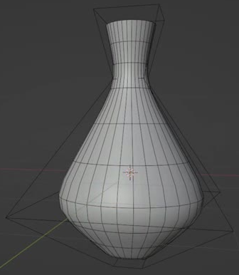
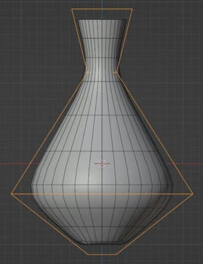
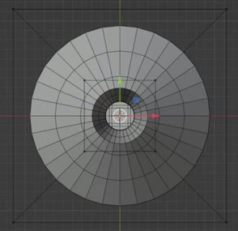
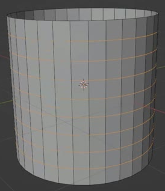
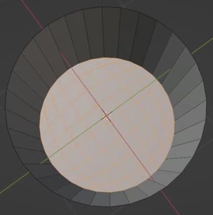

# Lattice-Controlled Vase

Create a smooth, upright vase whose small foot, full lower belly, narrow neck, and flared open rim are shaped by a live lattice. The saved asset must remain easy to reshape through the cage while retaining a simple cylindrical base mesh.

## Starting Scene

Use Blender 5.1.2 and Cycles with GPU rendering. No external input assets are provided or needed; the input folder is empty. Start from an empty scene and create the vase and its lattice using native Blender geometry. A neutral material, camera, and lights may be added for the final render.

## Vase Profile

Match the reference's elongated silhouette: the vase is roughly one and a half times as tall as its widest diameter. A small, flat-ended foot expands into a rounded belly in the lower half. Above the belly, the shoulder rises in a long taper to a narrow neck, then opens outward into a short flared mouth. The neck must remain visibly open, and the mouth must stand clearly above it.

The belly is the widest part. Both the foot and rim are substantially narrower than the belly, with the rim wider than the neck. Keep all parts centered on one upright axis and preserve the smooth transition between the lower body and upper taper. Absolute size is unrestricted.

## Circular Sections and Opening

Keep horizontal sections circular throughout the foot, belly, neck, and rim, with front and side profiles agreeing. The top is an uninterrupted open ring leading into the vase interior. A connected floor closes the bottom; the interior must not open through the foot. A thin single-surface shell is sufficient, and a thick ceramic wall is not required.

## Deformation Substrate

Keep the undeformed body as a straight, upright cylindrical shell. Its sidewall must have a regular quad layout with horizontal divisions distributed along its height so the cage can shape the lower body, shoulder, and neck separately. The floor must be a connected grid-like quad patch. Provide enough geometry to support the curved profile without a dense sculpted or remeshed substitute.

## Live Shape Controls

Use a separate, live Blender lattice with four horizontal control levels corresponding to the foot, belly, neck, and rim. Keep the cage and the body editable in the saved file. The cage must determine the vase profile throughout the body: bypassing its deformation must return the body to the straight cylindrical substrate, and restoring it must restore the submitted vase.

Each level must support a modest centered width adjustment that visibly changes its corresponding region while preserving the other regions as a recognizable vase. The neck and rim levels must also allow a modest height adjustment. These edits must keep the opening and floor connected, preserve round sections when adjusted symmetrically, and avoid tears or self-intersections. The controls are for manual reshaping; no timeline animation is required.

Keep smoothing live after the cage deformation. Bypassing smoothing alone must reveal the shaped control mesh, and restoring it must recover the smooth surface without altering the cylindrical base mesh.

## Smooth Finish

The evaluated vase must read as one continuous smooth form. Keep the belly and shoulder free of visible facet bands, unwanted creases, doubled surfaces, inverted patches, and local pinching. Finish the existing neck, rim, and foot cleanly, with an even floor and no conspicuous pinch where it meets the wall. Use a simple neutral presentation that makes the silhouette and opening easy to inspect.

## Deliverables

- `submission.blend`: the finished vase, live lattice, editable cylindrical substrate, live smoothing, and a render-ready scene, saved with the intended vase profile active.
- `build.py`: a self-contained Blender Python script that recreates the scene from an empty scene and saves the finished result as `submission.blend`. It must not depend on a pre-existing solution file or unavailable external assets.
- `B92_Lattice_Controlled_Vase.png`: a PNG rendered from the actual submitted scene using Cycles GPU. Show the complete vase from a slightly elevated three-quarter view so the open mouth and full silhouette are visible. Use the final smooth state without cage wires or construction overlays. A source image, viewport screenshot, or external replacement is not a valid render.
