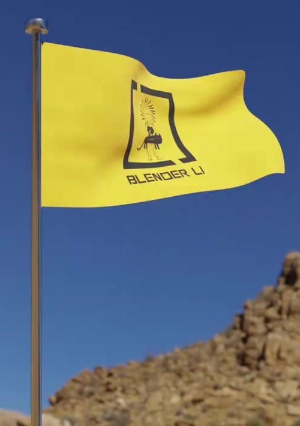
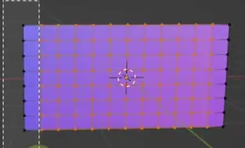
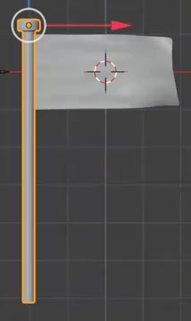
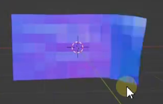
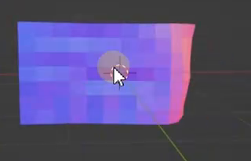

# Wind-Driven Yellow Flag

Create an editable yellow cloth flag fluttering from a slender metal pole. The pole-side edge stays attached while the free cloth develops changing folds under wind. Deliver a five-second portrait animation with physical cloth behavior that can be recomputed after changing the wind.

## Starting Scene

Use Blender 5.1.2 and Cycles with GPU rendering. Start from an empty scene and create the flag and pole with native geometry. The `input/` directory is empty; no external asset is required.

A plain yellow flag and a simple blue or blue-gray environment are sufficient. The emblem and rocky landscape visible in the reference are optional visual context. Any additional image assets used in the finished scene must be included or packed with the submission.

## Flag and Pole

- The flag's undeformed shape is a thin, upright rectangle, approximately twice as wide as it is tall. It extends sideways from the upper part of the pole and has an uninterrupted outer boundary.
- Provide distributed, editable surface geometry that can bend into broad folds across the flag. The finished cloth must read as a flexible sheet with smooth curved folds and edges, without holes, torn seams, large planar facets, or unintended thick edges.
- Create a separate, slender cylindrical pole. Its shaft extends substantially below the flag, its top sits slightly above the flag, and a wider rounded cap finishes the top.
- Keep the pole rigid, with a round silhouette and smooth cap-to-shaft transitions. The flag's attachment edge lies alongside the pole rather than floating away from it.

## Surface Appearance

Give the flag a bright yellow, nonmetallic cloth appearance with broad, soft shading across the folds. It should read as matte fabric, retaining visible yellow color in both lit and shaded regions. Keep its surface appearance continuous as it bends.

Give the pole a neutral gray metal appearance. Reflections and longitudinal highlights should reveal the round shaft and rounded cap while preserving a darker gray body. The cloth and metal must remain visibly distinct.

## Physical Cloth

Use a recomputable cloth simulation with gravity and editable wind strength and direction. The fixed edge must remain constrained to the pole, and the rest of the sheet must be free to deform. Keep the attachment stable throughout playback: any drift relative to the pole must stay below 1% of the flag's undeformed width. The pole itself remains stationary.

Support this physical response check on a disposable copy of the scene:

1. Clear the simulation cache and recompute frames 1 through 120 with the submitted wind settings.
2. Set wind strength to zero, leave gravity and all other settings unchanged, clear the cache, and recompute the same range.
3. The free cloth must take a visibly different trajectory or settled shape, showing gravity-driven droop or reduced billowing when wind is removed. The attachment edge must remain constrained in both runs.
4. Restore the original wind and clear and recompute again to recover the submitted behavior.

Provide access to the settings and cache-reset procedure within the editable scene or `build.py`. Stored animation may support delivery, but changing the wind and recomputing must affect the cloth physically.

## Animation

Set the scene to frames **1 through 120 inclusive at 24 fps**. This is a five-second, non-looping clip; the final pose does not need to match the first.

At frame 1, show the upright flag close to its rectangular rest shape. By frame 25, wind should have developed visible billowing. From frames 25 through 120, the free edge and folds continue changing while the flag stays extended generally away from the pole. The motion must include changes within the cloth surface, not only movement of the entire object. Maintain a stable attachment and avoid temporal jumps, explosive stretching, and persistent visible self-intersection.

The two unshaded reference states below show the intended change in the free cloth. Their viewport colors are not the final material target.

Replaying from the start after a cache reset must reproduce the intended motion. Keep the final animation available after reopening the saved scene, either through included simulation data or a working recompute procedure.

## Presentation

Use a fixed portrait camera that keeps the complete flag, the pole cap, and most of the shaft visible throughout the clip. Make the yellow cloth the focal point, with clear space around its changing free edge. A simple environment is sufficient when its lighting reveals the cloth folds and metal reflections. Maintain a readable silhouette and stable exposure across the animation.

## Deliverables

- `submission.blend`: the saved, editable scene with geometry, used materials, physical controls, camera, declared timeline, and the data needed to replay or recompute the animation.
- `build.py`: a script that recreates the scene from an empty Blender session, prepares any necessary simulation data or recomputation, and explicitly saves the completed result as `submission.blend`. The saved file must reopen independently and retain the scene, controls, and animation behavior.
- `B93_Wind_Driven_Yellow_Flag_dynamic.mp4`: a portrait video rendered from the actual submitted scene, covering every frame from 1 through 120 at 24 fps. Use the saved scene's camera and materials; the video must show the animated geometry rather than source images, viewport captures, or an external replacement.
