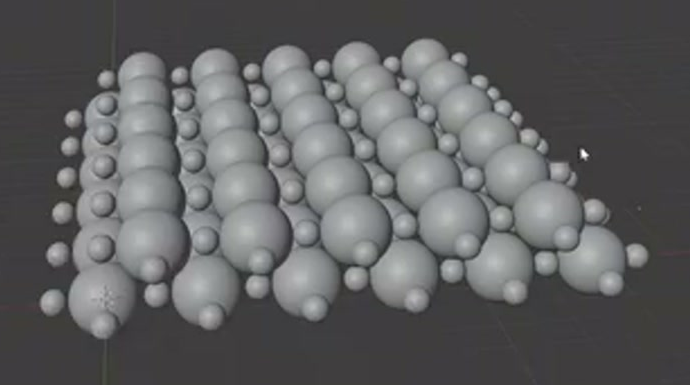
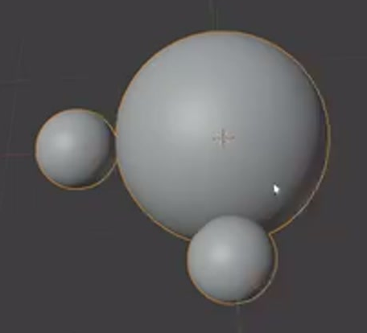
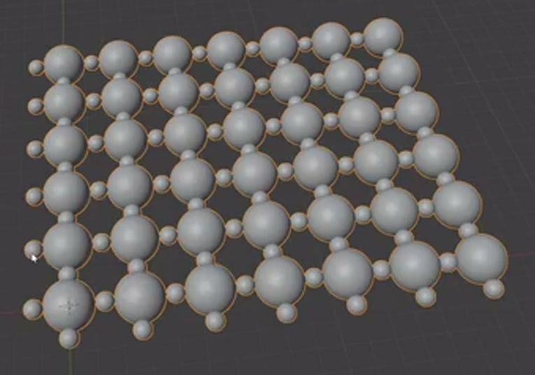
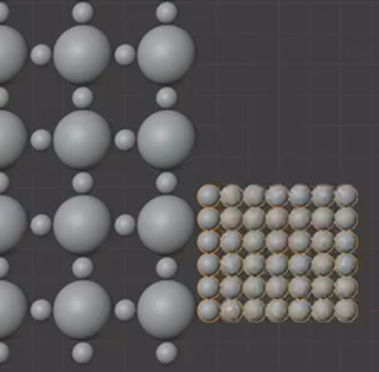
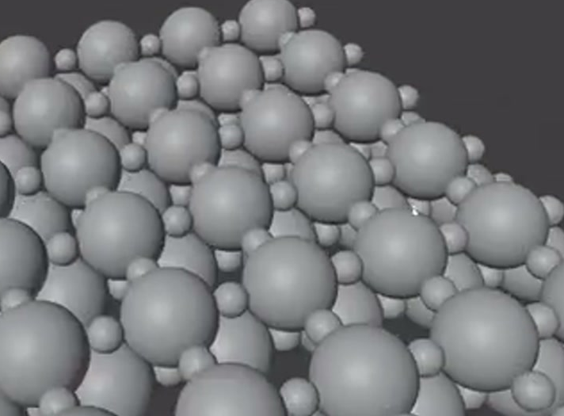

# Staggered Molecular Lattice Sheet

Create an editable molecular lattice sheet made from smooth large and small spheres. Regular two-dimensional repetition, a separate field of small spheres, and staggered parallel layers must combine into one compact structure with visible thickness.

## Starting Scene

Use Blender 5.1.2 and configure Cycles with GPU rendering. Start from an empty scene. No external assets are provided or required; the `input/` folder is empty. Create all geometry from native Blender shapes.

## Molecular Unit

Use a repeating motif with one large sphere and two matching smaller spheres. Viewed along the layer normal, the small spheres lie on two perpendicular sides of the large sphere, forming an L-shaped arrangement. Their diameters must be clearly smaller than the large sphere's, with the same size relationship throughout the asset. Keep the spheres individually recognizable where they meet; contact or slight overlap is acceptable.

## Main Lattice

Expand the motif into a broad rectangular lattice with at least five large-sphere sites along each of two perpendicular directions. Use a near-square footprint, straight rows, and consistent spacing along each direction. The smaller spheres must repeat between neighboring large spheres along both directions, preserving the motif's arrangement. Avoid accidental missing sites, doubled sites, and compressed rows.

Keep the main lattice procedural in the saved scene. Provide live controls for repetition count and spacing along both planar directions. Changing either count must add or remove a complete row or column, and changing a spacing control must update that direction uniformly while preserving the motif. Modifiers, geometry nodes, or equivalent live constructions are acceptable.

## Small-Sphere Field

Include a separately controllable two-dimensional field made only from the smaller spheres. It must have matching sphere size, regular spacing, and a near-square outline with several rows in both directions. Integrate it into the assembled sheet so that it contributes visible small spheres among or along the edges of the larger-sphere layers. Retain the ability to isolate it for inspection.

Provide live count and spacing controls for both directions of this field, independent of the main lattice. A count change must add or remove a complete row or column of small spheres without altering the main lattice. The separated layout in the reference shows the components for comparison; the delivered asset must be assembled.

## Staggered Sheet

Assemble at least two parallel large-sphere lattice layers with a visible separation along the layer normal. Offset neighboring layers within their planes so that their spheres interleave in an oblique view. Give at least one layer a shorter span than the main layer, producing a stepped or staggered boundary.

The layers and small-sphere field must form one compact sheet. Its two broad dimensions must exceed its thickness, with enough depth to distinguish the layers and enough proximity for them to read as a single asset. Preserve clear large-sphere silhouettes and visible small spheres between or beside them. The result must remain inspectable from the front, side, and oblique directions.

## Surface and Presentation

Give both sphere sizes round silhouettes and smooth shading without conspicuous polygon facets, dents, or shading seams. Assess this on the actual sphere geometry, including the smaller field.

Use simple neutral surfaces and lighting that reveal the spherical forms. Frame the entire assembled sheet from an oblique angle, showing both its broad footprint and layer depth with comfortable margins. The background must allow the complete outline and small spheres to remain legible.

## Deliverables

- `submission.blend`: the complete editable scene, with the live repetition controls, assembled lattice, materials, lighting, and camera ready to render.
- `build.py`: a reproducible Blender Python script that recreates the complete scene from an empty scene and explicitly saves it as `submission.blend`. It must recreate the geometry, live controls, assembly, materials, lighting, camera, and render settings without manual intervention. Use relative paths for any output.
- `B94_Staggered_Molecular_Lattice_Sheet.png`: a PNG rendered from the actual submitted scene using the final camera. The image must show the complete asset; source images, viewport screenshots, and externally substituted images do not satisfy this deliverable.
