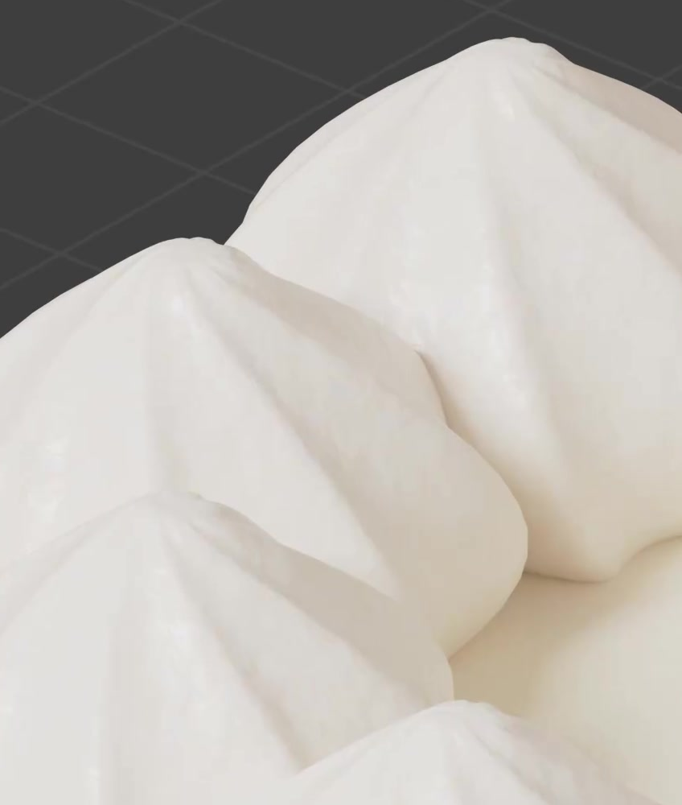
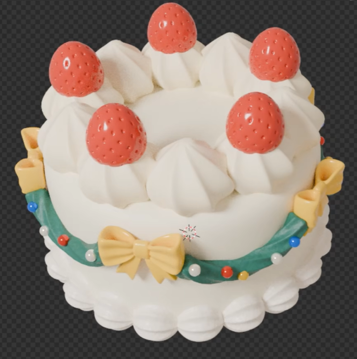

# Procedural Cream Material

Create a reusable procedural cream material on a simple cake base. Its pale warm color, subtle irregular color variation, and shallow surface grain should produce a soft cream finish under neutral lighting. The references specify the cream finish; the required geometry is the simple base described below.

## Starting Scene and Simple Base

Use Blender 5.1.2 with Cycles GPU rendering. Start from an empty scene; input/ is empty and no external model, texture, or plugin is needed. Build a short round cake base with a flat top, rounded top edge, and smooth continuous side wall. Apply the cream material across its top and sides. Keep the base editable. The decorated cake visible in the source references is a material example, not required geometry.

## Cream Color

The applied surface must remain pale warm white, with a restrained ivory tint. Use slightly different light cream colors throughout the surface, with soft transitions. Avoid dark specks, strong yellow patches, or broad high-contrast staining. Color variation must be present in the material itself rather than painted by the lighting.

## Fine Color Variation

Generate irregular, fine-grained color variation procedurally in three dimensions. It must be visible in a close view while merging into a coherent cream color in the whole-object view. The pattern should have no obvious tiling, straight stripes, or stretched streaks on the side wall. It must not depend on an image texture.

## Shallow Surface Grain

Add a separate procedural surface-normal or shallow-relief pattern that is coarser than the fine color variation. Under oblique light, this should create gentle uneven highlights and tiny shallow bumps, without craters, sharp spikes, or a visibly damaged silhouette. Preserve the smooth overall cake form. This detail must change how the surface responds to light, rather than being only a flat color pattern.

## Soft Light Response

Use an opaque, nonmetallic cream response with soft visible highlights. The surface should retain detail in bright and shaded regions without becoming mirror-like, metallic, glassy, or featurelessly flat. The color and grain must remain legible under neutral lighting from more than one direction.

## Editable and Attached Texture

Keep the material procedural and reusable. Provide independently editable controls for the cream color range, color-pattern scale, relief-pattern scale, relief strength, and highlight softness. Adjusting the relief scale or strength must leave the color pattern unchanged; adjusting the color-pattern scale must leave the relief pattern unchanged.

Both patterns must remain attached to the cake when it is translated or rotated, and must continue smoothly across its rounded edge. Reusing the same material on a second simple rounded object must retain both procedural patterns without a new image texture or manual repainting. Identify the material and its controls with a short comment in build.py.

## Deliverables

- <code>submission.blend</code>: the editable cake base with its applied cream material, editable material controls, and a camera and lighting setup.
- <code>build.py</code>: a reproducible Blender Python script that constructs the scene from empty without external assets.
- <code>B95_Procedural_Cream_Material.png</code>: a Cycles GPU render from the actual submitted scene, using a close oblique view that shows the top, rounded edge, side wall, and visible surface grain. Source images, viewport screenshots, and external picture replacements are not valid render deliveries.
