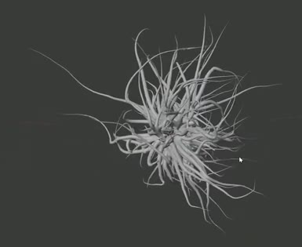
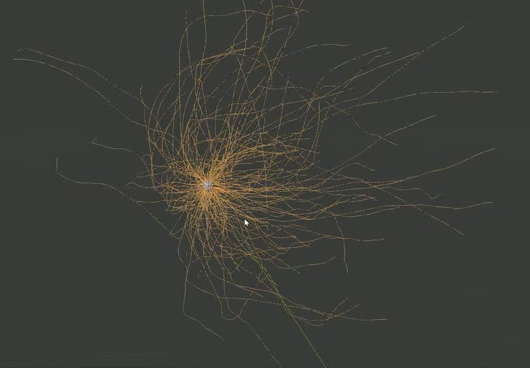
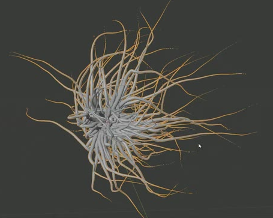

# Simulated Tentacle Virus

Create a static microscopic-virus concept model: a compact tangled core surrounded by a dense three-dimensional spread of wiry tentacles. Grow the tentacle paths with a reproducible particle simulation, then make one continuous, closed, smoothly finished mesh. Long wandering arms and shorter curls should taper from substantial roots to very fine tips.

## Starting Scene

Use Blender 5.1.2 and start from an empty scene. No external input assets are provided or required; `../input/` is empty. Create a small spherical emitter using native geometry. Choose a consistent scale and preserve the proportions in the references. The emitter and simulation helpers are retained for inspection and excluded from the final render.

## Particle Simulation

Generate 200 trajectories by integrating particle motion under forces over frames 1-200 at 24 fps. Emit from across the small spherical surface during frames 1-100, with varied lifetimes of up to 100 frames so the resulting paths have mixed lengths. Gravity has no effect on the particles. A spatially varying turbulence field produces wandering paths; its center rises vertically from the emitter, easing through frames 1-100 and continuing upward at a constant rate through frame 200. A separate repulsive force placed to one side adds a subtle drift away from that side.

Preserve the simulation settings and sampled centerlines in the saved scene. The particle trajectories must supply the centerlines used to build the tentacles. Keep a reproducible baseline seed and document controls in `build.py` for the seed, turbulence amount, and directional-force strength. These controls must allow a fresh simulation to be computed without hand editing geometry. Native simulation or an equivalent coded particle solver is acceptable.

Recomputing with the same settings and seed must reproduce the baseline paths. Recomputing with zero turbulence must reduce the wandering; setting the directional-force strength to zero must reduce the corresponding drift. Restoring the baseline controls must restore the baseline result. Ordinary timeline changes and edits to the retained helpers must leave the saved finished body fixed until an explicit rebuild is requested. This is a static final asset; the simulation timeline is retained for inspection.

## Organic Form

The body has a compact, visibly tangled central mass and a dense field of outward-reaching arms in every direction, including front and back. It should read as a spatial cluster when viewed from different sides. Mix short curls, medium strands, and long reaching tentacles. The outer region remains mostly open space, and the dense center occupies only a small part of the full span.

Use irregular, non-repeating bends and changes of direction along the tentacles. Their centerlines should flow smoothly through broad arcs and tighter curls. A subtle overall directional bias may remain while the arms still spread around the core. Match this wiry form without requiring the precise arrangement of any individual arm.

## Tapered Tentacles

Give the paths real round tubular volume. The individual arms remain slender relative to their length, start thickest near the core, and narrow continuously toward fine pointed ends. Long, nearly hairline terminal sections are appropriate. Preserve this taper across the existing arms, including the short ones, and retain a visible distinction between thick roots and delicate tips after fusion.

## Unified Mesh

Deliver the finished visible body as one connected, watertight manifold mesh. Tentacle roots and intersecting arms merge into shared material. Closed tips, consistent outward-facing surfaces, and a continuous interior are required. Remove disconnected fragments, internal overlapping tube walls, holes, and duplicate surface sheets. A voxel union or an equivalent solid-fusion method is acceptable. Preserve the slender silhouette and the spaces between arms during fusion.

## Surface Finish

The core and tentacle flanks have a smooth organic finish. Use sufficient geometric resolution for continuous curved silhouettes and round cross-sections. Relax visible remeshing steps and rough junctions while preserving the thin tips, the irregular bends, and the dense center's structure. The mesh must remain inspectable as real geometry; surface shading alone cannot conceal broken or coarse geometry.

## Presentation

Use Cycles with GPU rendering. Show the complete body from a clear three-quarter view against a simple contrasting background. Neutral shading and soft directional lighting should make the overlapping roots, open spaces, and fine tips readable. Keep simulation helpers out of the image. All visible forms must come from the submitted scene.

## Deliverables

- `submission.blend`: the finished fixed body, retained simulation settings and centerlines, and a render-ready camera and lighting setup. Keep required data self-contained in the file.
- `build.py`: a runnable script that recreates the scene from an empty scene, recomputes the simulation and final geometry, and saves the completed result as `submission.blend`. Document its run command and simulation controls in comments. The saved file must reopen independently with the finished body and its retained simulation data intact.
- `B96_Simulated_Tentacle_Virus.png`: a PNG rendered from the actual submitted scene, at least 1200 pixels on its longest side. The image must show the complete final asset; source images, viewport screenshots, and external replacements are not deliverables.
