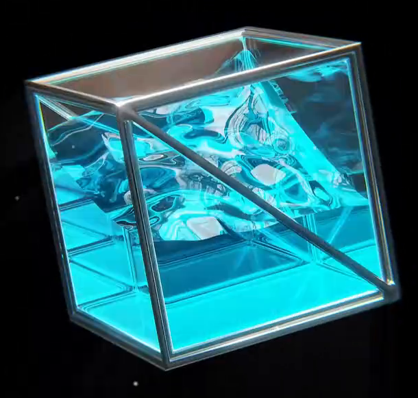
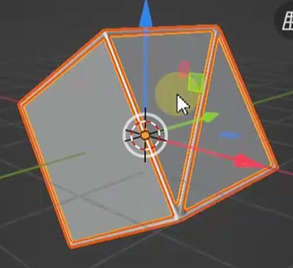
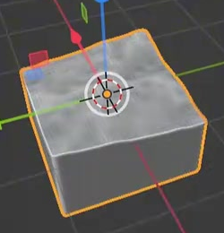
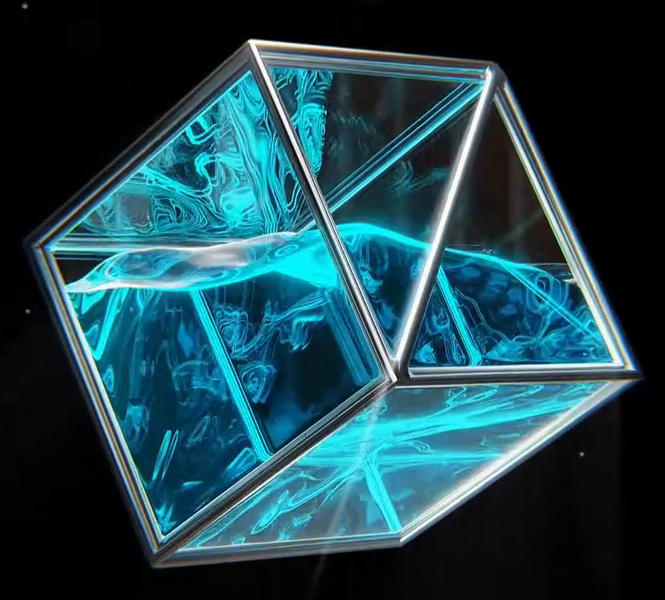

# Rocking Glass Wave Display

Create an animated display of luminous cyan water inside a clear, cube-shaped glass enclosure reinforced by a silver metal frame. The enclosure rocks from side to side while a detailed wave surface continues to evolve inside it.

## Starting Scene

Use Blender 5.1.2 and Cycles with GPU rendering. The input folder is empty; no external asset is required. Build the enclosure, frame, water, and wave system from native Blender geometry, starting from an empty scene or the default scene. The reference images show appearance and structure, not required object names or construction steps.

## 1. Glass Enclosure and Metal Frame

Create a rigid enclosure with approximately equal width, depth, and height. Its planar glass walls and base must have real thickness and leave an unobstructed upper region above the water. Keep its outer silhouette box-shaped rather than deforming it with the waves.

Surround the box edges with connected metal struts. Include a diagonal brace across the front and another across an adjacent side, so both are visible from a three-quarter view. The struts must be narrow enough to reveal the glass and water, with softened edges that catch highlights and tidy corner joints.

## 2. Water Volume

Create a distinct water volume occupying roughly the lower half to two-thirds of the enclosure in its upright orientation. Give it continuous side surfaces and a bottom, topped by a detailed nonplanar surface with broad crests, troughs, and smaller ripples. The wave profile must be geometry, not only a painted pattern or shading effect.

The lower volume must remain connected to the wave surface. Use enough geometric detail for smooth silhouettes and curved highlights, without visible holes, faceting, spikes, or collapsed regions. The glass and water must remain distinguishable as separate surfaces.

## 3. Editable Wave System

Keep a live procedural relationship between an editable wave generator and the visible water surface. Provide separately adjustable controls for wave height and wave phase or time. Reducing wave height to zero must flatten the top while preserving the lower water volume; changing wave phase at a fixed animation frame must alter the crests and troughs without moving the enclosure.

The system must regenerate the visible surface after either control changes, including when the enclosure is tilted. It may use native modifiers, geometry nodes, or an equivalent editable implementation. Any larger driving surface must stay out of the final render.

## 4. Animation and Containment

Use frames 1 through 150 at 30 fps. Rock the glass enclosure and its frame together about a horizontal axis through the center of the box: approximately -30 degrees at frame 1, +30 degrees at frame 75, and -30 degrees again at frame 150, within 5 degrees of each stated angle. Interpolate smoothly and keep the assembly's center fixed. The glass panels, frame corners, and diagonal braces must remain rigid and aligned throughout the motion.

Animate the wave phase continuously across the same timeline. The wave shapes must evolve visibly, rather than merely moving a frozen water shape with the enclosure. Keep the average water surface approximately level relative to world up while its boundary adapts to the tilted walls. Water must stay inside the enclosure, with no conspicuous gaps at the walls, detached regions, or protruding driver geometry. No splash particles or fluid spill are required.

The final enclosure pose returns to the initial tilt, but the water does not need to repeat its initial shape. This is a five-second clip, not a required seamless loop. Replaying the timeline from frame 1 must reproduce the same motion.

## 5. Glass, Metal, and Water

Give the enclosure clear glass with visible reflections, edge highlights, and refraction. The water must remain legible through the front and side panels; avoid opaque, excessively dark, or milky glass.

Give the struts and braces a silver metal appearance with reflective highlights that reveal their softened edges. Keep the frame visually distinct from the transparent enclosure.

Give the water a saturated cyan or turquoise appearance that combines transmission and visible self-emission. Preserve readable crests, darker troughs, and reflective or refractive variation across the water, rather than reducing it to a uniformly bright block. The emission must come from the water material itself.

## 6. Camera and Lighting

Use a stable three-quarter camera view against a black or very dark neutral background. Show the front, an adjacent side, and the wave surface together. Keep the entire enclosure inside the image throughout its tilt, with clear separation between its silhouette and the background. Light the glass and metal so their reflections remain readable without washing out the cyan wave detail. Keep unrelated scene objects and construction helpers out of the render.

## Deliverables

- `submission.blend`: the complete editable scene, including the live wave controls, the full 1-150 animation at 30 fps, camera, lighting, and materials. Save it at frame 1 with its required resources available.
- `build.py`: a Blender Python script that recreates the complete scene from an empty file and saves `submission.blend` next to the script. Reopening that saved file must preserve the geometry, materials, editable controls, camera, and animation.
- `B97_Rocking_Glass_Wave_Display_dynamic.mp4`: a five-second video rendered from the actual submitted scene, containing all frames 1-150 at 30 fps. It must show the complete rocking motion and evolving waves, without substituting reference images, viewport screenshots, or external video.
