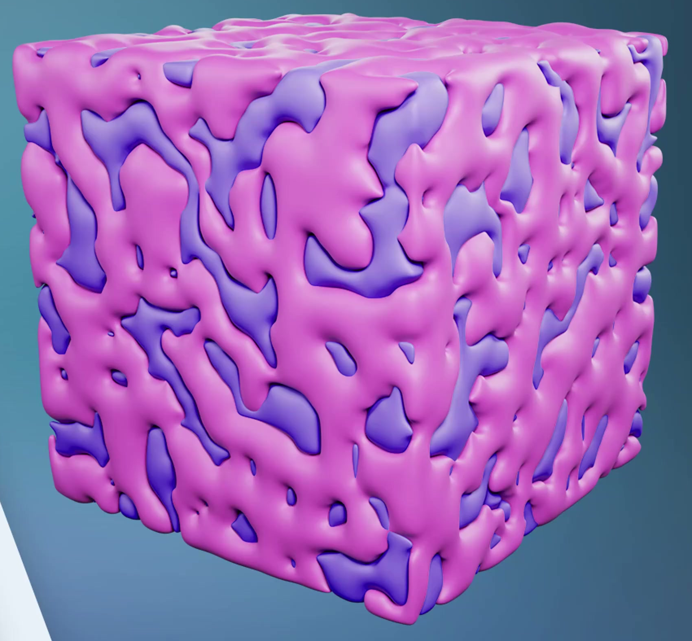
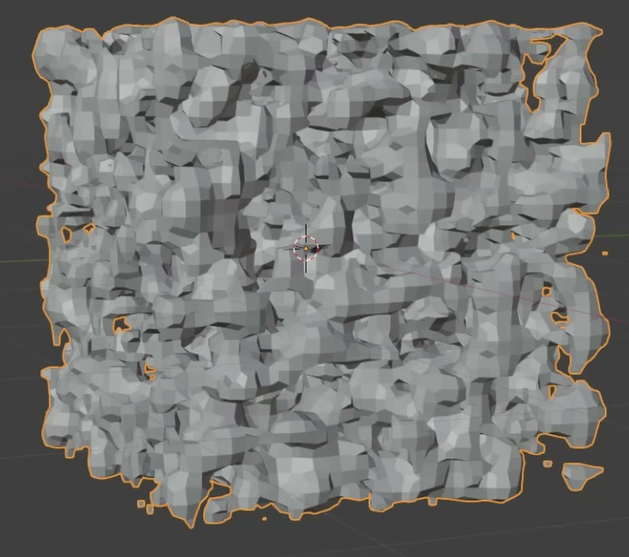
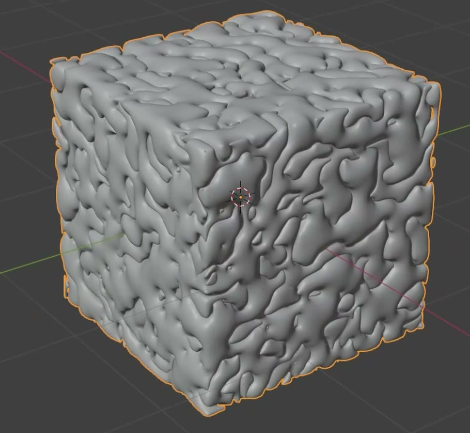

# Interlaced Porous Cube

Create a static, editable porous cube made from two irregular phases that fit together across the same cubic region. Each phase must have real three-dimensional openings and rounded branching forms; together they should resemble an organic, interlaced material sample.

The colored reference establishes the relationship between the two phases. Match the structural character and relative pore scale; the individual random pattern and exact colors may differ.

## Starting Scene

Use Blender 5.1.2. Start from an empty scene or the default cube. The `input/` directory is empty: all geometry and materials must be created with native Blender data. Use Cycles with GPU rendering for the final image. This is a static asset with no required timeline animation.

## 1. Cubic Envelope

Keep the combined result approximately cubic, with comparable width, depth, and height. Its faces should remain recognizable as the sides of a material sample despite their irregular pore boundaries. The pattern must extend around the object, including the top and side faces, and the two phases must occupy the same region. Choose any convenient overall scale.

## 2. Porous Phase Geometry

Create two substantial, separately inspectable geometric phases. Each must extend across the sample in all three dimensions and contain repeated, irregular openings connected by thicker lobes and narrower bridges. Vary opening size and outline organically instead of forming a regular lattice. Openings must be actual geometry that can be inspected when the other phase is hidden.

This isolated construction state shows the three-dimensional pore structure. Use the completed references for the required smooth finish.

## 3. Interlaced Relationship

With both phases visible, their irregular shapes must alternate across the same faces: openings and recesses in one phase reveal the other. Preserve the impression of two interlaced networks distributed throughout one sample. Each phase must contribute clearly visible regions on the top and both sides in the final three-quarter view. Keep their registration consistent around corners and avoid visible surface flicker from competing coincident faces.

## 4. Rounded Surface Finish

Give both phases smoothly rounded lobes, bridges, and pore rims while preserving recognizable openings. The completed geometry must avoid prominent voxel steps, flat polygon bands, long spikes, and shading breaks across broad core surfaces. Maintain the organic detail at close inspection as well as in the full-object view.

## 5. Editable Procedural Construction

Retain an inspectable procedural system in the saved scene. Both phases must derive from one shared three-dimensional pattern and coordinate space. Equivalent procedural implementations are acceptable; the visible result must remain generated and editable.

Provide clearly labeled controls or documented callable controls for:

- Changing the shared pattern realization, such as its seed or spatial offset, so both phases update together and remain interlaced.
- Changing pore scale so the sample can produce visibly coarser and finer structures while its overall cubic dimensions remain fixed. Preserve usable results for a modest change in each direction from the submitted setting.
- Showing either phase alone or both together without changing their geometry or position.

Place any short control documentation in a Text datablock in `submission.blend`. Restoring the original controls must restore the submitted geometry deterministically. Save the scene with both phases visible.

## 6. Phase Color Separation

Assign a different solid base color to each phase so their boundaries are easy to follow in the rendered sample. Both colors must be carried by actual materials on the generated geometry. Use an opaque, restrained surface response that keeps the rounded shapes and recesses readable; choose any two clearly distinguishable colors.

## Deliverables

Submit these three files:

- `submission.blend`, containing the finished generated asset, its editable controls, materials, and a camera framing the complete cube in a three-quarter view.
- `build.py`, which recreates the scene from a clean Blender 5.1.2 session and saves the recreated result as `submission.blend`. Include the render setup and retain the procedural controls in the saved file. The saved file must reopen with the recreated scene intact, without external assets or manual preparation.
- `B98_Interlaced_Porous_Cube.png`, rendered from the actual submitted scene. Show the entire sample with enough detail to inspect the pores, contrasting phases, and rounded surfaces. The image must be an actual scene render, not a reference image, viewport screenshot, or external replacement.
