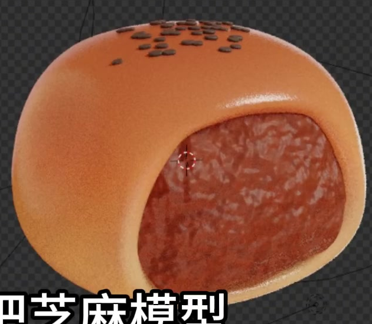
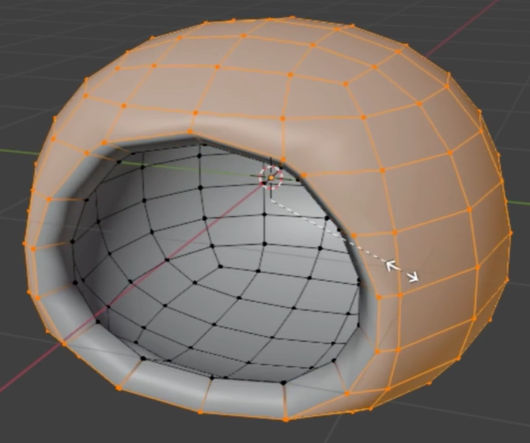
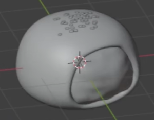

# Red Bean Bun Cutaway

Create a rounded baked bun with a large side opening that exposes a textured red bean filling. The finished asset combines a golden bread shell, a dense reddish-brown filling, and a small dark sesame cluster on top.

## Starting Scene

Use Blender 5.1.2 and Cycles with GPU rendering. Start from an empty scene and create the bun, filling, and sesame with native Blender geometry. No external input assets are supplied; `input/` is empty. Create the material variation procedurally within Blender. Absolute dimensions are unrestricted; preserve the relative proportions visible in the references.

## Bun Form

Give the bun a broad, softly squared footprint, rounded corners, a gently domed crown, and a stable flattened underside. It should read as a plump bread roll rather than a sphere or a sharply edged box. Keep the main silhouette and visible outer surface smooth, without unintended faceting or pinched shading.

## Shell and Filling

Form a real opening on one side of the bun. Its contour should be broadly rounded with a flatter lower edge, and it should reveal a substantial area of filling. The bread must have visible wall thickness around the opening, including a continuous lower rim. Round the lip and join it cleanly to the outer shell.

Fit a separate, editable three-dimensional filling body into the shell. It should occupy the interior and sit just behind the lip, without an empty gap around its perimeter or protruding through the outer bread surface. Give its exposed surface gentle irregularity while retaining the overall rounded cutaway shape. Keep the shell and filling distinguishable when inspected from an oblique view.

## Sesame Geometry

Model sesame as small, flattened, elongated grains with rounded edges and a subtly tapered end. Individual grains must remain readable at the final image scale. Place them against the bread surface without visibly floating, burying them completely, or turning them into long spikes.

Use a dark charcoal, nonmetallic sesame surface that contrasts with the golden crust. Keep the grains visibly solid, with restrained highlights.

## Editable Sesame Scatter

Distribute the grains in an irregular, sparse cluster around the crown. Preserve visible bread between grains; keep the side opening, exposed filling, and lower sidewalls clear. The grains should have varied directions while lying naturally along the local bread surface.

Keep this distribution procedural and editable. Provide a density control that changes the amount of sesame and an editable placement region that can be narrowed or widened across the crown. Updating either control must regenerate the placement on the bread while preserving the seed form and scale. Return the saved scene to the crown-centered reference arrangement.

## Procedural Bread Crust

Create a warm baked color transition from toasted orange-brown across the crown to pale golden bread toward the lower sides and opening rim. The transition should follow the bun's height and remain smooth across its surface.

Add fine, irregular pores or grain to the crust. These should be much smaller than the sesame grains and subtle enough to preserve the smooth overall bun shape. Use a nonmetallic surface with soft glossy highlights that reveal the crown and curved lip without washing out the baked colors. Both color variation and fine surface relief must come from active procedural material controls.

## Procedural Red Bean Filling

Give the filling a dense reddish-brown to deep brown appearance with irregular lighter and darker patches. Combine broad uneven relief with finer granular detail so the exposed surface reads as bean paste. Its variation should be coarser and less regular than the crust pores, with diffuse or restrained highlights rather than a polished or metallic finish.

Keep the color and surface-detail patterns procedural and editable. Their effect must be visible on the actual filling surface and remain continuous across the exposed body.

## Deliverables

Provide these files together:

- `submission.blend`: the complete editable scene, including the procedural sesame distribution and active procedural materials.
- `build.py`: a self-contained Blender Python script that recreates the scene from an empty file and saves the completed result as `submission.blend`. It must not depend on a preexisting solution scene, external textures, or interactive steps.
- `B99_Red_Bean_Bun_Cutaway.png`: a PNG rendered from the actual submitted scene. Use a clear three-quarter view showing the crown, the complete opening rim, and the filling. Frame the entire bun with a small margin and use unobtrusive lighting and a simple background so the material differences remain readable. Source images, viewport screenshots, and externally composited replacement buns are not acceptable render substitutes.

Keep the saved render setup ready to reproduce the PNG. The saved result produced by `build.py` must reopen independently with its geometry, procedural controls, materials, camera, and lighting intact.
